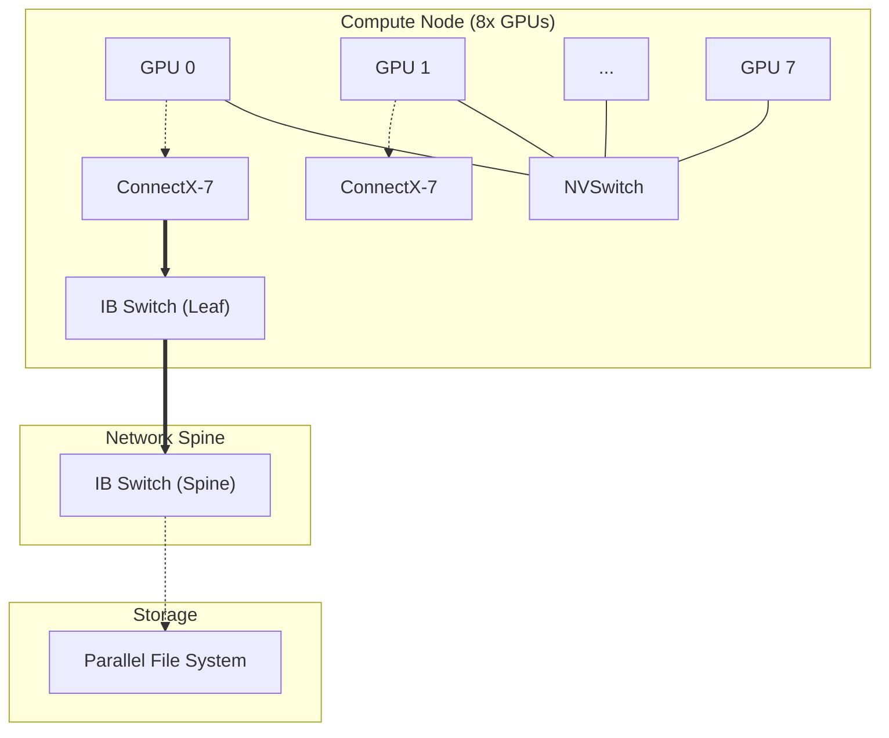

# 高性能计算集群设计 (HPC Cluster Design)

## 1. 设计目标

构建一个千卡/万卡级别的 AI 算力集群，核心指标是：
- **线性加速比 (Linear Scalability)**: 随着 GPU 数量增加，训练速度应尽可能线性增长。
- **高可用性 (Availability)**: 减少平均无故障时间 (MTBF) 的影响，快速恢复。
- **高带宽利用率**: 网络和存储不应成为瓶颈。

## 2. 计算节点设计 (Compute Node)

AI 算力节点是集群的基本单元，通常采用标准的 HGX (NVIDIA) 或 OAM (OCP) 模组设计。

### 2.1 GPU 模组架构
以 NVIDIA H100 NVL8 (HGX H100) 为例：
*   **GPU**: 8x H100 80GB HBM3
*   **互联**: 4x NVSwitch Gen3 chips
*   **带宽**: 
    *   **NVLink**: 900 GB/s (双向) / GPU
    *   **Total Bandwidth**: 3.6 TB/s bisection bandwidth within node.
*   **拓扑**: Any-to-Any 全互联。任意两个 GPU 之间通信不经过 PCIe，直接通过 NVSwitch。

### 2.2 CPU 与 PCIe
*   **CPU**: 通常配置双路 AMD EPYC (Genoa) 或 Intel Xeon (Sapphire Rapids)，提供足够的 PCIe Gen5 lane。
*   **PCIe Switch**: 用于连接网卡 (NIC) 和 NVMe SSD。
*   **GPUDirect RDMA**: 网卡与 GPU 处于同一 PCIe Root Complex 下，支持网卡直接读写 GPU 显存，绕过 CPU 内存拷贝。

## 3. 网络架构设计 (Network Architecture)

在大模型训练中，网络是决定集群扩展性的关键。通常设计三张独立的物理网络。

### 3.1 参数面网络 (Compute Fabric)
用于训练过程中的梯度聚合 (AllReduce) 和参数广播。
*   **技术路线**:
    *   **InfiniBand (IB)**: 性能最强，延迟最低。推荐 NVIDIA Quantum-2 (NDR) 400Gbps switches。
    *   **RoCE v2 (RDMA over Converged Ethernet)**: 性价比高，基于以太网。需要支持 PFC (Priority Flow Control) 和 ECN (Explicit Congestion Notification) 以实现无损网络。
*   **拓扑结构**:
    *   **Fat-Tree (胖树)**: 最通用的无阻塞拓扑，适用于通用计算。
    *   **Rail-Optimized (轨道优化)**: 针对多卡训练优化的拓扑。
        *   原理：将不同节点上同一位置的 GPU (例如所有节点的 GPU-0) 归入同一个 Rail (VLAN/Subnet)。
        *   优势：NCCL Ring/Tree 算法在 Rail 内部通信效率最高。
*   **推荐配置**: 1:1 收敛比 (无收敛)，即网卡总带宽 = 上行链路带宽。每台服务器配置 8 张 400Gbps NDR 网卡（每卡对应一张网卡）。

### 3.2 数据面网络 (Storage Fabric)
用于读取训练数据集、写入 Checkpoint、以及拉取容器镜像。
*   **技术**: 以太网 (100Gbps/200Gbps)。
*   **隔离**: 与计算网络物理隔离，避免 Checkpoint 保存时的突发流量影响训练通信。

### 3.3 管理网络 (Management Fabric)
用于 Kubernetes 控制平面、SSH、IPMI/BMC 管理。
*   **配置**: 千兆或万兆以太网。

## 4. 存储架构设计 (Storage Architecture)

### 4.1 需求特征
*   **读模式**: 随机小文件读 (图片/文本片段) -> 演变为 -> 顺序大文件读 (现在常用的 TFRecord/Parquet 格式)。需要高吞吐。
*   **写模式**: 周期性 Checkpoint 写入。这是最严苛的场景。例如：万亿参数模型，Optimizer States + Weights 可能达到 20TB+，需要在 1-2 分钟内写入完成，否则严重拖慢训练效率。

### 4.2 存储分层
1.  **热存储 (Hot Tier)**: 高性能并行文件系统。
    *   选型: Lustre, IBM Spectrum Scale (GPFS), WEKA。
    *   介质: 全 NVMe SSD。
2.  **温存储 (Warm Tier)**: 对象存储加速层。
    *   架构: MinIO / Ceph + Alluxio / JuiceFS。
    *   用途: 存储数据集，提供 POSIX 兼容接口供训练脚本读取。
3.  **冷存储 (Cold Tier)**: 低成本对象存储 (S3/OSS)。
    *   用途: 长期归档模型和原始数据。

## 5. 集群物理部署 (Pod/SuperPod)

*   **SuperPod**: NVIDIA 定义的标准集群单元，通常包含 32 个节点 (256 GPUs)。
*   **电力与散热**:
    *   单机柜功耗可达 40kW+ (H100 节点)。
    *   需要液冷 (DLC - Direct Liquid Cooling) 或风液混合散热方案。

## 6. 架构图示

