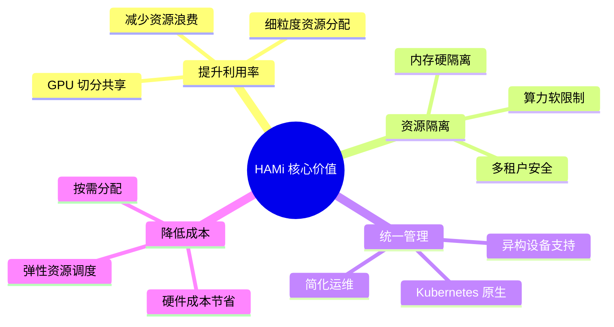
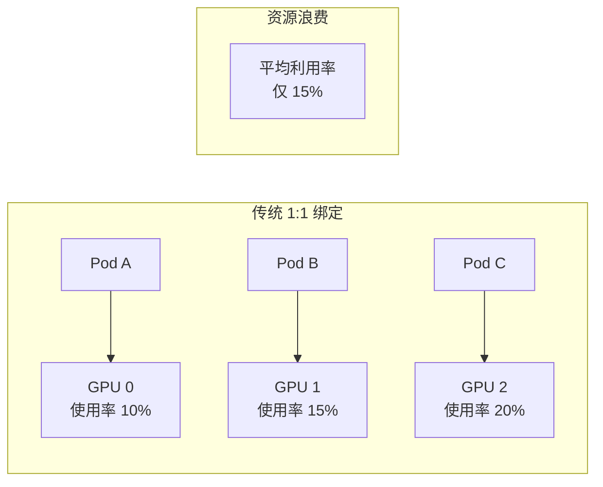
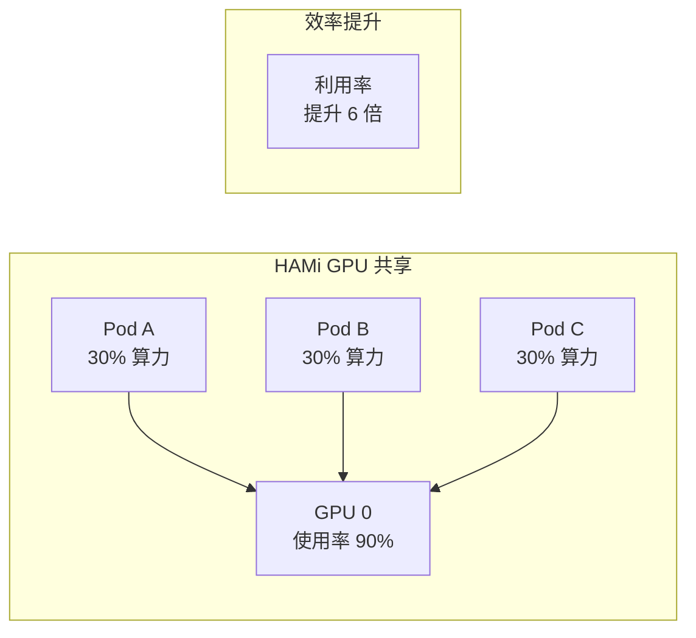
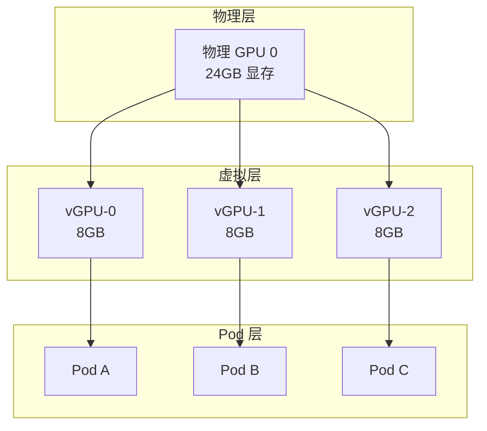

# HAMi 概述与核心概念

## 1. 什么是 HAMi？

HAMi (Heterogeneous AI Computing Virtualization Middleware) 是一个开源的 Kubernetes 中间件，专为**异构计算设备的虚拟化和共享**而设计。它是 CNCF Sandbox 项目，提供了对 NVIDIA GPU、华为 NPU、海光 DCU 等多种 AI 加速器的统一管理能力。

### 1.1 核心价值



### 1.2 适用场景

| 场景 | 描述 | 典型需求 |
|------|------|---------|
| **AI 推理服务** | 多个轻量推理模型共享 GPU | 内存隔离 + 算力保障 |
| **开发测试环境** | 开发者共享 GPU 进行调试 | 资源公平分配 |
| **多租户平台** | 不同团队/用户隔离使用 | 安全隔离 + 计费 |
| **批量推理任务** | 大规模 batch 推理 | 资源弹性调度 |

## 2. 为什么需要 GPU 共享？

### 2.1 传统模式的问题



**痛点分析：**
- 很多 AI 推理任务无法充分利用整卡
- GPU 昂贵，闲置造成巨大浪费
- Kubernetes 原生只支持整卡分配
- 无法实现多任务共享同一 GPU

### 2.2 HAMi 解决方案



## 3. GPU 共享技术对比

### 3.1 NVIDIA 官方方案

| 方案 | 原理 | 优点 | 缺点 |
|------|------|------|------|
| **Time-slicing** | 时间片轮转 | 简单、无需额外硬件 | 无隔离、互相干扰 |
| **MPS** | Multi-Process Service | 提升并发性能 | 隔离弱、故障传播 |
| **MIG** | Multi-Instance GPU | 硬件级隔离 | 仅 A100/H100 支持 |

### 3.2 HAMi 的优势

```yaml
# HAMi 技术特点
优势:
  - 软件层实现，无需特定硬件
  - 内存硬隔离，防止 OOM 传播
  - 算力可配置，按需分配
  - 支持多种 GPU 型号
  - Kubernetes 原生集成
  - CNCF 开源项目，社区活跃

劣势:
  - 软件拦截有微量开销 (< 3%)
  - 算力是软限制，非硬隔离
  - 需要容器运行时支持
```

> [!TIP]
> HAMi 适合大多数推理和开发场景。对于需要硬件级隔离的高安全场景，可以考虑 MIG。

## 4. 核心概念

### 4.1 vGPU (虚拟 GPU)

HAMi 将物理 GPU 虚拟化为多个 vGPU，每个 vGPU 有独立的：
- **显存配额**: 如 4GB、8GB
- **算力配额**: 如 30%、50%

```yaml
# Pod 声明示例
resources:
  limits:
    nvidia.com/gpu: 1           # 请求 1 个 vGPU
    nvidia.com/gpumem: 4000     # 显存 4000MB
    nvidia.com/gpucores: 30     # 算力 30%
```

### 4.2 资源类型

HAMi 扩展了 Kubernetes 资源类型：

| 资源名称 | 说明 | 单位 |
|---------|------|------|
| `nvidia.com/gpu` | GPU 卡数量 | 个 |
| `nvidia.com/gpumem` | 显存大小 | MB |
| `nvidia.com/gpumem-percentage` | 显存百分比 | % |
| `nvidia.com/gpucores` | GPU 算力百分比 | % |

### 4.3 设备复制 (Device Replication)



## 5. 支持的设备类型

HAMi 支持多种异构计算设备：

| 厂商 | 设备类型 | 资源名称 |
|------|---------|---------|
| NVIDIA | GPU | `nvidia.com/gpu` |
| 华为 | Ascend NPU | `huawei.com/Ascend910` |
| 海光 | DCU | `hygon.com/dcu` |
| 寒武纪 | MLU | `cambricon.com/mlu` |
| 天数智芯 | GPGPU | `iluvatar.ai/gpu` |

## 6. 快速体验

### 6.1 创建共享 GPU Pod

```yaml
apiVersion: v1
kind: Pod
metadata:
  name: gpu-test
spec:
  containers:
  - name: cuda-container
    image: nvidia/cuda:12.0-runtime-ubuntu22.04
    command: ["nvidia-smi", "-L"]
    resources:
      limits:
        nvidia.com/gpu: 1           # 1 个 vGPU
        nvidia.com/gpumem: 2000     # 2GB 显存
        nvidia.com/gpucores: 25     # 25% 算力
```

### 6.2 查看资源分配

```bash
# 查看节点 GPU 资源
kubectl describe node <node-name> | grep -A 10 "nvidia.com"

# 查看 Pod GPU 分配详情
kubectl describe pod gpu-test | grep -A 5 "Annotations"
```

## 7. 总结

| 概念 | 说明 |
|------|------|
| **HAMi** | Kubernetes GPU 虚拟化中间件，CNCF Sandbox 项目 |
| **vGPU** | 虚拟 GPU，包含独立的显存和算力配额 |
| **显存隔离** | 硬隔离，超限触发 CUDA OOM |
| **算力限制** | 软限制，通过时间片控制 |
| **设备复制** | 将物理 GPU 虚拟化为多个设备 |

> [!IMPORTANT]
> HAMi 的核心价值是在**不需要特殊硬件**的情况下，实现 GPU 资源的**细粒度共享**和**有效隔离**，将 GPU 利用率从 15% 提升到 90%+。
