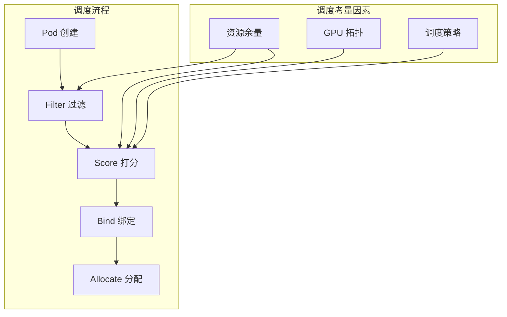
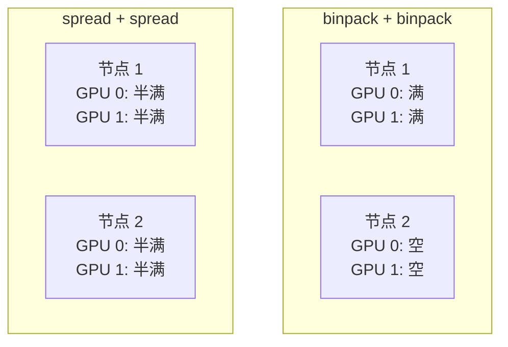
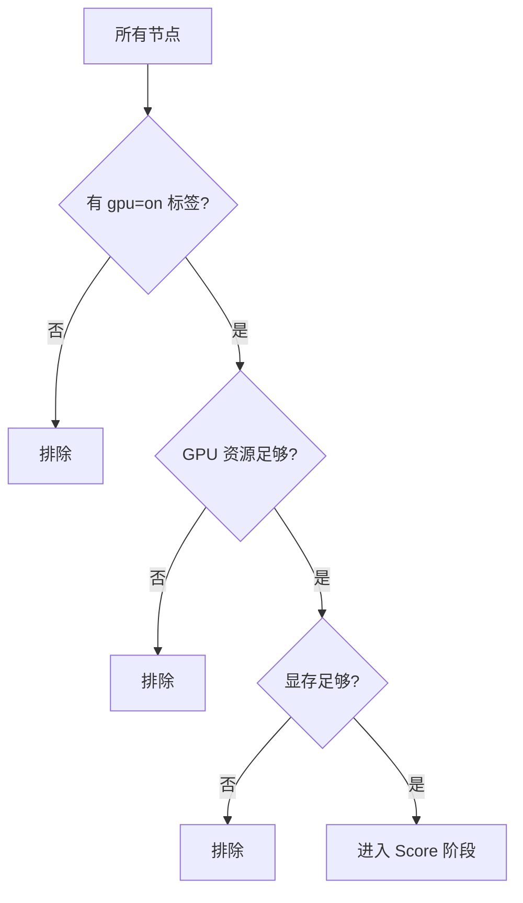
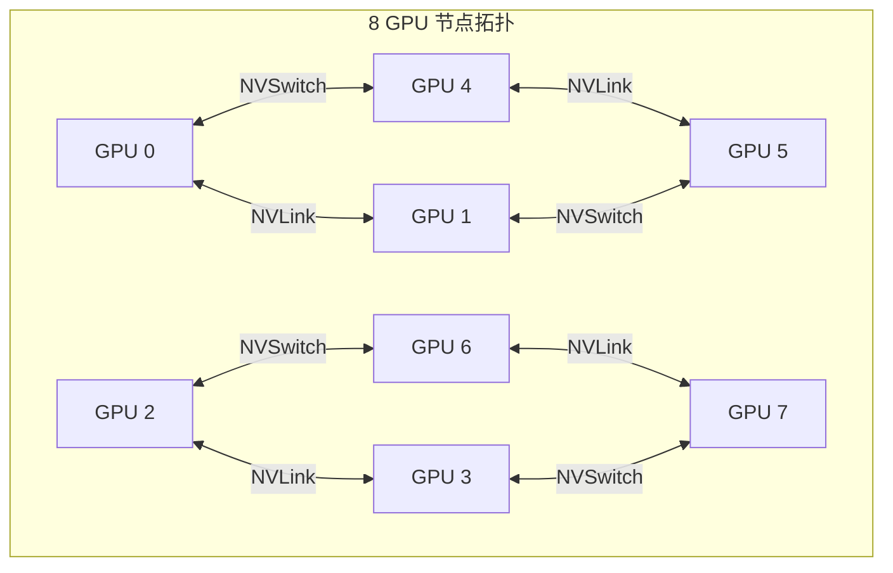
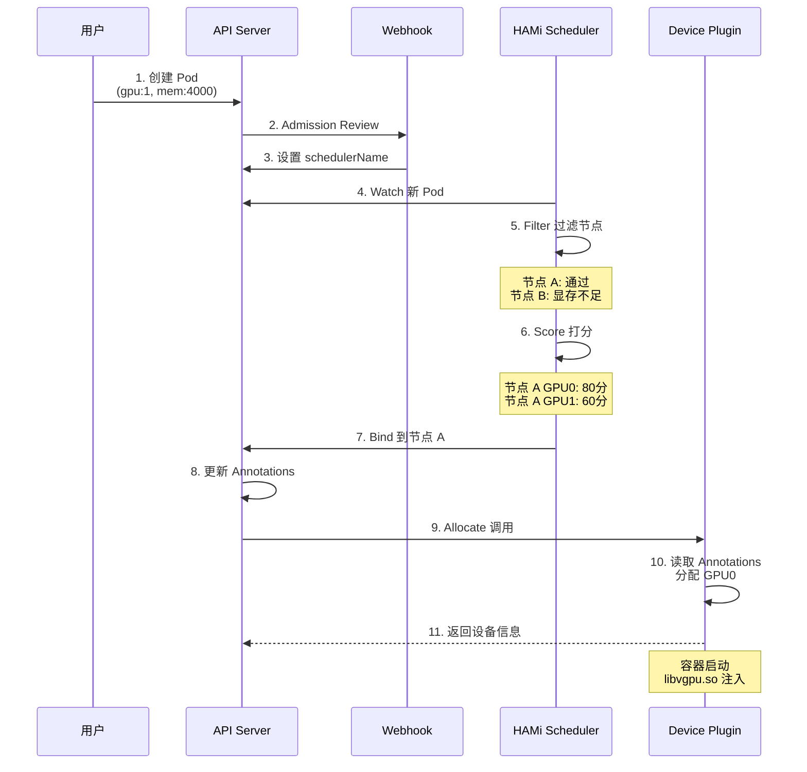

# HAMi 调度策略

## 1. 调度架构概述

HAMi Scheduler 作为 Kubernetes 调度器扩展，负责智能分配 GPU 资源：



## 2. 调度策略详解

### 2.1 节点级策略 (Node Scheduler Policy)

决定 Pod 调度到哪个节点：

| 策略 | 行为 | 适用场景 |
|------|------|---------|
| **binpack** | 优先填满节点 | 节省成本、提高利用率 |
| **spread** | 分散到不同节点 | 高可用、故障隔离 |

```yaml
# 配置示例
scheduler:
  schedulerPolicy:
    nodeSchedulerPolicy: binpack  # 或 spread
```

### 2.2 GPU 级策略 (GPU Scheduler Policy)

决定使用节点上的哪个 GPU：

| 策略 | 行为 | 适用场景 |
|------|------|---------|
| **binpack** | 优先填满一块 GPU | 最大化单卡利用率 |
| **spread** | 分散到不同 GPU | 减少单卡争用 |

```yaml
# 配置示例
scheduler:
  schedulerPolicy:
    gpuSchedulerPolicy: spread  # 或 binpack
```

### 2.3 策略组合效果



## 3. Filter 过滤阶段

### 3.1 节点过滤条件

调度器在 Filter 阶段会排除不满足条件的节点：



### 3.2 资源检查逻辑

```go
// 简化的 Filter 逻辑
func filterNode(node *Node, request *PodRequest) bool {
    // 检查节点标签
    if !hasLabel(node, "gpu", "on") {
        return false
    }
    
    // 检查可用 GPU 数量
    availableGPUs := countAvailableGPUs(node)
    if availableGPUs < request.GPUCount {
        return false
    }
    
    // 检查显存是否满足
    for _, gpu := range node.GPUs {
        if gpu.FreeMemory >= request.GPUMemory {
            return true
        }
    }
    return false
}
```

## 4. Score 打分阶段

### 4.1 打分因素

| 因素 | 权重 | 说明 |
|------|------|------|
| 资源余量 | 高 | 剩余显存/算力 |
| GPU 利用率 | 中 | 当前使用程度 |
| 拓扑亲和 | 中 | NVLink 连接 |
| 节点亲和 | 低 | Pod Affinity 规则 |

### 4.2 Binpack 打分

优先选择资源使用率高的节点/GPU：

```go
// Binpack 打分逻辑
func scoreBinpack(node *Node, request *PodRequest) int {
    usedRatio := float64(node.UsedMemory) / float64(node.TotalMemory)
    // 使用率越高，分数越高
    return int(usedRatio * 100)
}
```

### 4.3 Spread 打分

优先选择资源使用率低的节点/GPU：

```go
// Spread 打分逻辑
func scoreSpread(node *Node, request *PodRequest) int {
    usedRatio := float64(node.UsedMemory) / float64(node.TotalMemory)
    // 使用率越低，分数越高
    return int((1 - usedRatio) * 100)
}
```

## 5. 拓扑感知调度

### 5.1 NVLink 拓扑

对于多 GPU 任务，HAMi 支持拓扑感知调度：



### 5.2 拓扑感知配置

```yaml
scheduler:
  topologyAware: true
  nvlinkOptimization: true
```

### 5.3 亲和性调度

当任务请求多个 GPU 时，优先分配 NVLink 连接的 GPU：

```yaml
# 请求 2 个 GPU，优先分配同一 NVLink 组
resources:
  limits:
    nvidia.com/gpu: 2
    nvidia.com/gpumem: 8000
```

## 6. 高级调度配置

### 6.1 Gang Scheduling

确保分布式训练的所有 Pod 同时调度：

```yaml
# 需要配合 Volcano 等 Gang Scheduler
apiVersion: scheduling.volcano.sh/v1beta1
kind: PodGroup
metadata:
  name: training-job
spec:
  minMember: 4
```

### 6.2 Node Affinity

指定 Pod 调度到特定节点：

```yaml
spec:
  affinity:
    nodeAffinity:
      requiredDuringSchedulingIgnoredDuringExecution:
        nodeSelectorTerms:
        - matchExpressions:
          - key: nvidia.com/gpu.product
            operator: In
            values:
            - "NVIDIA-A100-SXM4-80GB"
```

### 6.3 Pod Anti-Affinity

避免同类 Pod 调度到同一节点：

```yaml
spec:
  affinity:
    podAntiAffinity:
      preferredDuringSchedulingIgnoredDuringExecution:
      - weight: 100
        podAffinityTerm:
          labelSelector:
            matchLabels:
              app: inference-service
          topologyKey: kubernetes.io/hostname
```

## 7. 调度监控

### 7.1 调度延迟指标

```yaml
# Prometheus 指标
hami_scheduler_scheduling_latency_seconds{result="success"}
hami_scheduler_scheduling_latency_seconds{result="failure"}
```

### 7.2 查看调度决策

```bash
# 查看调度器日志
kubectl -n hami-system logs -l app=hami-scheduler --tail=100

# 查看 Pod 调度事件
kubectl describe pod <pod-name> | grep -A 20 "Events"

# 查看分配的 GPU 信息
kubectl get pod <pod-name> -o jsonpath='{.metadata.annotations}' | jq .
```

### 7.3 调度失败排查

```bash
# 检查节点资源
kubectl describe node <node-name> | grep -A 20 "Allocated resources"

# 检查调度器状态
kubectl -n hami-system get pods -l app=hami-scheduler

# 查看调度失败原因
kubectl describe pod <pending-pod-name> | grep -A 5 "Events"
```

## 8. 调度策略选择指南

### 8.1 场景推荐

| 场景 | 节点策略 | GPU 策略 | 原因 |
|------|---------|---------|------|
| **推理服务** | spread | spread | 高可用，减少单点故障 |
| **开发环境** | binpack | binpack | 节省资源，降低成本 |
| **训练任务** | binpack | spread | 平衡利用率和性能 |
| **多租户** | spread | binpack | 租户隔离，资源高效 |

### 8.2 配置模板

**高可用模式**:
```yaml
scheduler:
  schedulerPolicy:
    nodeSchedulerPolicy: spread
    gpuSchedulerPolicy: spread
```

**成本优化模式**:
```yaml
scheduler:
  schedulerPolicy:
    nodeSchedulerPolicy: binpack
    gpuSchedulerPolicy: binpack
```

**平衡模式**:
```yaml
scheduler:
  schedulerPolicy:
    nodeSchedulerPolicy: binpack
    gpuSchedulerPolicy: spread
```

## 9. 调度流程完整示例



## 10. 总结

| 策略 | 适用节点 | 适用 GPU | 效果 |
|------|---------|---------|------|
| **binpack** | 资源紧张 | 单任务密集 | 最大化利用率 |
| **spread** | 高可用需求 | 多任务并发 | 负载均衡 |

> [!TIP]
> 推荐从 `binpack + spread` 组合开始，根据实际监控数据调整策略。使用 Prometheus + Grafana 持续观察 GPU 利用率和调度延迟。
