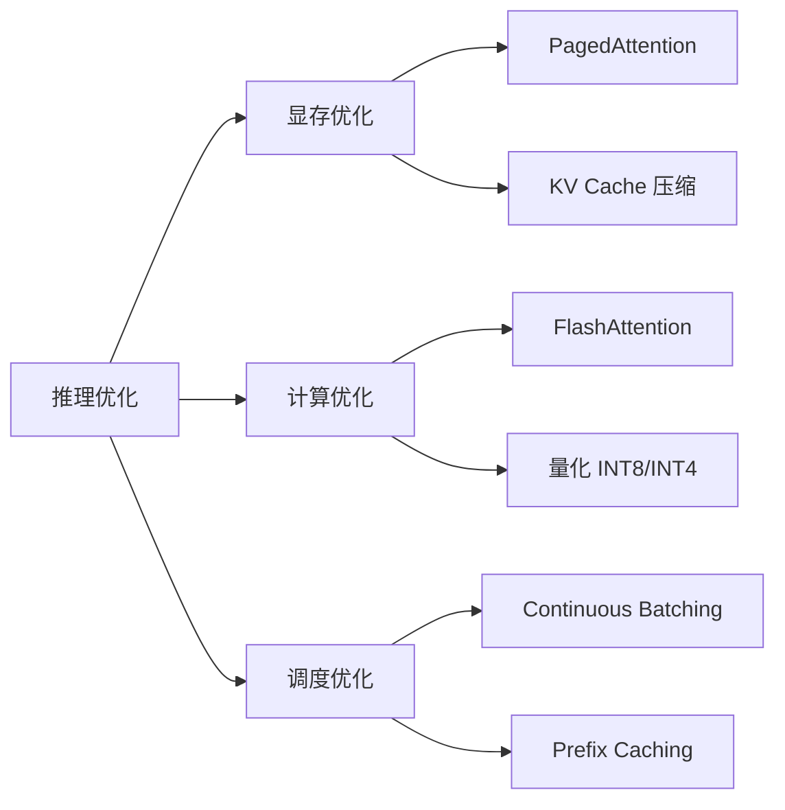

# 推理服务

> 本目录包含大模型推理服务的框架选型、部署和优化相关文档。

## 📁 目录内容

### 框架对比
- [[Megatron-LM vs. vLLM vs. SGLang|推理框架对比分析]]
  - PagedAttention vs RadixAttention
  - 吞吐量与延迟对比
  - 选型建议

### 框架详解
- [[Megatron推理服务|Megatron 推理服务]]
  - 分布式推理架构
  - Kubernetes 部署方案
  - Triton Server 集成

- [[vLLM推理服务|vLLM 推理服务]]
  - PagedAttention 原理
  - Continuous Batching
  - 快速部署指南

## 🚀 框架速览

| 框架 | 定位 | 适用场景 |
|------|------|----------|
| **vLLM** | 通用高性能推理 | 7B-70B 模型在线服务 |
| **SGLang** | 复杂逻辑推理 | 结构化输出、长文本 |
| **Megatron** | 超大规模推理 | 100B+ 模型、多节点 |
| **TensorRT-LLM** | 极致性能 | 生产环境、低延迟 |

## 🔧 关键技术

## 🔗 相关链接

- [[../MOC - AI基础设施|返回 AI 基础设施 MOC]]
- [[../GPU性能优化/MOC - GPU性能优化|GPU 性能优化]]
- [[../Ray/MOC - Ray|Ray Serve]]
