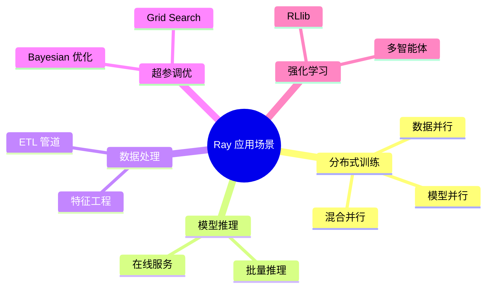
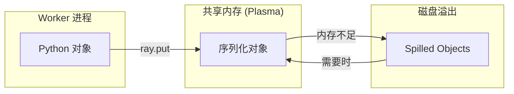

# Ray 概述与核心概念

## 1. 什么是 Ray？

Ray 是一个开源的**通用分布式计算框架**，由 UC Berkeley RISELab 开发。它的设计目标是让开发者能够用最小的代码改动，将单机 Python 程序扩展为分布式应用。

### 1.1 核心特点

| 特点 | 描述 |
|------|------|
| **简单易用** | 只需 `@ray.remote` 装饰器即可将函数/类转为分布式 |
| **通用性强** | 支持任务并行、Actor 模型、流处理等多种范式 |
| **高性能** | 底层 C++ 实现，亚毫秒级任务调度延迟 |
| **生态丰富** | 内置 Train、Serve、Data、Tune 等高级库 |
| **云原生** | 原生支持 Kubernetes、AWS、GCP、Azure |

### 1.2 适用场景



## 2. 核心抽象

Ray 提供两个核心的分布式抽象：**Task** 和 **Actor**。

### 2.1 Task（远程函数）

Task 是无状态的远程函数调用，适合批处理和并行计算。

```python
import ray

ray.init()

# 使用 @ray.remote 将普通函数转为远程函数
@ray.remote
def compute(x):
    return x * x

# 调用远程函数，返回 ObjectRef（Future）
future = compute.remote(4)

# 获取结果（阻塞）
result = ray.get(future)  # 16
```

**核心特性：**
- 异步非阻塞调用
- 自动依赖管理
- 故障自动重试

### 2.2 Actor（远程类）

Actor 是有状态的分布式对象，适合需要维护状态的场景。

```python
@ray.remote
class Counter:
    def __init__(self):
        self.value = 0
    
    def increment(self):
        self.value += 1
        return self.value
    
    def get_value(self):
        return self.value

# 创建 Actor 实例
counter = Counter.remote()

# 调用 Actor 方法
counter.increment.remote()
counter.increment.remote()
result = ray.get(counter.get_value.remote())  # 2
```

**核心特性：**
- 状态持久化在单个进程中
- 方法调用按顺序执行（单线程模型）
- 支持 Actor 池化（ActorPool）

### 2.3 Task vs Actor 对比

| 特性 | Task | Actor |
|------|------|-------|
| 状态 | 无状态 | 有状态 |
| 并发模型 | 完全并行 | 顺序执行 |
| 生命周期 | 调用即销毁 | 显式销毁 |
| 适用场景 | 批处理、MapReduce | 模型服务、状态机 |

## 3. 分布式对象存储

Ray 使用 **Plasma** 对象存储来管理分布式数据，实现零拷贝数据共享。

### 3.1 ObjectRef

每个远程调用返回一个 `ObjectRef`，它是对象的引用（类似 Future）。

```python
# 返回 ObjectRef，不阻塞
ref = compute.remote(10)

# ray.get() 阻塞直到结果可用
result = ray.get(ref)

# 批量获取
refs = [compute.remote(i) for i in range(10)]
results = ray.get(refs)  # 并行等待所有结果
```

### 3.2 ray.put()

显式将数据放入对象存储，避免重复序列化。

```python
# 大数据对象只序列化一次
large_data = list(range(1000000))
data_ref = ray.put(large_data)

# 可以传递给多个 Task，避免重复传输
@ray.remote
def process(data):
    return sum(data)

futures = [process.remote(data_ref) for _ in range(10)]
```

### 3.3 内存管理



## 4. 资源管理

Ray 支持细粒度的资源声明和调度。

### 4.1 资源声明

```python
# 声明 CPU 和 GPU 需求
@ray.remote(num_cpus=2, num_gpus=1)
def train_model(config):
    import torch
    device = torch.device("cuda")
    # ...

# 自定义资源
@ray.remote(resources={"TPU": 1})
def tpu_task():
    pass
```

### 4.2 资源查看

```python
# 查看集群资源
print(ray.cluster_resources())
# {'CPU': 128, 'GPU': 8, 'memory': 500000000000, ...}

# 查看可用资源
print(ray.available_resources())
```

## 5. 快速上手示例

### 5.1 并行计算 π

```python
import ray
import random

ray.init()

@ray.remote
def sample(num_samples):
    count = 0
    for _ in range(num_samples):
        x, y = random.random(), random.random()
        if x*x + y*y <= 1:
            count += 1
    return count

# 启动 100 个并行任务
num_tasks = 100
samples_per_task = 1000000

futures = [sample.remote(samples_per_task) for _ in range(num_tasks)]
counts = ray.get(futures)

pi = 4 * sum(counts) / (num_tasks * samples_per_task)
print(f"π ≈ {pi}")
```

### 5.2 Actor 模式：参数服务器

```python
@ray.remote
class ParameterServer:
    def __init__(self, dim):
        self.params = [0.0] * dim
    
    def get_params(self):
        return self.params
    
    def update(self, gradients):
        for i, g in enumerate(gradients):
            self.params[i] -= 0.01 * g  # SGD

@ray.remote
def worker(ps, data):
    params = ray.get(ps.get_params.remote())
    # 计算梯度...
    gradients = [random.random() for _ in params]
    ps.update.remote(gradients)

ps = ParameterServer.remote(dim=1000)
workers = [worker.remote(ps, None) for _ in range(10)]
ray.get(workers)
```

## 6. 总结

| 概念 | 说明 |
|------|------|
| `ray.init()` | 初始化 Ray，连接或启动集群 |
| `@ray.remote` | 将函数/类转为分布式对象 |
| `.remote()` | 异步调用远程函数/方法 |
| `ray.get()` | 获取 ObjectRef 的实际值 |
| `ray.put()` | 将对象放入分布式存储 |
| `ObjectRef` | 远程对象的引用（Future） |

> [!TIP]
> Ray 的设计哲学是"**让分布式像本地一样简单**"。只需掌握上述几个 API，就可以将单机程序扩展为分布式应用。
