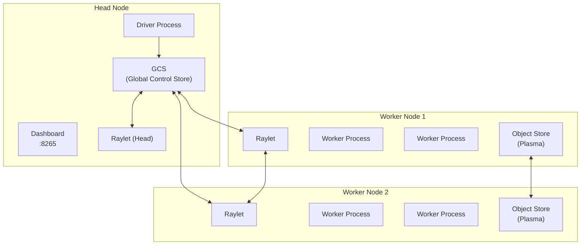
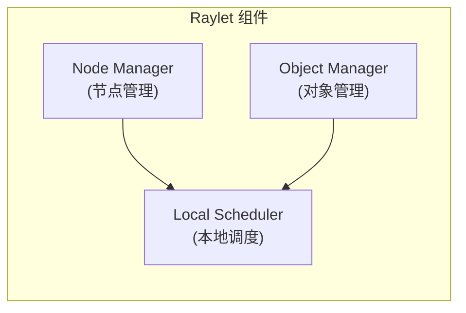
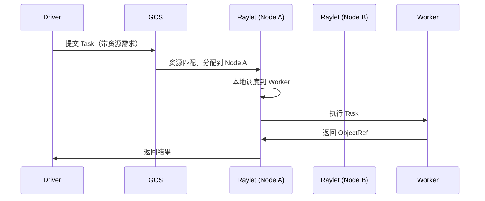
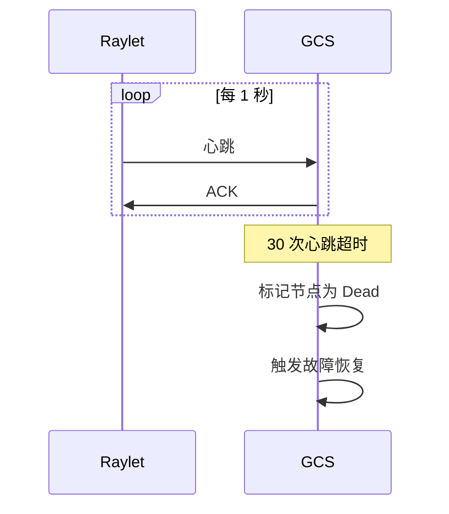

# Ray 集群架构

## 1. 架构概览

Ray 集群采用**中心化元数据 + 分布式执行**的架构设计，兼顾可扩展性和易用性。



---

## 2. 核心组件

### 2.1 GCS (Global Control Store)

**全局控制存储**，是 Ray 集群的"大脑"，运行在 Head 节点上。

| 职责 | 说明 |
|------|------|
| **Actor 管理** | 记录 Actor 位置、状态、重启策略 |
| **资源管理** | 汇总各节点资源信息 |
| **节点管理** | 节点注册、心跳监控、故障检测 |
| **Placement Group** | 管理调度约束 |
| **Job 管理** | 追踪 Job 生命周期 |

> [!NOTE]
> GCS 默认使用内存存储。生产环境可配置 Redis 后端实现持久化（Ray 2.0+ 默认内置 GCS，无需外部 Redis）。

### 2.2 Raylet

每个节点运行一个 **Raylet** 进程，负责本地资源调度和进程管理。



**核心功能：**

1. **本地调度**：决定 Task 在哪个 Worker 进程执行
2. **对象管理**：管理本地 Plasma 存储，处理跨节点对象传输
3. **Worker 管理**：启动/回收 Worker 进程池
4. **心跳上报**：向 GCS 汇报节点状态

### 2.3 Worker 进程

实际执行 Task 和 Actor 方法的进程。

- **Task Worker**：执行无状态函数，任务完成后可复用
- **Actor Worker**：执行有状态对象方法，专属于某个 Actor

```bash
# 查看 Ray Worker 进程
ps aux | grep ray::IDLE  # 空闲 Worker
ps aux | grep ray::      # 所有 Ray 进程
```

### 2.4 Object Store (Plasma)

分布式共享内存对象存储。

| 特性 | 说明 |
|------|------|
| **共享内存** | 同节点进程间零拷贝访问 |
| **不可变对象** | 写入后不可修改 |
| **LRU 驱逐** | 内存满时自动驱逐 |
| **磁盘溢出** | 可配置 Spill to Disk |
| **分布式传输** | 跨节点自动拉取 |

---

## 3. 调度机制

### 3.1 两级调度

Ray 采用**两级调度**架构：



1. **全局调度（GCS）**：根据资源需求选择目标节点
2. **本地调度（Raylet）**：在节点内分配到具体 Worker

### 3.2 资源调度策略

**默认策略：**
```python
# 优先本地执行（减少网络开销）
@ray.remote(num_cpus=1)
def task():
    pass
```

**调度约束：**
```python
# 强制在 GPU 节点执行
@ray.remote(num_gpus=1)
def gpu_task():
    pass

# 自定义资源约束
@ray.remote(resources={"node_type": 1})
def special_task():
    pass
```

### 3.3 Placement Group

控制 Task/Actor 的物理拓扑放置。

```python
from ray.util.placement_group import placement_group

# 创建 Placement Group（要求放置在相邻位置）
pg = placement_group([
    {"CPU": 4, "GPU": 1},
    {"CPU": 4, "GPU": 1},
], strategy="STRICT_PACK")  # 尽量放在同一节点

ray.get(pg.ready())

# 使用 Placement Group
@ray.remote(num_cpus=4, num_gpus=1)
def train():
    pass

train.options(placement_group=pg).remote()
```

**策略类型：**

| 策略 | 说明 |
|------|------|
| `STRICT_PACK` | 必须在同一节点 |
| `PACK` | 尽量在同一节点 |
| `STRICT_SPREAD` | 必须在不同节点 |
| `SPREAD` | 尽量在不同节点 |

---

## 4. 故障容错

### 4.1 节点故障检测



### 4.2 Actor 故障恢复

```python
# 配置 Actor 自动重启
@ray.remote(
    max_restarts=3,           # 最多重启 3 次
    max_task_retries=-1,      # 无限重试任务
)
class FaultTolerantActor:
    def __init__(self):
        self.state = self._recover_state()
    
    def _recover_state(self):
        # 从持久化存储恢复
        pass
```

### 4.3 Task 故障重试

```python
@ray.remote(
    max_retries=3,            # 最多重试 3 次
    retry_exceptions=True,     # 遇到异常时重试
)
def unreliable_task():
    pass
```

---

## 5. 网络通信

### 5.1 通信类型

| 类型 | 用途 | 协议 |
|------|------|------|
| **控制面** | GCS ↔ Raylet 心跳、元数据 | gRPC |
| **数据面** | 对象传输 | 直接内存传输 |
| **任务调度** | Raylet ↔ Worker | gRPC + 共享内存 |

### 5.2 对象传输优化

```python
# 小对象：内联返回（避免 Plasma 开销）
# 默认阈值：100KB
ray.init(_system_config={"max_direct_call_object_size": 100 * 1024})

# 大对象：通过 Plasma 传输
large_array = np.zeros((10000, 10000))
ref = ray.put(large_array)  # 存入 Plasma
```

---

## 6. 监控与可观测性

### 6.1 Ray Dashboard

访问 `http://<head-ip>:8265`：

- **Jobs**：任务列表和状态
- **Actors**：Actor 实例和资源
- **Nodes**：节点资源使用
- **Logs**：集中式日志查看
- **Metrics**：Prometheus 指标

### 6.2 常用 API

```python
# 集群资源
print(ray.cluster_resources())
# {'CPU': 128, 'GPU': 8, 'memory': 500GB, ...}

# 可用资源
print(ray.available_resources())

# 节点信息
print(ray.nodes())
# [{'NodeID': '...', 'Alive': True, 'Resources': {...}}, ...]
```

### 6.3 Prometheus 指标

Ray 暴露 Prometheus 格式指标：

```bash
curl http://<head-ip>:8080/metrics
```

常用指标：
- `ray_node_cpu_utilization`
- `ray_node_gpu_utilization`
- `ray_object_store_memory`
- `ray_tasks_running`

---

## 7. 总结

| 组件 | 职责 |
|------|------|
| **GCS** | 全局元数据、Actor 注册、节点管理 |
| **Raylet** | 本地调度、对象管理、Worker 管理 |
| **Worker** | 执行 Task 和 Actor 方法 |
| **Plasma** | 分布式对象存储 |
| **Dashboard** | 可视化监控 |

> [!TIP]
> 理解 Ray 架构的关键是：**GCS 负责"调度到哪里"，Raylet 负责"如何执行"**。这种分离使 Ray 能够高效扩展到数千节点。
