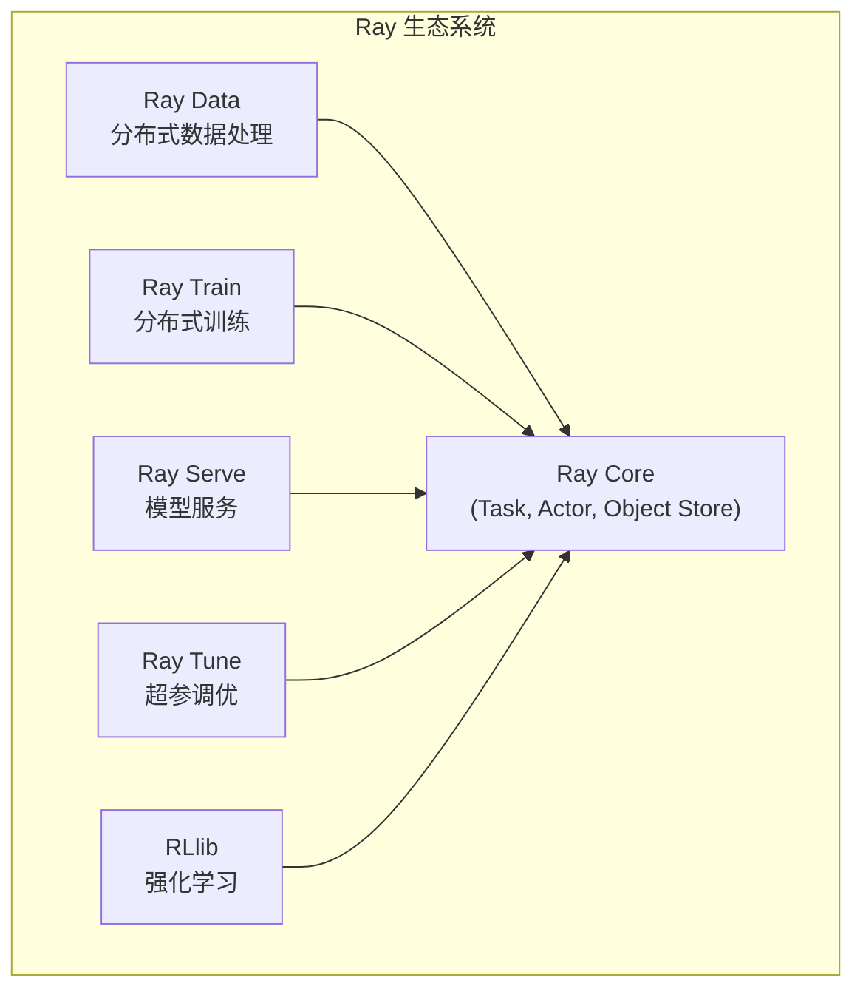

# Ray 生态系统组件

## 1. 概述

Ray 不仅是一个分布式计算框架，还提供了一整套针对 AI/ML 工作负载的高级库：



---

## 2. Ray Data

### 2.1 简介

**Ray Data** 是分布式数据处理库，用于 ETL、特征工程和模型训练数据准备。

```python
import ray

# 读取数据
ds = ray.data.read_parquet("s3://bucket/data/")

# 分布式 Map
ds = ds.map(lambda row: {"feature": row["value"] * 2})

# 过滤
ds = ds.filter(lambda row: row["feature"] > 0)

# 写出
ds.write_parquet("/output/")
```

### 2.2 核心特性

| 特性 | 说明 |
|------|------|
| **惰性执行** | 自动优化执行计划 |
| **流式处理** | 支持无界数据流 |
| **统一接口** | 支持多种数据源 (Parquet, CSV, JSON, 自定义) |
| **与 Train 集成** | 训练数据直接传入模型 |

### 2.3 与 Spark 对比

```python
# Ray Data - 与深度学习紧密集成
import ray
from ray.train import ScalingConfig

ds = ray.data.read_images("s3://bucket/images/")
ds = ds.map(preprocess_image)

# 直接传入训练
trainer = TorchTrainer(
    train_fn,
    datasets={"train": ds},
    scaling_config=ScalingConfig(num_workers=4)
)
```

---

## 3. Ray Train

### 3.1 简介

**Ray Train** 提供统一的分布式训练抽象，支持 PyTorch、TensorFlow、Hugging Face 等框架。

### 3.2 基本用法

```python
import ray
from ray import train
from ray.train import ScalingConfig
from ray.train.torch import TorchTrainer

def train_fn(config):
    model = get_model()
    
    # 获取分布式训练数据
    train_dataset = train.get_dataset_shard("train")
    
    for epoch in range(config["epochs"]):
        for batch in train_dataset.iter_torch_batches():
            loss = train_step(model, batch)
            
            # 报告指标
            train.report({"loss": loss})
    
    # 保存 Checkpoint
    train.report({"loss": loss}, checkpoint=Checkpoint.from_dict({"model": model.state_dict()}))

trainer = TorchTrainer(
    train_fn,
    train_loop_config={"epochs": 10},
    scaling_config=ScalingConfig(
        num_workers=4,
        use_gpu=True,
        resources_per_worker={"GPU": 1}
    ),
    datasets={"train": train_dataset}
)

result = trainer.fit()
print(result.checkpoint)
```

### 3.3 支持的框架

| 框架 | Trainer 类 |
|------|-----------|
| PyTorch | `TorchTrainer` |
| TensorFlow | `TensorflowTrainer` |
| Hugging Face | `TransformersTrainer` |
| Lightning | `LightningTrainer` |
| XGBoost | `XGBoostTrainer` |
| LightGBM | `LightGBMTrainer` |

### 3.4 分布式训练策略

```python
from ray.train.torch import TorchConfig

# 配置 DDP
trainer = TorchTrainer(
    train_fn,
    torch_config=TorchConfig(
        backend="nccl",          # GPU 通信后端
    ),
    scaling_config=ScalingConfig(
        num_workers=8,
        use_gpu=True,
        placement_strategy="SPREAD"  # 尽量分布到不同节点
    )
)
```

---

## 4. Ray Serve

### 4.1 简介

**Ray Serve** 是可扩展的模型服务框架，支持：
- 复杂的模型组合 (Model Composition)
- 动态批处理 (Dynamic Batching)
- 自动扩缩容

### 4.2 基本用法

```python
from ray import serve
import ray

ray.init()
serve.start()

@serve.deployment(num_replicas=2)
class ModelDeployment:
    def __init__(self):
        self.model = load_model()
    
    async def __call__(self, request):
        data = await request.json()
        return self.model.predict(data)

# 部署
model = ModelDeployment.bind()
serve.run(model)

# 调用
import requests
resp = requests.post("http://localhost:8000/", json={"input": [1, 2, 3]})
```

### 4.3 动态批处理

```python
@serve.deployment
class BatchedModel:
    def __init__(self):
        self.model = load_model()
    
    @serve.batch(max_batch_size=32, batch_wait_timeout_s=0.1)
    async def predict(self, inputs: List[np.ndarray]):
        # inputs 是一个批次
        batch = np.stack(inputs)
        return self.model(batch).tolist()
    
    async def __call__(self, request):
        data = await request.json()
        return await self.predict(np.array(data["input"]))
```

### 4.4 模型组合

```python
@serve.deployment
class Preprocessor:
    def preprocess(self, data):
        return normalize(data)

@serve.deployment
class Model:
    def predict(self, data):
        return self.model(data)

@serve.deployment
class Pipeline:
    def __init__(self, preprocessor, model):
        self.preprocessor = preprocessor
        self.model = model
    
    async def __call__(self, request):
        data = await request.json()
        processed = await self.preprocessor.preprocess.remote(data)
        result = await self.model.predict.remote(processed)
        return result

# 组合部署
preprocessor = Preprocessor.bind()
model = Model.bind()
pipeline = Pipeline.bind(preprocessor, model)
serve.run(pipeline)
```

---

## 5. Ray Tune

### 5.1 简介

**Ray Tune** 是超参数调优库，支持多种搜索算法和调度策略。

### 5.2 基本用法

```python
from ray import tune
from ray.tune.schedulers import ASHAScheduler

def train_fn(config):
    for epoch in range(100):
        loss = train_epoch(config["lr"], config["batch_size"])
        tune.report(loss=loss)  # 报告指标

# 定义搜索空间
search_space = {
    "lr": tune.loguniform(1e-5, 1e-1),
    "batch_size": tune.choice([16, 32, 64, 128]),
    "hidden_dim": tune.randint(64, 512)
}

# 配置调度器
scheduler = ASHAScheduler(
    metric="loss",
    mode="min",
    max_t=100,
    grace_period=10
)

# 运行调优
results = tune.run(
    train_fn,
    config=search_space,
    num_samples=50,        # 尝试 50 组配置
    scheduler=scheduler,
    resources_per_trial={"cpu": 2, "gpu": 1}
)

print(results.best_config)
```

### 5.3 搜索算法

| 算法 | 说明 |
|------|------|
| `GridSearch` | 网格搜索 |
| `RandomSearch` | 随机搜索 |
| `BayesOptSearch` | 贝叶斯优化 |
| `HyperOptSearch` | TPE 算法 |
| `OptunaSearch` | Optuna 集成 |

### 5.4 调度器

| 调度器 | 说明 |
|--------|------|
| `ASHAScheduler` | 异步 Successive Halving |
| `MedianStoppingRule` | 中位数停止规则 |
| `PopulationBasedTraining` | 种群训练 (PBT) |
| `HyperBandForBOHB` | BOHB 算法 |

---

## 6. RLlib

### 6.1 简介

**RLlib** 是强化学习库，支持多种算法和环境。

### 6.2 基本用法

```python
from ray.rllib.algorithms.ppo import PPOConfig

config = (
    PPOConfig()
    .environment("CartPole-v1")
    .training(
        lr=0.0001,
        train_batch_size=4000,
        gamma=0.99
    )
    .rollouts(
        num_rollout_workers=4,
        rollout_fragment_length=200
    )
    .resources(
        num_gpus=1
    )
)

algo = config.build()

for i in range(100):
    result = algo.train()
    print(f"Iteration {i}: reward = {result['episode_reward_mean']}")

algo.save("/checkpoints/ppo")
```

### 6.3 支持的算法

- **Policy Gradient**: PPO, A3C, A2C, PG
- **Q-Learning**: DQN, Rainbow, Apex-DQN
- **Actor-Critic**: SAC, TD3, DDPG
- **Model-Based**: Dreamer, MBPO
- **Multi-Agent**: QMIX, MADDPG

---

## 7. 组件集成

### 7.1 端到端 ML Pipeline

```python
import ray
from ray import tune, train
from ray.train import ScalingConfig
from ray.train.torch import TorchTrainer

# 1. 数据处理 (Ray Data)
dataset = ray.data.read_parquet("s3://bucket/data/")
dataset = dataset.map(preprocess)
train_ds, val_ds = dataset.train_test_split(test_size=0.2)

# 2. 超参调优 (Ray Tune)
def train_fn(config):
    # 获取数据分片
    train_shard = train.get_dataset_shard("train")
    
    model = build_model(config)
    for epoch in range(config["epochs"]):
        for batch in train_shard.iter_torch_batches():
            loss = train_step(model, batch, config["lr"])
        train.report({"loss": loss})

tuner = tune.Tuner(
    TorchTrainer(
        train_fn,
        scaling_config=ScalingConfig(num_workers=4, use_gpu=True),
        datasets={"train": train_ds}
    ),
    param_space={
        "train_loop_config": {
            "lr": tune.loguniform(1e-5, 1e-2),
            "epochs": 10
        }
    },
    tune_config=tune.TuneConfig(num_samples=20)
)

results = tuner.fit()
best_checkpoint = results.get_best_result().checkpoint
```

### 7.2 训练 + 部署

```python
from ray import serve
from ray.train import Checkpoint

# 加载最佳模型
checkpoint = Checkpoint.from_directory("/checkpoints/best")
model = load_from_checkpoint(checkpoint)

# 部署为服务
@serve.deployment(num_replicas=3, ray_actor_options={"num_gpus": 0.5})
class ModelService:
    def __init__(self, model):
        self.model = model
    
    async def __call__(self, request):
        data = await request.json()
        return self.model.predict(data)

serve.run(ModelService.bind(model))
```

---

## 8. 总结

| 组件 | 用途 | 替代方案 |
|------|------|----------|
| **Ray Data** | 分布式数据处理 | Spark, Dask |
| **Ray Train** | 分布式训练 | Horovod, DeepSpeed |
| **Ray Serve** | 模型服务 | TorchServe, Triton |
| **Ray Tune** | 超参调优 | Optuna, Hyperopt |
| **RLlib** | 强化学习 | Stable Baselines |

> [!TIP]
> Ray 生态的优势在于**统一的运行时**。数据处理、训练、调优、部署都运行在同一个 Ray 集群上，避免了多框架间的数据迁移开销。
