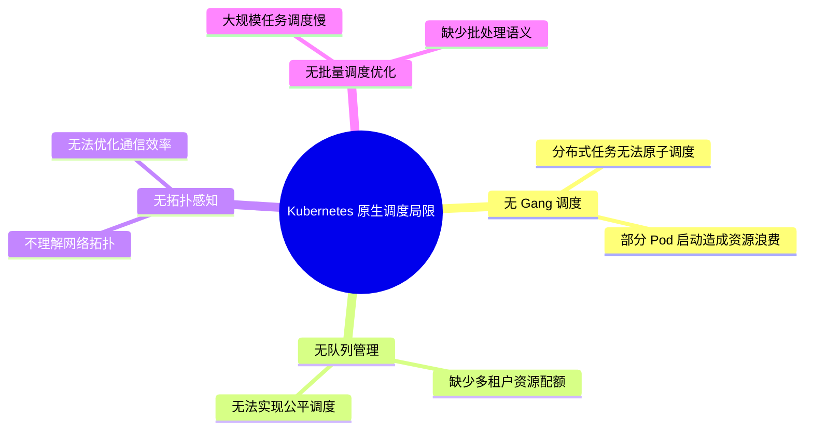
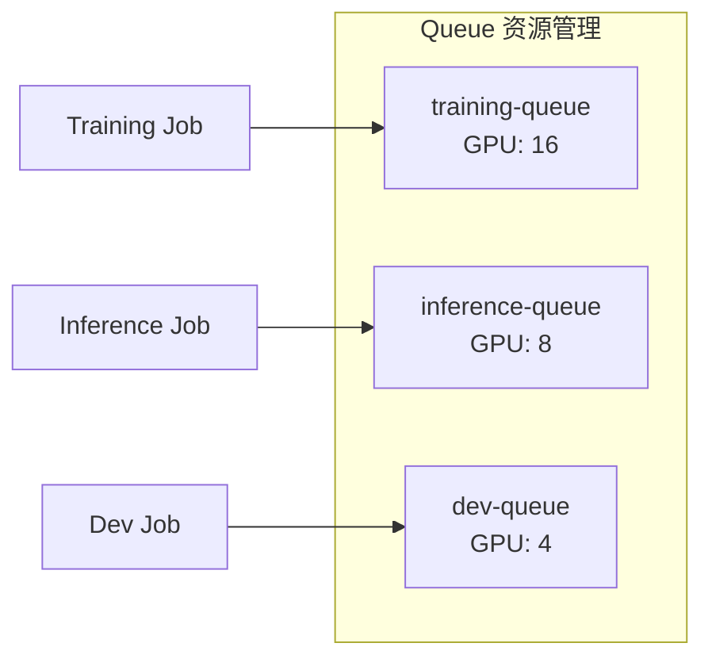
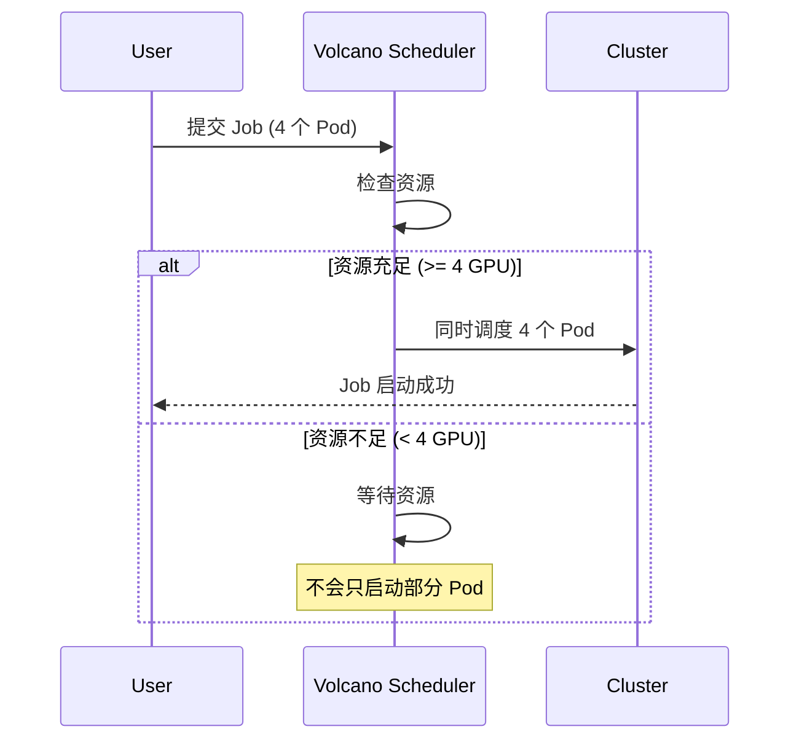
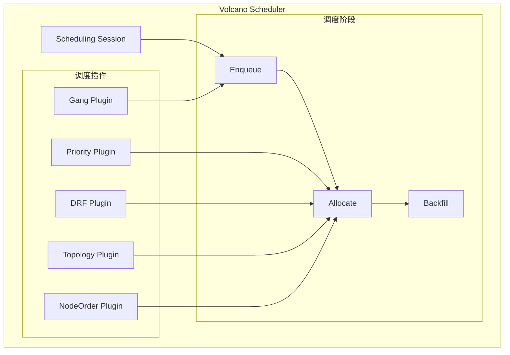

# Volcano 概述与核心概念

## 1. 什么是 Volcano？

Volcano 是一个基于 Kubernetes 的**云原生批量调度系统**，专为高性能计算 (HPC)、AI/ML、大数据等场景设计。它是 CNCF 孵化项目，扩展了 Kubernetes 原生调度器的能力。

### 1.1 为什么需要 Volcano？



### 1.2 Volcano 核心特性

| 特性 | 说明 | 场景 |
|------|------|------|
| **Gang Scheduling** | 全部 Pod 同时调度或都不调度 | 分布式训练 |
| **Queue Management** | 多队列资源隔离和优先级 | 多租户平台 |
| **Fair Scheduling** | DRF、Proportion 等公平算法 | 资源争用 |
| **Network Topology** | 网络拓扑感知调度 | 大模型训练 |
| **NUMA Aware** | CPU/内存 NUMA 亲和 | HPC 任务 |
| **Preemption** | 优先级抢占机制 | 紧急任务 |

## 2. 核心概念

### 2.1 Job (VcJob)

Volcano 定义的任务抽象，支持批处理语义：

```yaml
apiVersion: batch.volcano.sh/v1alpha1
kind: Job
metadata:
  name: pytorch-training
spec:
  minAvailable: 4           # 最少需要 4 个 Pod 同时运行
  schedulerName: volcano
  queue: default
  policies:
    - event: PodEvicted
      action: RestartJob
  tasks:
    - name: worker
      replicas: 4
      template:
        spec:
          containers:
          - name: pytorch
            image: pytorch/pytorch:2.0-cuda12.0
            resources:
              limits:
                nvidia.com/gpu: 1
```

### 2.2 Queue

资源队列，实现多租户隔离：

```yaml
apiVersion: scheduling.volcano.sh/v1beta1
kind: Queue
metadata:
  name: training-queue
spec:
  weight: 1
  reclaimable: true
  capability:
    cpu: "100"
    memory: "200Gi"
    nvidia.com/gpu: "16"
```



### 2.3 PodGroup

Pod 组抽象，Gang Scheduling 的核心：

```yaml
apiVersion: scheduling.volcano.sh/v1beta1
kind: PodGroup
metadata:
  name: pytorch-pg
spec:
  minMember: 4              # 最少成员数
  queue: training-queue
  priorityClassName: high-priority
```

### 2.4 Gang Scheduling



**Gang Scheduling 的价值**：

| 场景 | 无 Gang | 有 Gang |
|------|---------|---------|
| 4 Pod 需求，3 GPU 可用 | 启动 3 个 Pod，等待第 4 个 | 全部等待，避免资源浪费 |
| 分布式训练 | 部分启动，其他超时 | 同时启动，正常训练 |
| 资源利用 | 空占资源 | 高效利用 |

## 3. 调度插件架构

Volcano 采用插件化架构，支持灵活扩展：



### 3.1 核心插件

| 插件 | 功能 | 配置参数 |
|------|------|---------|
| **gang** | Gang Scheduling | - |
| **priority** | 优先级排序 | - |
| **drf** | Dominant Resource Fairness | - |
| **proportion** | 按比例分配 | - |
| **nodeorder** | 节点打分排序 | binpack/leastused |
| **predicates** | 节点过滤 | - |
| **topology** | 网络拓扑感知 | hypernode |

### 3.2 调度配置

```yaml
apiVersion: v1
kind: ConfigMap
metadata:
  name: volcano-scheduler-configmap
  namespace: volcano-system
data:
  volcano-scheduler.conf: |
    actions: "enqueue, allocate, backfill"
    tiers:
    - plugins:
      - name: priority
      - name: gang
      - name: conformance
    - plugins:
      - name: drf
      - name: predicates
      - name: proportion
      - name: nodeorder
      - name: binpack
    - plugins:
      - name: topology
        arguments:
          hypernode.scheduler.order: "GPU,RDMA,InfiniBand"
```

## 4. 与 Kubernetes 调度器对比

| 特性 | K8s Scheduler | Volcano |
|------|--------------|---------|
| 调度单位 | Pod | Job/PodGroup |
| Gang 调度 | ❌ | ✅ |
| 队列管理 | ❌ | ✅ |
| 公平调度 | ❌ | ✅ DRF |
| 网络拓扑 | ❌ | ✅ HyperNode |
| NUMA 感知 | 基础 | 增强 |
| 批量任务 | ❌ | ✅ |
| 抢占策略 | 基础 | 丰富 |

## 5. 安装 Volcano

### 5.1 Helm 安装

```bash
# 添加 Helm 仓库
helm repo add volcano-sh https://volcano-sh.github.io/helm-charts
helm repo update

# 安装 Volcano
helm install volcano volcano-sh/volcano \
  --namespace volcano-system \
  --create-namespace
```

### 5.2 验证安装

```bash
# 检查组件
kubectl -n volcano-system get pods

# 预期输出
# NAME                                      READY   STATUS
# volcano-admission-xxxxx                   1/1     Running
# volcano-controllers-xxxxx                 1/1     Running
# volcano-scheduler-xxxxx                   1/1     Running
```

## 6. 快速上手

### 6.1 创建队列

```yaml
apiVersion: scheduling.volcano.sh/v1beta1
kind: Queue
metadata:
  name: default
spec:
  weight: 1
---
apiVersion: scheduling.volcano.sh/v1beta1
kind: Queue
metadata:
  name: high-priority
spec:
  weight: 2
```

### 6.2 提交分布式训练任务

```yaml
apiVersion: batch.volcano.sh/v1alpha1
kind: Job
metadata:
  name: pytorch-ddp
spec:
  minAvailable: 2
  schedulerName: volcano
  queue: default
  plugins:
    ssh: []
    env: []
    svc: []
  tasks:
  - name: worker
    replicas: 2
    template:
      spec:
        containers:
        - name: pytorch
          image: pytorch/pytorch:2.0-cuda12.0
          command: ["python", "-m", "torch.distributed.launch"]
          args: ["--nproc_per_node=1", "train.py"]
          resources:
            limits:
              nvidia.com/gpu: 1
        restartPolicy: OnFailure
```

## 7. 总结

| 概念 | 说明 |
|------|------|
| **Volcano** | Kubernetes 批量调度系统 |
| **VcJob** | Volcano 任务抽象 |
| **Queue** | 资源队列，多租户隔离 |
| **PodGroup** | Pod 组，Gang 调度单位 |
| **Gang Scheduling** | 全部或无调度 |
| **Plugin** | 可插拔调度策略 |

> [!TIP]
> Volcano 是运行 AI 大模型训练的首选调度器，其 Gang Scheduling 和网络拓扑感知能力对分布式训练至关重要。
