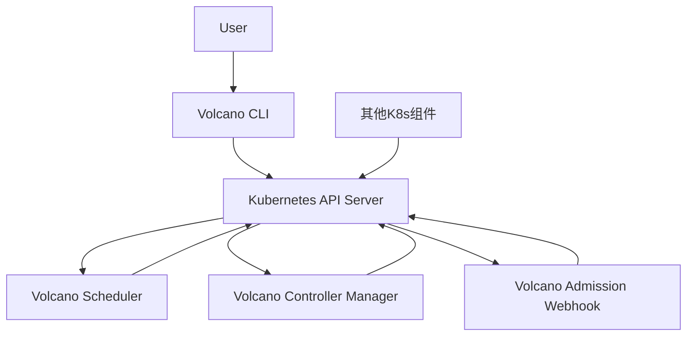
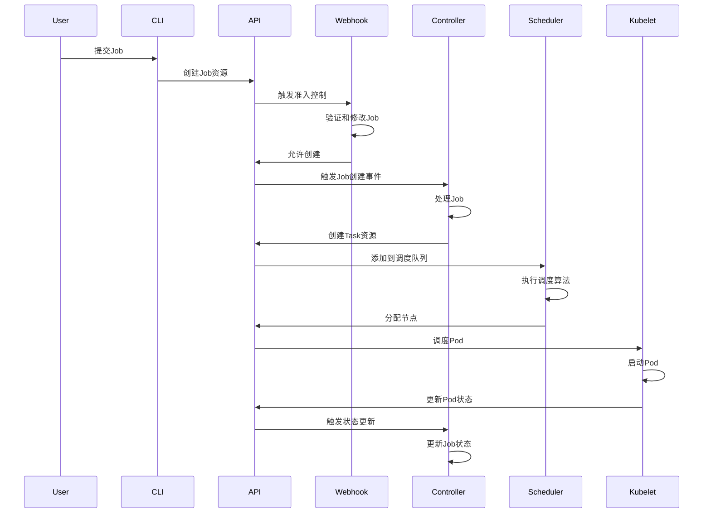
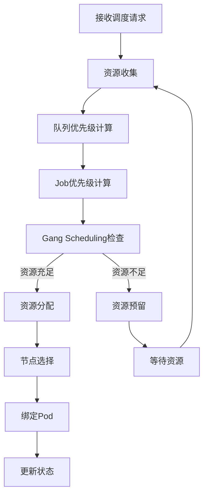

# Volcano架构设计

## 📋 概述

Volcano采用云原生架构设计，无缝集成Kubernetes生态，主要由调度器、控制器、准入控制器和CLI工具组成，共同实现高效的批处理调度。

## 🏗️ 系统架构

### 1. 整体架构图

### 2. 核心组件

#### 2.1 Volcano Scheduler
> 负责资源调度的核心组件

- **功能**：
  - 实现Gang Scheduling算法
  - 资源预留和分配
  - 队列管理和优先级调度
  - 节点亲和性和反亲和性支持
- **设计**：插件化架构，支持自定义调度策略
- **相关链接**：[[Scheduler]]

#### 2.2 Volcano Controller Manager
> 负责Job和Queue的生命周期管理

- **功能**：
  - Job创建、更新、删除
  - Task管理和状态同步
  - Queue管理和资源配额
  - 事件处理和状态更新
- **设计**：基于Kubernetes Controller模式
- **相关链接**：[[Controller]]

#### 2.3 Volcano Admission Webhook
> 负责资源验证和修改

- **功能**：
  - 验证Job和Queue配置
  - 修改资源配置，添加默认值
  - 执行准入策略
  - 资源配额检查
- **设计**：基于Kubernetes Admission Webhook机制
- **相关链接**：[[Admission Webhook]]

#### 2.4 Volcano CLI
> 命令行工具，用于管理Volcano资源

- **功能**：
  - 提交和管理Job
  - 管理Queue和资源配额
  - 查看调度状态和事件
  - 配置Volcano
- **设计**：基于kubectl插件机制
- **相关链接**：[[CLI]]

## 🔄 工作流程

### 1. Job提交流程

### 2. 调度决策流程

## 🎯 设计原则

### 1. 云原生原生
- 基于Kubernetes API和控制器模式
- 支持CRD扩展
- 无缝集成Kubernetes生态

### 2. 插件化设计
- 调度器支持插件扩展
- 控制器支持多种Job类型
- 支持自定义调度策略

### 3. 高性能
- 并行调度算法
- 高效的资源管理
- 优化的调度决策流程

### 4. 可扩展性
- 支持大规模集群（万级节点）
- 支持多种硬件加速设备
- 支持多种计算框架

### 5. 高可用性
- 调度器支持HA部署
- 控制器支持Leader选举
- 状态持久化到Kubernetes API

## 🔗 相关链接

### 核心概念
- [[../核心概念/Volcano核心概念|Volcano核心概念]]
- [[../核心概念/Gang Scheduling|Gang Scheduling]]

### 部署指南
- [[../部署指南/Volcano部署指南|Volcano部署指南]]

### 实践案例
- [[../实践案例/Volcano实践案例|Volcano实践案例]]

## 💡 架构优势

### 1. 与Kubernetes深度集成
- 复用Kubernetes的资源管理和调度框架
- 支持Kubernetes的所有资源类型
- 无缝集成Kubernetes的监控和日志系统

### 2. 强大的调度能力
- 支持多种调度策略
- 专为批处理优化
- 支持复杂的依赖关系

### 3. 灵活的扩展性
- 支持自定义调度插件
- 支持多种Job类型
- 支持异构资源管理

### 4. 高可靠性
- 基于成熟的Kubernetes架构
- 支持高可用部署
- 完善的错误处理和恢复机制

## 📊 性能特性

| 特性 | 指标 | 说明 |
|------|------|------|
| **调度延迟** | <100ms | 单个Job的调度延迟 |
| **吞吐量** | >1000 Jobs/秒 | 支持大规模Job并发调度 |
| **集群规模** | 支持万级节点 | 适合超大规模集群 |
| **资源利用率** | >80% | 优化的资源分配算法 |

## 💬 思考问题

1. Volcano架构如何实现与Kubernetes的无缝集成？
2. 插件化设计在Volcano架构中的优势是什么？
3. 如何提高Volcano调度器的性能？
4. 在大规模集群中，如何确保Volcano的可靠性？
