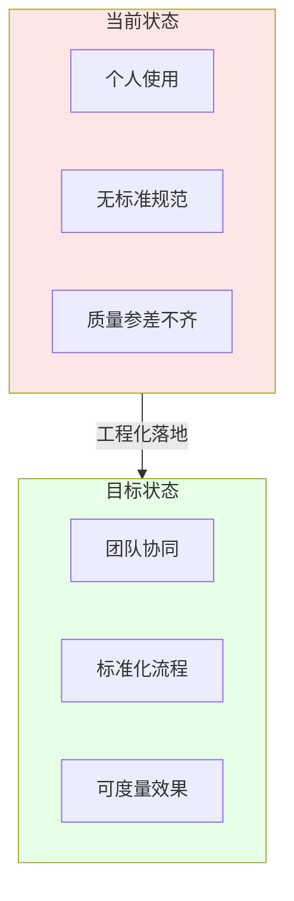
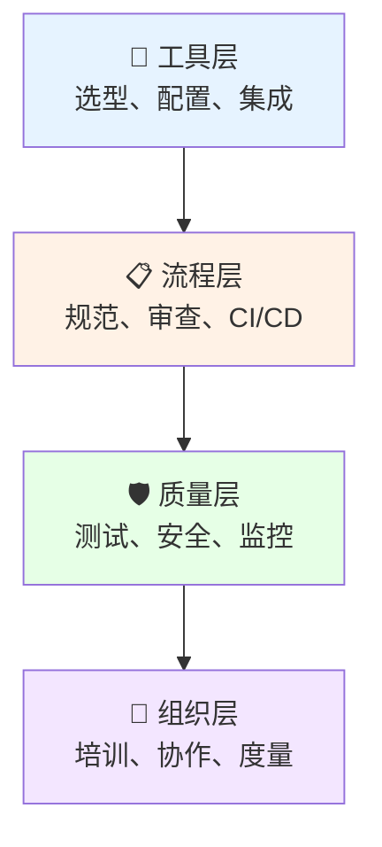
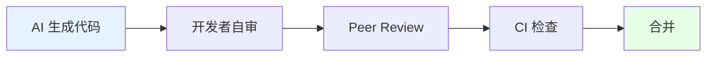
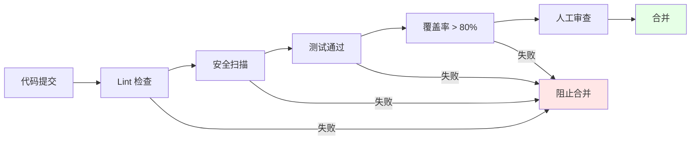
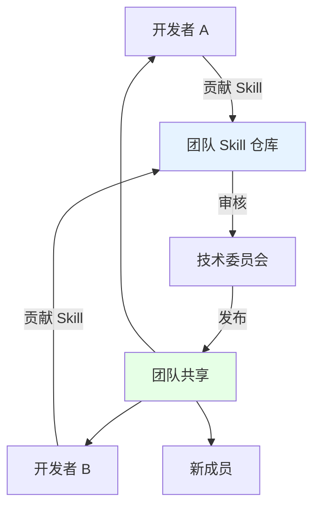

# AI 编码工程化落地指南

## 📋 概述

将 AI 编码从"个人提效工具"转变为"工程化生产力工具"，需要在**工具选型、流程规范、质量保障、团队协作**等维度进行系统性建设。

> [!IMPORTANT] 核心挑战
> AI 编码工具的最大风险不是"用不起来"，而是"用得乱"——缺乏规范导致代码质量下降、安全隐患、知识割裂。



---

## 🎯 工程化落地框架

### 四层落地模型



| 层级       | 核心目标                   | 关键产出               |
| ---------- | -------------------------- | ---------------------- |
| **工具层** | 统一工具栈，标准化配置     | 工具选型方案、配置模板 |
| **流程层** | 规范使用方式，融入研发流程 | 使用规范、审查清单     |
| **质量层** | 保障代码质量，控制风险     | 测试策略、安全检查     |
| **组织层** | 提升团队能力，度量效果     | 培训体系、效能指标     |

---

## 🔧 工具层：选型与配置

### 1. 工具选型矩阵

| 场景                | 推荐工具            | 理由                      |
| ------------------- | ------------------- | ------------------------- |
| **日常开发（IDE）** | Cursor / Windsurf   | 深度 IDE 集成，Agent 模式 |
| **代码审查**        | Claude / GPT-4      | 强推理能力，长上下文      |
| **终端/自动化**     | Aider / Claude Code | CLI 原生，Git 集成        |
| **企业私有化**      | Continue + 私有模型 | 数据安全，自主可控        |

### 2. 统一配置管理

#### 项目级配置 `.cursor/rules` 或 `.agent/`

```
.agent/
├── config.yaml          # 全局配置
├── rules/               # 编码规范
│   ├── coding-style.md
│   └── security.md
├── skills/              # 团队 Skill
│   ├── api-design/
│   └── code-review/
└── workflows/           # 标准工作流
    ├── feature-dev.md
    └── bug-fix.md
```

#### 配置示例：`config.yaml`

```yaml
# AI 编码工具全局配置
project:
  name: my-project
  language: [go, python]
  framework: [kubernetes, gin]

rules:
  - 遵循 Google Go Style Guide
  - 所有 API 需要错误处理
  - 敏感信息不得硬编码

context:
  always_include:
    - README.md
    - docs/architecture.md
  ignore:
    - vendor/
    - node_modules/
```

### 3. MCP 服务器标准化

| 服务器       | 用途       | 配置优先级 |
| ------------ | ---------- | ---------- |
| `filesystem` | 文件读写   | 必须       |
| `git`        | 版本控制   | 必须       |
| `memory`     | 上下文记忆 | 推荐       |
| `database`   | 数据库操作 | 按需       |
| 自定义       | 业务特定   | 按需       |

---

## 📋 流程层：规范与集成

### 1. AI 编码使用规范

#### 适用场景

| ✅ 推荐使用  | ❌ 谨慎使用       |
| ------------ | ----------------- |
| 新功能开发   | 核心算法实现      |
| 代码重构     | 安全敏感代码      |
| 测试用例生成 | 生产配置修改      |
| 文档编写     | 金融/医疗关键逻辑 |
| 代码解释     |                   |

#### 审查要求



> [!WARNING] 强制规则
> **AI 生成的代码必须经过人工审查后才能合并**，尤其是涉及安全、性能、业务核心逻辑的变更。

### 2. Commit 规范

```
# AI 辅助的 Commit 需要标注
feat(user): add user profile API [ai-assisted]
fix(auth): resolve token expiration bug [ai-generated]
refactor(db): optimize query performance [ai-suggested]
```

### 3. CI/CD 集成

```yaml
# .github/workflows/ai-code-check.yml
name: AI Code Quality Check

on: [pull_request]

jobs:
  ai-code-review:
    runs-on: ubuntu-latest
    steps:
      - uses: actions/checkout@v4

      # AI 生成代码检测
      - name: Detect AI-generated code
        run: |
          grep -r "ai-assisted\|ai-generated" --include="*.go" || true

      # 静态分析
      - name: Static Analysis
        run: golangci-lint run

      # 安全扫描
      - name: Security Scan
        run: gosec ./...

      # 测试覆盖率检查
      - name: Test Coverage
        run: |
          go test -coverprofile=coverage.out ./...
          go tool cover -func=coverage.out
```

### 4. 代码审查清单

```markdown
## AI 生成代码审查清单

### 功能正确性

- [ ] 代码逻辑是否符合需求
- [ ] 边界条件是否处理
- [ ] 错误处理是否完善

### 代码质量

- [ ] 命名是否清晰
- [ ] 是否有冗余代码
- [ ] 是否符合团队规范

### 安全检查

- [ ] 是否有敏感信息泄露
- [ ] 输入是否有校验
- [ ] 权限检查是否到位

### 性能考虑

- [ ] 是否有性能隐患
- [ ] 资源是否正确释放
- [ ] 是否需要缓存

### 可维护性

- [ ] 代码是否易于理解
- [ ] 是否有足够注释
- [ ] 测试是否覆盖
```

---

## 🛡️ 质量层：测试与安全

### 1. 测试策略

| 类型         | AI 辅助方式     | 人工职责     |
| ------------ | --------------- | ------------ |
| **单元测试** | AI 生成测试用例 | 审查边界条件 |
| **集成测试** | AI 生成测试框架 | 定义测试场景 |
| **E2E 测试** | AI 辅助脚本编写 | 验证业务流程 |

#### 测试生成 Skill

```markdown
# 测试生成 Skill

## 目标

为给定代码生成完整的测试用例

## 要求

1. 覆盖所有公开方法
2. 包含正常路径和异常路径
3. 包含边界条件测试
4. 使用表驱动测试（Go）或 pytest.mark.parametrize（Python）
5. Mock 外部依赖

## 输出格式

- 测试文件命名：`*_test.go` 或 `test_*.py`
- 每个测试函数有清晰的注释说明测试目的
```

### 2. 安全检查

#### 禁止 AI 处理的敏感信息

| 类型     | 示例           | 处理方式     |
| -------- | -------------- | ------------ |
| 认证凭据 | API Key, Token | 环境变量     |
| 加密密钥 | 私钥, 证书     | 密钥管理服务 |
| 用户数据 | PII, 密码      | 脱敏处理     |
| 业务机密 | 定价算法       | 限制 AI 访问 |

#### 安全扫描集成

```yaml
# 安全扫描工具
- gosec # Go 安全检查
- bandit # Python 安全检查
- trivy # 容器/依赖扫描
- gitleaks # 敏感信息泄露检测
```

### 3. 质量门禁



---

## 👥 组织层：培训与度量

### 1. 培训体系

#### 分级培训

| 级别    | 目标人群    | 培训内容               | 时长 |
| ------- | ----------- | ---------------------- | ---- |
| L1 基础 | 全体开发者  | 工具使用、基本规范     | 2h   |
| L2 进阶 | 骨干开发者  | Agent 模式、Skill 编写 | 4h   |
| L3 专家 | 技术 Leader | MCP 开发、团队规范制定 | 8h   |

#### 培训内容大纲

```
L1 基础培训
├── AI 编码工具概述
├── 基本使用方法
├── Prompt 编写技巧
├── 常见问题与注意事项
└── 团队规范介绍

L2 进阶培训
├── Agent 模式深度使用
├── 多文件编辑技巧
├── Skill 编写与使用
├── 工作流定制
└── 最佳实践案例

L3 专家培训
├── MCP 协议与服务器开发
├── 团队 Skill 库建设
├── 质量保障体系设计
├── 效能度量方法
└── 问题排查与优化
```

### 2. 效能度量

#### 核心指标

| 指标             | 定义                    | 目标       |
| ---------------- | ----------------------- | ---------- |
| **AI 采纳率**    | AI 生成代码被采纳的比例 | > 60%      |
| **返工率**       | AI 代码需要修改的比例   | < 30%      |
| **开发速度提升** | 对比无 AI 的开发周期    | > 30%      |
| **Bug 率**       | AI 辅助代码的缺陷密度   | ≤ 人工水平 |
| **安全问题数**   | AI 代码引入的安全问题   | 0          |

#### 度量看板

```
┌─────────────────────────────────────────────────────────┐
│                   AI 编码效能看板                        │
├─────────────────┬─────────────────┬─────────────────────┤
│  AI 采纳率      │  代码合格率      │  效率提升           │
│     68%         │     94%          │     +45%           │
│   ▲ +5%         │   ▲ +2%          │   ▲ +8%            │
├─────────────────┴─────────────────┴─────────────────────┤
│  本周 AI 辅助代码量: 12,450 行                          │
│  AI 生成测试覆盖: 2,340 个用例                          │
│  安全问题: 0                                            │
└─────────────────────────────────────────────────────────┘
```

### 3. 团队协作模式

#### Skill 共享机制



#### 知识沉淀

| 类型     | 沉淀形式   | 负责人       |
| -------- | ---------- | ------------ |
| 最佳实践 | Skill 模块 | 各方向负责人 |
| 踩坑经验 | FAQ 文档   | 全员贡献     |
| 复杂案例 | 案例库     | 项目 Owner   |

---

## 📅 落地路线图

### Phase 1: 试点期（1-2 周）

```
目标：小范围验证，快速迭代
├── 选择 1-2 个项目试点
├── 安装配置工具
├── 制定基本规范
└── 收集问题反馈
```

### Phase 2: 推广期（2-4 周）

```
目标：扩大范围，完善流程
├── 扩展到更多项目
├── 完善使用规范
├── 建立审查流程
├── 开展 L1 培训
└── 建立 Skill 库
```

### Phase 3: 成熟期（1-2 月）

```
目标：全面落地，持续优化
├── 全团队推广
├── CI/CD 集成
├── 效能度量体系
├── 高阶培训
└── 持续优化
```

### 里程碑检查点

| 阶段   | 关键指标   | 达标标准 |
| ------ | ---------- | -------- |
| 试点期 | 试点满意度 | > 80%    |
| 推广期 | 工具覆盖率 | > 60%    |
| 成熟期 | AI 采纳率  | > 60%    |
| 成熟期 | 效率提升   | > 30%    |

---

## ⚠️ 常见问题与应对

### 问题 1: AI 生成代码质量不稳定

**原因**: 上下文不足、规范不明确

**对策**:

- 完善项目 Rules 和 Skill
- 提供更多示例代码
- 分步骤生成，逐步验证

### 问题 2: 团队成员抵触

**原因**: 担心被取代、学习成本

**对策**:

- 强调"辅助"而非"替代"
- 提供充分培训
- 展示成功案例

### 问题 3: 安全合规担忧

**原因**: 代码泄露、数据安全

**对策**:

- 选择合规工具/私有化部署
- 明确禁止处理敏感数据
- 定期安全审计

### 问题 4: 效果难以量化

**原因**: 缺乏基线、度量不清

**对策**:

- 建立效能基线
- 采集关键指标
- 定期复盘对比

---

## 🔗 相关资源

- [[Agent-MCP-Skill核心概念]] - 核心概念理解
- [[Agentic Coding实践指南]] - Agent 使用技巧
- [[Agent与Skill演进分析]] - 演进趋势与利弊
- [[MCP协议与工具扩展]] - MCP 深度指南
- [[MOC - AI编码工具]] - 返回索引
