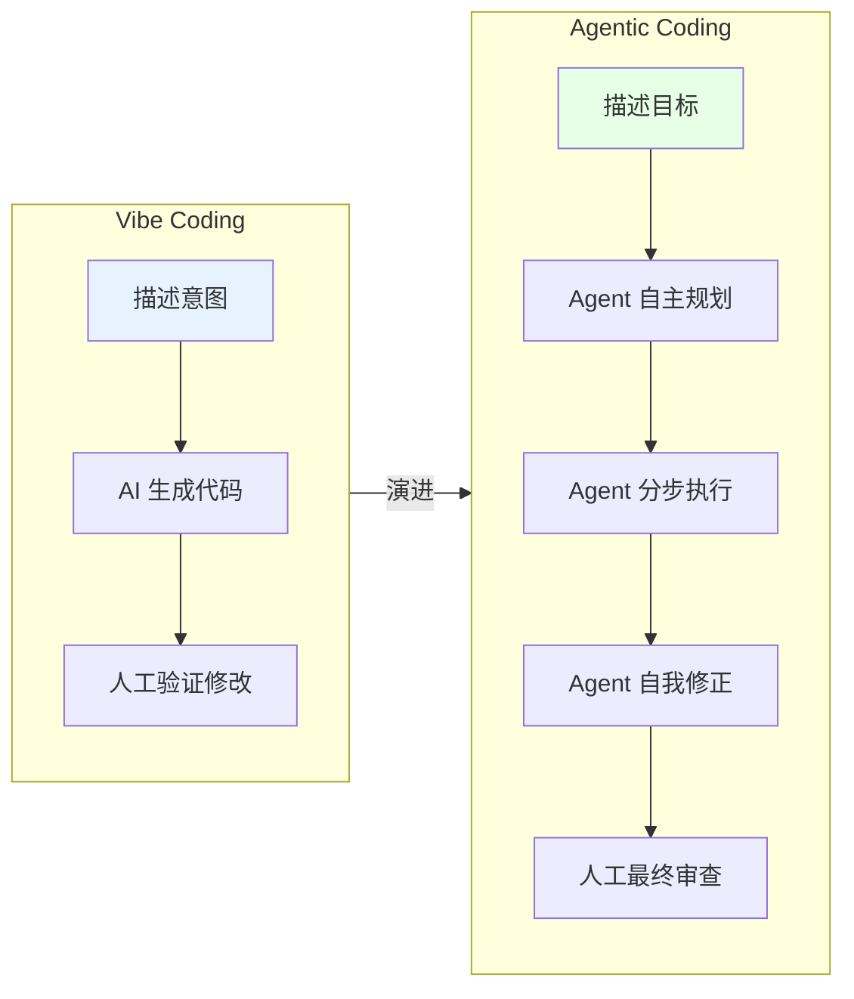
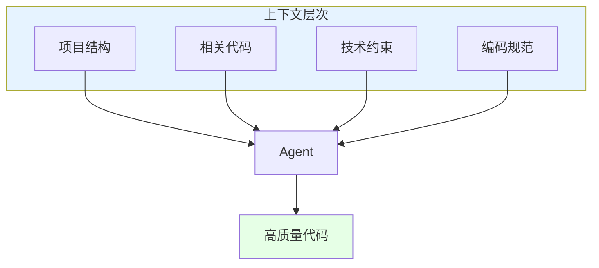
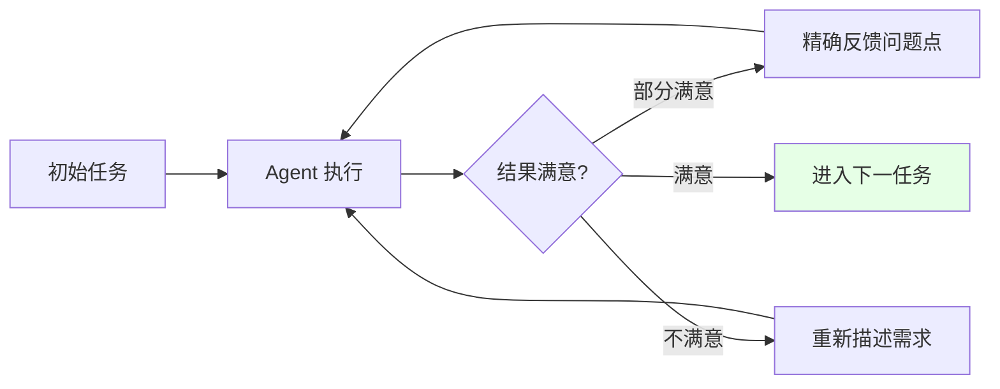
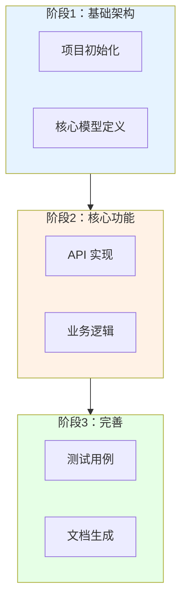
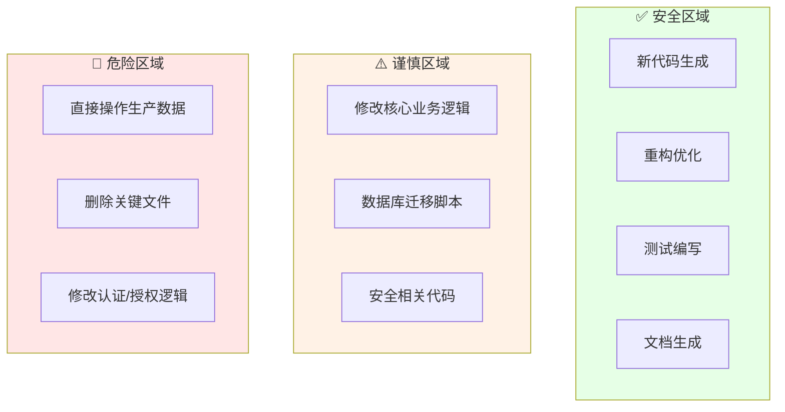
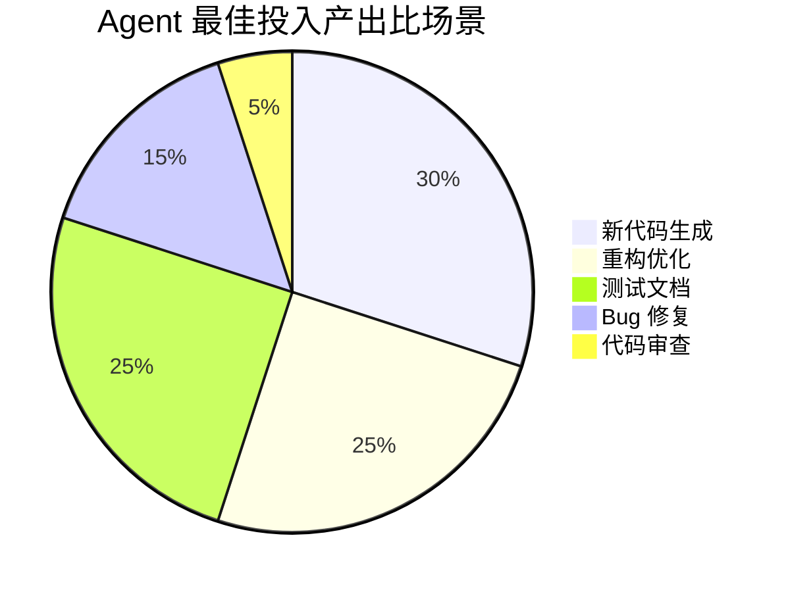

# Agentic Coding 实践指南

## 📋 什么是 Agentic Coding

> [!NOTE] 定义
> **Agentic Coding** 是一种让 AI Agent 自主规划、执行和修正编码任务的开发范式。
> 开发者从"代码实现者"转变为"任务指挥者"和"质量审核者"。

### 从 Vibe Coding 到 Agentic Coding



| 维度           | Vibe Coding          | Agentic Coding               |
| -------------- | -------------------- | ---------------------------- |
| **AI 角色**    | 代码生成器           | 自主编程助手                 |
| **人工参与**   | 每轮交互都需人工反馈 | 任务级别指导，Agent 自主执行 |
| **执行模式**   | 单次生成             | 多步规划执行                 |
| **错误处理**   | 人工发现并描述问题   | Agent 自动发现并尝试修复     |
| **适用复杂度** | 单一功能             | 跨文件、多步骤任务           |

---

## 🛠️ 主流 Agent 工具对比

### 工具概览

| 工具                  | 类型          | Agent 能力 | 最佳场景             |
| --------------------- | ------------- | ---------- | -------------------- |
| **Cursor Agent Mode** | IDE 内置      | ⭐⭐⭐⭐⭐ | 复杂重构、多文件编辑 |
| **Claude Code**       | 终端 Agent    | ⭐⭐⭐⭐⭐ | 新项目搭建、系统设计 |
| **Windsurf Cascade**  | AI-Native IDE | ⭐⭐⭐⭐   | 日常开发、代码探索   |
| **Aider**             | CLI 开源工具  | ⭐⭐⭐⭐   | 终端用户、Git 自动化 |
| **Devin / OpenHands** | 全自主 Agent  | ⭐⭐⭐⭐⭐ | 独立任务、POC 开发   |

### Cursor Agent Mode

> [!TIP] 核心优势
> 深度 IDE 集成，实时执行和反馈

**特性：**

- 多文件同时编辑
- 自动运行命令验证
- 上下文记忆用户偏好
- 支持 Cmd+Enter 快速生成

**典型交互流程：**

```
用户：创建一个 Express + TypeScript 的 REST API，包含用户 CRUD 操作

Agent 执行步骤：
1. 分析需求，确定文件结构
2. 创建 package.json 和 tsconfig.json
3. 创建 src/index.ts 入口文件
4. 创建 src/routes/users.ts 路由
5. 创建 src/controllers/userController.ts
6. 创建 src/models/user.ts 数据模型
7. 运行 npm install
8. 运行 npm run dev 验证
```

### Claude Code

> [!TIP] 核心优势
> 强大推理能力，终端原生体验

**特性：**

- 终端直接运行
- 自动分析和修复错误
- 深度理解代码库
- 支持复杂推理任务

**适用场景：**

- 新项目从零搭建
- 复杂算法实现
- 架构设计与重构

### Aider

> [!NOTE] 核心优势
> 完全开源，Git 深度集成

**特性：**

- 自动生成清晰的 commit message
- 支持多种 LLM（Claude、GPT、本地模型）
- 完整代码库映射
- 支持语音、图片输入

**安装与使用：**

```bash
# 安装
pip install aider-chat

# 使用 Claude
export ANTHROPIC_API_KEY=your_key
aider --model claude-3-5-sonnet-20241022

# 使用 GPT-4
export OPENAI_API_KEY=your_key
aider --model gpt-4o
```

---

## 📝 Agent 模式最佳实践

### 1. 任务描述技巧

> [!IMPORTANT] 核心原则
> **清晰、完整、有约束**的任务描述是 Agent 成功的关键

**任务描述模板：**

```markdown
## 目标

[一句话描述要完成什么]

## 技术栈

- 语言/框架：[如 Python 3.11 + FastAPI]
- 数据库：[如 PostgreSQL]
- 其他依赖：[如 Redis 缓存]

## 详细需求

1. [功能点1]
2. [功能点2]
3. ...

## 约束条件

- [性能要求、安全要求等]

## 验收标准

- [如何判断任务完成]
```

**❌ 不好的描述：**

```
帮我写个用户系统
```

**✅ 好的描述：**

```
创建一个用户认证模块，包含：
1. 注册接口：邮箱+密码，密码使用 bcrypt 哈希
2. 登录接口：返回 JWT token，有效期 7 天
3. 用户信息接口：需要 token 验证

技术栈：FastAPI + SQLAlchemy + PostgreSQL
要求：
- 所有接口需要输入验证
- 错误返回统一格式
- 包含单元测试
```

### 2. 上下文管理



**上下文提供策略：**

| 场景       | 需要提供的上下文           |
| ---------- | -------------------------- |
| 新功能开发 | 现有代码结构、相关模块代码 |
| Bug 修复   | 错误日志、相关代码片段     |
| 重构       | 当前实现、目标架构         |
| API 开发   | 现有 API 风格、数据模型    |

### 3. 迭代反馈策略



**反馈技巧：**

**❌ 模糊反馈：**

```
这个不太对，再改改
```

**✅ 精确反馈：**

```
有两个问题需要修改：
1. 用户注册时邮箱验证缺失，需要添加格式校验
2. 登录失败时应返回 401 而非 400
```

### 4. 分阶段执行

对于复杂任务，采用分阶段执行策略：



**实践建议：**

1. 每个阶段完成后审查验证
2. 发现问题及时修正，避免累积
3. 阶段之间可以调整后续计划

---

## 🎯 典型使用场景

### 场景一：复杂重构

```
任务：将现有的 Express.js 项目迁移到 NestJS

Agent 执行流程：
1. 分析现有项目结构
2. 创建 NestJS 项目骨架
3. 逐模块迁移：
   - 迁移用户模块
   - 迁移订单模块
   - 迁移支付模块
4. 迁移中间件和守卫
5. 更新配置文件
6. 运行测试验证
7. 生成迁移报告
```

**效率提升：** 传统手动迁移可能需要 2-3 天，Agent 辅助可在数小时内完成初步迁移。

### 场景二：功能开发

```
任务：为电商系统添加优惠券功能

Agent 执行流程：
1. 设计数据模型（Coupon, UserCoupon）
2. 创建数据库迁移脚本
3. 实现核心服务：
   - 创建优惠券
   - 领取优惠券
   - 使用优惠券
   - 优惠券验证
4. 实现 API 接口
5. 添加优惠券计算到订单流程
6. 编写单元测试
7. 编写 API 文档
```

### 场景三：Bug 修复

```
问题描述：
用户反馈订单支付后状态没有更新，支付回调日志显示：
"Error: Transaction already completed"

Agent 执行流程：
1. 分析支付回调处理代码
2. 识别问题：并发请求导致重复处理
3. 实现修复方案：添加分布式锁
4. 添加幂等性检查
5. 编写回归测试
6. 验证修复效果
```

### 场景四：文档生成

```
任务：为项目 API 生成完整文档

Agent 执行流程：
1. 扫描所有 API 路由
2. 分析请求/响应类型
3. 生成 OpenAPI 规范文件
4. 生成 Markdown 格式 API 文档
5. 添加使用示例
6. 生成邮递员集合
```

---

## ⚠️ 风险与注意事项

### 1. 代码审查要点

> [!CAUTION] 关键警示
> Agent 生成的代码必须经过人工审查，特别是关键逻辑

**审查清单：**

| 类别     | 检查点                            |
| -------- | --------------------------------- |
| **安全** | 输入验证、SQL 注入、XSS、权限检查 |
| **逻辑** | 边界条件、异常处理、并发安全      |
| **性能** | N+1 查询、内存泄漏、无限循环风险  |
| **规范** | 代码风格、命名规范、文档注释      |

### 2. 安全边界设定



**建议：**

- 敏感操作设置人工确认点
- 生产环境操作严格审批
- 保持完整的操作日志

### 3. 成本控制

| 工具       | 计费方式      | 成本优化建议         |
| ---------- | ------------- | -------------------- |
| Cursor Pro | $20/月固定    | 充分利用额度         |
| Claude API | 按 token 计费 | 精简上下文，避免冗余 |
| Aider      | 按 API 计费   | 选择合适的模型       |

**成本优化策略：**

1. 简单任务使用便宜模型
2. 复杂任务才使用高端模型
3. 合理控制上下文长度
4. 批量处理相似任务

---

## 📈 效率量化

### 典型场景效率对比

| 场景         | 传统开发 | Agent 辅助 | 提效幅度   |
| ------------ | -------- | ---------- | ---------- |
| 新项目初始化 | 2-4小时  | 15-30分钟  | **80-90%** |
| 复杂功能开发 | 1-2天    | 2-4小时    | **70-80%** |
| 跨文件重构   | 4-8小时  | 30-60分钟  | **80-85%** |
| Bug 分析修复 | 1-4小时  | 15-45分钟  | **60-75%** |
| 测试用例编写 | 2-4小时  | 30-60分钟  | **75-85%** |

### 最大化 Agent 价值



---

## 🎯 最佳实践总结

### Do's ✅

1. **清晰描述目标**：提供完整的任务描述和约束
2. **提供充足上下文**：包含相关代码、结构、规范
3. **分阶段执行**：复杂任务拆分，逐步验证
4. **及时精确反馈**：问题描述具体，避免模糊
5. **保持审查习惯**：所有生成代码必须审查

### Don'ts ❌

1. **盲目信任**：不审查直接使用 Agent 生成的代码
2. **过度放权**：让 Agent 执行敏感操作无人监管
3. **忽略上下文**：不提供必要的项目信息
4. **模糊反馈**：只说"不对"而不说明具体问题
5. **一步到位**：期望 Agent 一次完成所有工作

---

## 🔗 相关资源

- [[Agent-MCP-Skill核心概念]] - 核心概念详解
- [[MCP协议与工具扩展]] - MCP 配置与 Skill 开发
- [[Vibe Coding提效指南]] - AI 编码基础方法论
- [[AI编码工具对比分析]] - 工具选型参考
- [[MOC - AI编码工具]] - 返回索引

---

_最后更新：2026-01-26_
