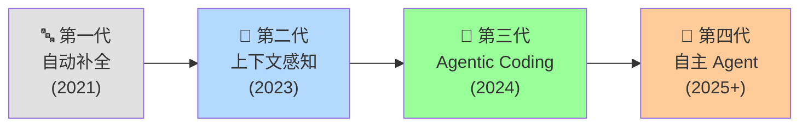
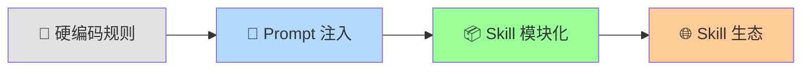
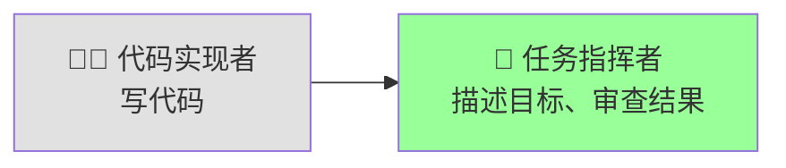
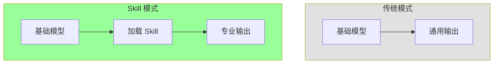
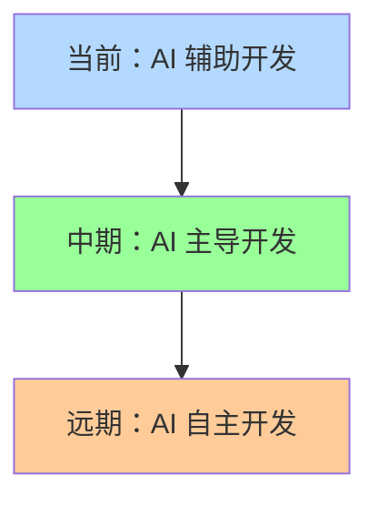

# Agent 与 Skill 演进分析：技术意义与开发者影响

## 📋 概述

AI 编码工具正经历从"代码补全"到"自主编程"的范式转变。**Agent** 和 **Skill** 是这一转变中的两个关键概念，它们的演进深刻影响着开发者的工作方式。

> [!IMPORTANT] 核心观点
> Agent 让 AI 从"被动响应"升级为"主动协作"，Skill 让专业知识从"隐性经验"转化为"显式资产"。二者的演进既带来效率革命，也伴随新的挑战。

---

## 🔄 演进历程

### Agent 演进路径



| 代际       | 代表产品                  | 核心能力             | 技术突破               |
| ---------- | ------------------------- | -------------------- | ---------------------- |
| **第一代** | GitHub Copilot (早期)     | 行级补全             | 基于上下文的代码预测   |
| **第二代** | Copilot Chat, Cursor      | 文件级理解           | 多轮对话、代码解释     |
| **第三代** | Cursor Agent, Claude Code | 多文件操作、工具调用 | **自主规划、闭环执行** |
| **第四代** | Devin, OpenHands          | 端到端任务完成       | 最小化人工干预         |

### Skill 演进路径



| 阶段             | 方式               | 问题                 | 改进                 |
| ---------------- | ------------------ | -------------------- | -------------------- |
| **硬编码**       | 规则写死在代码中   | 无法扩展，修改成本高 | -                    |
| **Prompt 注入**  | 对话中手动描述规范 | 每次重复，容易遗漏   | 上下文利用率提高     |
| **Skill 模块化** | 封装为独立文件     | 需要维护成本         | 知识可复用、可版本化 |
| **Skill 生态**   | 社区共享、市场化   | 质量参差不齐         | 专业能力即插即用     |

---

## 🎯 技术意义

### Agent 的技术意义

#### 1. 编程范式转变

| 维度         | 传统开发           | Agent 辅助开发             |
| ------------ | ------------------ | -------------------------- |
| **任务分解** | 开发者手动分析     | Agent 自动规划步骤         |
| **代码生成** | 逐行手写或片段补全 | Agent 多文件批量生成       |
| **错误处理** | 手动调试、搜索     | Agent 自动分析、修复、重试 |
| **验证确认** | 手动运行测试       | Agent 自动执行验证         |

#### 2. 开发者角色转变



> [!TIP] 核心转变
> 开发者从「How to code」转向「What to achieve」，更关注业务逻辑和系统设计。

#### 3. 效率量化提升

| 任务类型     | 传统方式       | Agent 模式     | 效率提升  |
| ------------ | -------------- | -------------- | --------- |
| 新项目搭建   | 2-4 小时       | 10-30 分钟     | **5-10x** |
| 功能模块开发 | 1-2 天         | 2-4 小时       | **3-5x**  |
| Bug 修复     | 30 分钟-2 小时 | 5-15 分钟      | **4-8x**  |
| 代码重构     | 数小时-数天    | 30 分钟-2 小时 | **5-10x** |

### Skill 的技术意义

#### 1. 知识资产化

| 知识类型     | 传统形式       | Skill 形式 | 价值转化     |
| ------------ | -------------- | ---------- | ------------ |
| **团队规范** | 文档、口头约定 | 可执行指令 | AI 自动遵守  |
| **最佳实践** | 靠经验传承     | 显式定义   | 新人立即可用 |
| **领域知识** | 专家脑中       | 结构化编码 | 赋能 AI      |
| **工作流程** | 手工操作       | 自动化脚本 | 一键执行     |

#### 2. 能力扩展模式



**关键优势**：无需微调模型，通过 Skill 注入即可获得特定领域能力。

---

## ✅ 对开发者的利

### Agent 带来的好处

| 收益         | 说明                       | 场景示例               |
| ------------ | -------------------------- | ---------------------- |
| **效率飞跃** | 复杂任务自动规划执行       | 多文件重构、新功能开发 |
| **降低门槛** | 不熟悉的技术栈也能快速上手 | 使用新框架、学习新语言 |
| **减少重复** | 模板代码、CRUD 自动生成    | API 开发、测试用例     |
| **闭环验证** | 自动运行测试、修复错误     | CI/CD 场景             |
| **知识辅助** | 边做边学，AI 解释原理      | 探索陌生代码库         |

### Skill 带来的好处

| 收益           | 说明                         | 场景示例           |
| -------------- | ---------------------------- | ------------------ |
| **一致性保证** | 团队规范代码化，输出统一     | 代码风格、API 设计 |
| **知识传承**   | 专家经验显式化，新人快速上手 | 入职培训、知识共享 |
| **复用价值**   | 一次编写，无限复用           | 部署流程、审查清单 |
| **质量提升**   | 最佳实践自动应用             | 安全检查、性能优化 |
| **上下文节省** | 无需每次重复描述需求         | 日常开发           |

---

## ⚠️ 对开发者的弊

### Agent 的风险与挑战

| 风险         | 描述                           | 严重程度 | 缓解策略                      |
| ------------ | ------------------------------ | -------- | ----------------------------- |
| **技能退化** | 过度依赖导致基础编码能力下降   | 🔴 高    | 保持手写练习，理解生成代码    |
| **失控风险** | 复杂任务 Agent 可能"跑偏"      | 🟡 中    | 分步执行，设置人工检查点      |
| **调试困难** | 生成代码难以理解和调试         | 🟡 中    | 要求 Agent 添加注释，分块生成 |
| **安全隐患** | Agent 有权限执行命令、修改文件 | 🔴 高    | 审查敏感操作，限制权限范围    |
| **过度工程** | 简单问题用 Agent 反而更慢      | 🟢 低    | 判断任务复杂度，选择合适工具  |

### Skill 的风险与挑战

| 风险         | 描述                           | 严重程度 | 缓解策略                |
| ------------ | ------------------------------ | -------- | ----------------------- |
| **维护成本** | Skill 需要持续更新             | 🟡 中    | 指定 Owner，定期 Review |
| **知识固化** | 过时 Skill 可能误导 AI         | 🔴 高    | 版本管理，标记有效期    |
| **只知其然** | 不理解 Skill 背后原理          | 🟡 中    | 编写时附加原理说明      |
| **过度封装** | 为每个小任务都写 Skill，成本高 | 🟢 低    | 只封装高频、高价值场景  |
| **依赖风险** | 过度依赖第三方 Skill           | 🟡 中    | 审查内容，必要时本地化  |

---

## 🛡️ 风险缓解最佳实践

### Agent 使用守则

```
✅ 应该做的
├── 始终审查关键代码变更
├── 对敏感操作保持人工确认
├── 分步执行复杂任务，设置检查点
├── 理解 Agent 生成的代码逻辑
└── 保持基础编码能力的练习

❌ 不应该做的
├── 盲目信任 Agent 的所有输出
├── 让 Agent 执行未经审查的脚本
├── 复杂系统一步到位生成
└── 完全放弃手写代码
```

### Skill 管理规范

```
📦 Skill 生命周期管理
├── 创建：只封装高频、高价值场景
├── 审查：使用前检查内容正确性
├── 更新：技术演进时及时更新
├── 归档：过时 Skill 标记废弃
└── 共享：团队统一 Skill 仓库
```

---

## 📊 何时使用？决策矩阵

### Agent 使用场景

| 场景           | 推荐度     | 原因                 |
| -------------- | ---------- | -------------------- |
| 多文件重构     | ⭐⭐⭐⭐⭐ | Agent 擅长跨文件协调 |
| 新功能开发     | ⭐⭐⭐⭐   | 规划 + 生成 + 验证   |
| 探索陌生代码库 | ⭐⭐⭐⭐   | 边问边学             |
| 单行精确修改   | ⭐⭐       | 手动更快更准         |
| 敏感系统操作   | ⭐         | 需要严格人工控制     |

### Skill 使用场景

| 场景         | 推荐度     | 原因                 |
| ------------ | ---------- | -------------------- |
| 团队规范落地 | ⭐⭐⭐⭐⭐ | 一致性是核心价值     |
| 重复性工作流 | ⭐⭐⭐⭐⭐ | 复用价值最大         |
| 复杂部署流程 | ⭐⭐⭐⭐   | 减少出错             |
| 一次性任务   | ⭐⭐       | Skill 编写开销不划算 |
| 探索性工作   | ⭐         | 流程未定型，不宜封装 |

---

## 🔮 未来展望

### 短期趋势 (1-2 年)

- **Agent 能力增强**：更长上下文、更强推理、更好的工具使用
- **Skill 生态繁荣**：社区共享平台、企业 Skill 市场
- **混合工作流**：Agent + Skill + MCP 深度集成

### 长期趋势 (3-5 年)



- **开发者角色**：从"代码编写"转向"需求定义、架构设计、质量把控"
- **核心能力**：系统思维、业务理解、AI 协作能力将更加重要
- **竞争优势**：能够高效驾驭 AI 工具的开发者将更具竞争力

---

## 🎯 给开发者的建议

> [!TIP] 核心原则
> **拥抱 AI 提升效率，但保持对代码的理解和控制力**

### 立即行动

1. **开始使用 Agent 模式**处理复杂任务
2. **为高频工作流编写第一个 Skill**
3. **建立代码审查习惯**，不盲目信任 AI 输出

### 长期投资

1. **保持基础编码能力**，AI 是工具不是替代
2. **培养系统设计能力**，这是 AI 难以替代的
3. **学习 AI 协作技巧**，Prompt 工程、Agent 调优
4. **关注 AI 工具演进**，持续更新工作方式

---

## 🔗 相关资源

- [[Agent-MCP-Skill核心概念]] - 核心概念详解
- [[Agentic Coding实践指南]] - Agent 实战技巧
- [[Vibe Coding提效指南]] - AI 编码基础方法论
- [[MOC - AI编码工具]] - 返回索引
