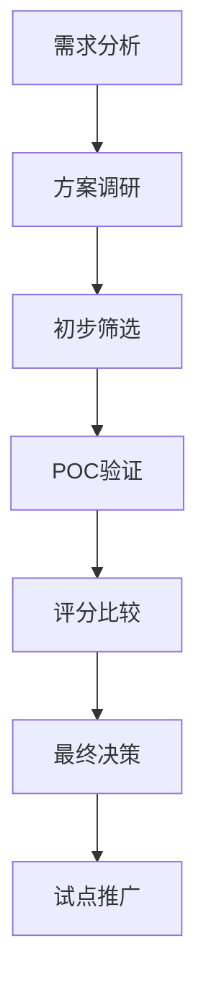

# 技术选型 - 系统化的选型方法论

## 🎯 选型原则

### 核心原则

1. **业务驱动**: 技术服务于业务，而非技术本身
2. **适度超前**: 选择成熟且有发展潜力的技术
3. **团队匹配**: 考虑团队的技术能力和学习成本
4. **生态完整**: 关注社区活跃度和生态系统成熟度

### 避免的陷阱

- ❌ 盲目追新：只因技术新颖而采用
- ❌ 简历驱动：选择技术只为丰富简历
- ❌ 过度工程：使用复杂方案解决简单问题
- ❌ 忽视运维：只考虑开发不考虑运维成本

## 📊 评估维度

### 技术评估

- **功能完整性**: 是否满足核心需求
- **性能表现**: 性能是否满足 SLA 要求
- **可扩展性**: 能否支持未来增长
- **可靠性**: 是否有高可用保障

### 运维评估

- **监控能力**: 是否有完善的可观测性支持
- **部署复杂度**: 部署和升级是否简单
- **文档质量**: 官方文档是否完善
- **问题排查**: 调试和排错是否容易

### 生态评估

- **社区活跃度**: GitHub Stars、Commits、Issues 处理速度
- **商业支持**: 是否有商业公司支持
- **人才储备**: 是否容易招聘到相关人才
- **培训资源**: 学习资料是否丰富

### 成本评估

- **许可费用**: 开源 vs 商业许可
- **学习成本**: 团队上手时间
- **迁移成本**: 从现有方案迁移的代价
- **长期维护**: 持续运维的人力成本

## 🛠️ 选型流程

### 1. 需求分析

- 明确业务场景和功能需求
- 确定性能和可用性要求
- 识别约束条件（预算、时间、团队能力）

### 2. 方案调研

- 行业主流方案调研
- 竞品/同行技术选型参考
- 技术雷达和 CNCF Landscape 参考

### 3. POC 验证

- 核心功能验证
- 性能基准测试
- 故障场景模拟
- 运维复杂度评估

### 4. 决策与记录

- 使用评分矩阵进行综合评估
- 撰写 ADR 记录决策过程
- 明确迁移计划和风险预案

## 📋 相关文档

- [[../模板/技术选型报告模板|技术选型报告模板]]
- [[../模板/POC评估报告模板|POC评估报告模板]]
- [[../ADR/MOC - ADR|ADR MOC]]
