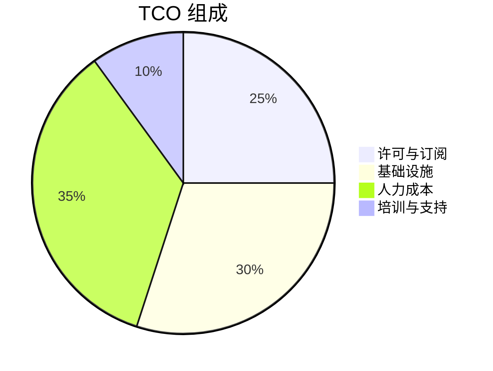

# 风险与成本分析

## 🎯 目标

技术决策不仅需要考虑技术本身，还需要全面评估风险和成本，确保决策的长期可持续性。

## 📊 风险评估框架

### 风险分类

| 类型        | 描述                   | 示例             |
| ----------- | ---------------------- | ---------------- |
| 🔧 技术风险 | 技术方案本身的不确定性 | 新技术成熟度不足 |
| 👥 人员风险 | 团队能力和稳定性       | 核心人员离职     |
| 📅 进度风险 | 项目时间线的不确定性   | 学习曲线超出预期 |
| 💰 成本风险 | 预算超支的可能性       | 许可费用增长     |
| 🔒 安全风险 | 安全漏洞和合规问题     | 开源组件CVE      |

### 风险矩阵

```
影响程度
  高 │ 中  │ 高  │ 极高
  中 │ 低  │ 中  │ 高
  低 │ 低  │ 低  │ 中
     └─────┴─────┴─────
       低    中    高  → 发生概率
```

### 风险应对策略

- **规避**: 调整计划以消除风险
- **转移**: 将风险转移给第三方（如保险、外包）
- **缓解**: 采取措施降低风险影响
- **接受**: 主动接受风险及其后果

## 💰 成本分析

### TCO (总体拥有成本)



### 成本类别

#### 直接成本

- 软件许可费
- 硬件/云资源费用
- 实施与集成费用
- 培训费用

#### 间接成本

- 学习曲线产生的效率损失
- 运维人力成本
- 机会成本

### ROI 计算

```
ROI = (收益 - 成本) / 成本 × 100%
```

考虑因素:

- 效率提升带来的人力节省
- 系统可用性提升的业务价值
- 开发效率提升带来的时间节省

## 📋 技术债务评估

### 债务类型

- **设计债务**: 架构缺陷、设计妥协
- **代码债务**: 代码质量问题、缺少测试
- **文档债务**: 文档缺失或过时
- **依赖债务**: 过时的依赖、安全漏洞

### 债务优先级

| 优先级 | 条件           | 处理时机   |
| ------ | -------------- | ---------- |
| P0     | 影响生产稳定性 | 立即处理   |
| P1     | 阻碍新功能开发 | 下个迭代   |
| P2     | 影响开发效率   | 季度规划   |
| P3     | 代码整洁性     | 有空时处理 |

## 🔗 相关资源

- [[../模板/风险评估矩阵模板|风险评估矩阵模板]]
- [[../模板/TCO分析模板|TCO分析模板]]
