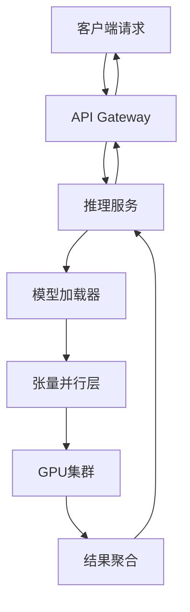

# Megatron推理服务

## 📋 定义
Megatron是NVIDIA开发的大规模语言模型训练和推理框架，专为分布式GPU训练和推理而设计，支持训练和推理像GPT-3这样的大型语言模型。

## 🎯 核心特性

### 1. 分布式训练
- **模型并行**：将大模型分割到多个GPU上
- **数据并行**：在不同GPU上处理不同数据批次
- **流水线并行**：将模型层分布到不同GPU，形成流水线
- **混合精度训练**：使用FP16/BF16加速训练

### 2. 高效推理
- **张量并行推理**：支持大模型的分布式推理
- **流水线推理**：优化推理吞吐量
- **KV Cache优化**：减少显存占用，提升推理速度
- **批处理优化**：支持动态批处理

### 3. 模型支持
- GPT系列（GPT-2, GPT-3）
- BERT系列
- T5系列
- LLaMA系列
- 其他Transformer架构模型

---

## 🏗️ 架构设计

### Megatron核心组件



### 推理服务架构

#### 1. 模型加载层
- 从检查点加载模型权重
- 支持分布式模型加载
- 优化显存使用

#### 2. 并行执行层
- 张量并行推理
- 流水线并行推理
- GPU间通信优化（NCCL）

#### 3. 服务接口层
- RESTful API
- gRPC接口
- WebSocket支持（流式输出）

#### 4. 缓存层
- KV Cache管理
- 结果缓存
- 模型权重缓存

---

## 🚀 快速开始

### 环境准备

#### 1. 硬件要求
```bash
# GPU要求
- NVIDIA GPU（A100, H100, V100等）
- 多GPU节点（推荐4-8卡）
- 显存：每卡至少40GB（用于7B+模型）
```

#### 2. 软件依赖
```bash
# 安装CUDA
conda install cuda-toolkit -c nvidia

# 安装PyTorch
pip install torch==2.0.0+cu117 -f https://download.pytorch.org/whl/torch_stable.html

# 安装Megatron-LM
git clone https://github.com/NVIDIA/Megatron-LM.git
cd Megatron-LM
pip install -r requirements.txt
```

### 基础推理示例

#### 1. 单GPU推理
```python
import torch
from megatron import get_args
from megatron.initialize import initialize_megatron
from megatron.model import GPTModel
from megatron.text_generation import generate

def inference_single_gpu():
    # 初始化Megatron
    initialize_megatron()
    args = get_args()
    
    # 加载模型
    model = GPTModel.from_pretrained(
        model_path="path/to/checkpoint",
        config=args
    )
    
    # 生成文本
    prompt = "Hello, how are you?"
    output = generate(model, prompt, max_length=100)
    
    print(output)
```

#### 2. 多GPU推理（张量并行）
```bash
# 启动多GPU推理
python -m torch.distributed.launch \
    --nproc_per_node=8 \
    --nnodes=1 \
    --node_rank=0 \
    --master_addr="localhost" \
    --master_port=6000 \
    tools/generate_text.py \
    --tensor-model-parallel-size 8 \
    --load path/to/checkpoint \
    --prompt "Hello, how are you?" \
    --max-length 100
```

---

## 📊 推理服务部署

### 方案1：Kubernetes部署

#### 1. 创建GPU节点池
```yaml
# gpu-nodepool.yaml
apiVersion: v1
kind: Node
metadata:
  name: gpu-node-1
  labels:
    gpu-type: A100
    gpu-count: "8"
spec:
  containers:
  - name: nvidia-device-plugin
    image: nvidia/k8s-device-plugin:stable
```

#### 2. 部署推理服务
```yaml
# megatron-inference-deployment.yaml
apiVersion: apps/v1
kind: Deployment
metadata:
  name: megatron-inference
  namespace: ai-inference
spec:
  replicas: 1
  selector:
    matchLabels:
      app: megatron-inference
  template:
    metadata:
      labels:
        app: megatron-inference
    spec:
      containers:
      - name: megatron-inference
        image: your-registry/megatron-inference:latest
        resources:
          limits:
            nvidia.com/gpu: 8
            memory: 128Gi
          requests:
            nvidia.com/gpu: 8
            memory: 64Gi
        env:
        - name: MODEL_PATH
          value: "/models/gpt-3-7b"
        - name: TENSOR_PARALLEL_SIZE
          value: "8"
        - name: NCCL_DEBUG
          value: "INFO"
        volumeMounts:
        - name: model-storage
          mountPath: /models
      volumes:
      - name: model-storage
        persistentVolumeClaim:
          claimName: model-pvc
```

#### 3. 创建Service
```yaml
# megatron-inference-service.yaml
apiVersion: v1
kind: Service
metadata:
  name: megatron-inference
  namespace: ai-inference
spec:
  selector:
    app: megatron-inference
  ports:
  - port: 80
    targetPort: 8000
  type: LoadBalancer
```

### 方案2：使用NVIDIA Triton Inference Server

#### 1. Triton + Megatron集成
```python
# triton_megatron_backend.py
import triton_python_backend_utils as pb_utils
from megatron import get_args
from megatron.model import GPTModel
from megatron.text_generation import generate

class TritonModel:
    def __init__(self):
        self.model = None
        self.initialize()
    
    def initialize(self, args):
        # 初始化Megatron模型
        self.model = GPTModel.from_pretrained(
            model_path=args["model_path"]
        )
    
    def execute(self, requests):
        responses = []
        for request in requests:
            prompt = pb_utils.get_input_tensor_by_name(
                request, "prompt"
            ).as_numpy()
            
            output = generate(self.model, prompt)
            
            responses.append(pb_utils.InferenceResponse(
                output_tensors=[
                    pb_utils.Tensor(
                        "output",
                        output.encode('utf-8')
                    )
                ]
            ))
        return responses
```

#### 2. Triton配置
```protobuf
# config.pbtxt
name: "megatron_gpt"
backend: "python"
max_batch_size: 16

input [
  {
    name: "prompt"
    data_type: TYPE_STRING
    dims: [1]
  }
]

output [
  {
    name: "output"
    data_type: TYPE_STRING
    dims: [1]
  }
]

instance_group [
  {
    kind: KIND_GPU
    count: 8
    gpus: [0, 1, 2, 3, 4, 5, 6, 7]
  }
]
```

---

## ⚡ 性能优化

### 1. 推理加速技术

#### KV Cache优化
```python
class KVCacheManager:
    def __init__(self, max_cache_len=2048):
        self.cache = {}
        self.max_cache_len = max_cache_len
    
    def get_cache(self, request_id):
        return self.cache.get(request_id)
    
    def update_cache(self, request_id, key, value):
        if request_id not in self.cache:
            self.cache[request_id] = {}
        
        # 限制缓存大小
        if len(self.cache[request_id]) > self.max_cache_len:
            self.cache[request_id].popitem(last=False)
        
        self.cache[request_id][key] = value
```

#### 批处理优化
```python
class BatchInference:
    def __init__(self, max_batch_size=16, timeout_ms=50):
        self.requests = []
        self.max_batch_size = max_batch_size
        self.timeout_ms = timeout_ms
    
    async def add_request(self, request):
        self.requests.append(request)
        
        if len(self.requests) >= self.max_batch_size:
            return await self.process_batch()
        
        # 等待更多请求或超时
        await asyncio.sleep(self.timeout_ms / 1000)
        
        if len(self.requests) > 0:
            return await self.process_batch()
    
    async def process_batch(self):
        batch = self.requests[:self.max_batch_size]
        self.requests = self.requests[self.max_batch_size:]
        
        # 批量推理
        outputs = await self.model.generate_batch(batch)
        return outputs
```

### 2. 显存优化

#### 1. 模型量化
```python
# FP16量化
model = model.half()

# INT8量化（需要额外工具）
from torch.quantization import quantize_dynamic

model_int8 = quantize_dynamic(
    model,
    {torch.nn.Linear},
    dtype=torch.qint8
)
```

#### 2. 梯度检查点
```python
from megatron.model import GPTModel

model = GPTModel(
    config,
    checkpoint_activations=True  # 启用梯度检查点
)
```

### 3. 通信优化

#### NCCL配置
```bash
# 环境变量配置
export NCCL_IB_DISABLE=0
export NCCL_SOCKET_IFNAME=ib0
export NCCL_DEBUG=INFO
export NCCL_IB_HCA=mlx5_0:1,mlx5_1:1
export NCCL_IB_GID_INDEX=3
```

---

## 🔗 与云原生结合

### 1. Kubernetes GPU调度

#### GPU共享调度
```yaml
# 使用NVIDIA GPU Operator
apiVersion: apps/v1
kind: DaemonSet
metadata:
  name: nvidia-device-plugin-daemonset
  namespace: kube-system
spec:
  selector:
    matchLabels:
      name: nvidia-device-plugin-ds
  template:
    metadata:
      labels:
        name: nvidia-device-plugin-ds
    spec:
      containers:
      - name: nvidia-device-plugin-ctr
        image: nvidia/k8s-device-plugin:stable
        args:
        - --mig-strategy=single
        - --fail-on-init-error=false
        volumeMounts:
        - name: device-plugin
          mountPath: /var/lib/kubelet/device-plugins
      volumes:
      - name: device-plugin
        hostPath:
          path: /var/lib/kubelet/device-plugins
```

### 2. 自动扩缩容

#### HPA + GPU
```yaml
apiVersion: autoscaling/v2
kind: HorizontalPodAutoscaler
metadata:
  name: megatron-inference-hpa
  namespace: ai-inference
spec:
  scaleTargetRef:
    apiVersion: apps/v1
    kind: Deployment
    name: megatron-inference
  minReplicas: 1
  maxReplicas: 10
  metrics:
  - type: Resource
    resource:
      name: nvidia.com/gpu
      target:
        type: Utilization
        averageUtilization: 70
```

### 3. 监控与可观测性

#### Prometheus监控
```yaml
# prometheus-config.yaml
scrape_configs:
  - job_name: 'megatron-inference'
    kubernetes_sd_configs:
    - role: pod
      namespaces:
        names:
        - ai-inference
    relabel_configs:
    - source_labels: [__meta_kubernetes_pod_label_app]
      action: keep
      regex: megatron-inference
    - source_labels: [__meta_kubernetes_pod_ip]
      target_label: __address__
      replacement: $1:8000
```

---

## 🤖 AI智能体集成

### 1. 使用LangChain集成

```python
from langchain.llms.base import LLM
from megatron.text_generation import generate

class MegatronLLM(LLM):
    def __init__(self, model_path, tensor_parallel_size=8):
        self.model_path = model_path
        self.tensor_parallel_size = tensor_parallel_size
        self.model = self._load_model()
    
    def _load_model(self):
        # 加载Megatron模型
        from megatron import get_args
        from megatron.initialize import initialize_megatron
        from megatron.model import GPTModel
        
        initialize_megatron()
        args = get_args()
        model = GPTModel.from_pretrained(self.model_path)
        return model
    
    def _call(self, prompt, stop=None):
        output = generate(self.model, prompt)
        return output
    
    @property
    def _llm_type(self):
        return "megatron"

# 使用示例
from langchain.agents import initialize_agent, Tool
from langchain.chains import LLMMathChain

llm = MegatronLLM(model_path="/models/gpt-3-7b")
math_chain = LLMMathChain(llm=llm)

tools = [
    Tool(
        name="Calculator",
        func=math_chain.run,
        description="Useful for math questions"
    )
]

agent = initialize_agent(
    tools, llm, agent="zero-shot-react-description"
)

result = agent.run("What is 2+2?")
print(result)
```

### 2. RAG集成

```python
from langchain.vectorstores import Chroma
from langchain.embeddings import HuggingFaceEmbeddings
from langchain.chains import RetrievalQA

class MegatronRAG:
    def __init__(self, model_path, vector_db_path):
        self.llm = MegatronLLM(model_path)
        self.embeddings = HuggingFaceEmbeddings()
        self.vectorstore = Chroma(
            persist_directory=vector_db_path,
            embedding_function=self.embeddings
        )
        self.qa_chain = RetrievalQA.from_chain_type(
            llm=self.llm,
            chain_type="stuff",
            retriever=self.vectorstore.as_retriever()
        )
    
    def query(self, question):
        return self.qa_chain.run(question)

# 使用示例
rag = MegatronRAG(
    model_path="/models/gpt-3-7b",
    vector_db_path="./vector_db"
)

answer = rag.query("What is Kubernetes?")
print(answer)
```

---

## 📈 实践案例

### 案例1：智能客服系统

#### 需求分析
- 使用Megatron部署GPT-3-7B模型
- 支持多轮对话
- 响应时间<2秒
- 并发支持100+用户

#### 架构设计
```yaml
# 智能客服架构
components:
  - name: API Gateway
    type: Nginx
    function: 负载均衡和限流
  
  - name: Megatron Inference
    type: Kubernetes Deployment
    replicas: 3
    gpu: 8 per pod
    function: 模型推理
  
  - name: Redis Cache
    type: Redis Cluster
    function: KV Cache和结果缓存
  
  - name: Vector DB
    type: Milvus
    function: 知识库向量存储
  
  - name: Monitoring
    type: Prometheus + Grafana
    function: 监控和告警
```

#### 性能指标
| 指标 | 目标 | 实际 |
|------|------|------|
| 响应时间 | <2s | 1.5s |
| 并发用户 | 100+ | 150 |
| GPU利用率 | 70-80% | 75% |
| 显存占用 | <80GB | 72GB |

### 案例2：代码生成助手

#### 需求分析
- 使用CodeParrot模型（基于Megatron训练）
- 支持多种编程语言
- 代码补全和生成
- 集成到IDE

#### 实现方案
```python
# IDE插件集成
class CodeCompletionPlugin:
    def __init__(self, megatron_endpoint):
        self.endpoint = megatron_endpoint
    
    def get_completion(self, code, language):
        prompt = f"""
        Language: {language}
        Code:
        {code}
        
        Complete the code:
        """
        
        response = requests.post(
            self.endpoint,
            json={"prompt": prompt}
        )
        
        return response.json()["output"]
```

---

## 📚 学习路径

### 阶段1：基础入门（1-2周）
- 理解Megatron的核心概念
- 掌握单GPU推理
- 学习张量并行和数据并行

**学习资源**：
- [Megatron-LM GitHub](https://github.com/NVIDIA/Megatron-LM)
- [[基础层/Python/MOC - Python语言|Python]]异步编程
- [[核心层/Kubernetes/MOC - Kubernetes|Kubernetes]]基础

### 阶段2：进阶实践（2-4周）
- 多GPU推理部署
- Kubernetes部署Megatron
- 性能优化技巧

**学习资源**：
- [[核心层/云原生生态/MOC - 云原生生态|云原生生态]]
- [[架构层/系统设计/MOC - 系统设计|系统设计]]
- 实践案例：智能客服系统

### 阶段3：高级应用（1-3个月）
- 与AI智能体集成
- RAG应用开发
- 大规模生产部署

**学习资源**：
- [[前瞻层/AI智能体/AI智能体|AI智能体]]
- [[前瞻层/RAG/MOC - RAG技术|RAG技术]]
- [[前瞻层/AI与K8s结合/MOC - AI与K8s结合|AI与K8s结合]]

---

## 🔗 相关链接

### 核心技术
- [[核心层/Kubernetes/MOC - Kubernetes|Kubernetes]]：容器编排
- [[核心层/云原生生态/MOC - 云原生生态|云原生生态]]：服务网格、监控
- [[前瞻层/AI智能体/AI智能体|AI智能体]]：智能体框架
- [[前瞻层/RAG/MOC - RAG技术|RAG技术]]：检索增强生成

### 实践工具
- [[架构层/5W2H分析法]]：问题分析
- [[架构层/从开发者到架构师]]：架构思维
- [[管理层/技术决策/MOC - 技术决策|技术决策]]：技术选型

### 外部资源
- [NVIDIA Megatron-LM文档](https://github.com/NVIDIA/Megatron-LM)
- [Triton Inference Server](https://github.com/triton-inference-server/server)
- [NVIDIA GPU Operator](https://github.com/NVIDIA/gpu-operator)

---

## 💡 最佳实践

### 1. 模型部署
- 使用容器化部署，便于扩展和管理
- 合理设置GPU资源限制，避免资源浪费
- 使用模型检查点快速加载和恢复

### 2. 性能优化
- 启用KV Cache减少重复计算
- 使用批处理提高吞吐量
- 量化模型降低显存占用

### 3. 监控运维
- 监控GPU利用率和显存使用
- 设置合理的告警阈值
- 使用Prometheus和Grafana进行可视化

### 4. 安全考虑
- 使用TLS加密通信
- 实施API认证和授权
- 定期更新依赖和补丁

---

## 🔮 未来展望

随着Megatron和云原生技术的发展，未来的推理服务将更加智能化和自动化：

1. **自动扩缩容**：基于负载自动调整GPU资源
2. **智能调度**：AI驱动的任务调度和资源分配
3. **多模型融合**：同时部署多个模型，智能路由
4. **边缘推理**：在边缘设备上部署轻量级模型
5. **联邦学习**：分布式模型更新和推理

这些发展将推动AI推理服务的普及和应用，为业务创造更大价值。
