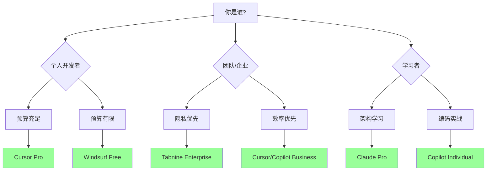

# AI编码工具对比分析

## 📋 概述

AI编码工具的发展经历了四个代际演进：


| 代际 | 特征 | 代表工具 |
|------|------|----------|
| 第一代 | 简单自动补全 | 早期Tabnine |
| 第二代 | 上下文感知函数补全 | Copilot、Codeium |
| 第三代 | 多步规划、多文件编辑 | Cursor、Windsurf、Aider |
| 第四代 | 自主监控、发现问题、自动修复 | 新兴探索中 |

---

## 🏆 主流工具详细对比

### 1. GitHub Copilot

> [!NOTE] 定位
> IDE内置型AI编码助手，被视为行业"黄金标准"

**核心特性：**
- 基于OpenAI Codex和GPT-4模型
- 无缝集成VS Code、Visual Studio、JetBrains等主流IDE
- 实时代码建议和样板代码生成
- Chat功能支持自然语言问答

**优势：**
- ✅ 81%的用户报告任务完成更快
- ✅ 与GitHub生态深度整合
- ✅ 适合快速MVP开发
- ✅ 学习曲线平缓

**劣势：**
- ⚠️ 可能生成低效或重复代码
- ⚠️ 大型代码库上下文感知有限
- ⚠️ Agent Mode效果弱于竞品（2025初期版本）

**定价：**
- 个人：$10/月
- 商业：$19/月
- 企业：$39/用户/月

**最佳场景：** 小团队、快速原型开发、日常编码辅助

---

### 2. Cursor

> [!IMPORTANT] 定位
> AI-First IDE，重新定义开发环境

**核心特性：**
- 独立AI-Native IDE（基于VS Code分支）
- 深度上下文感知，理解整个项目
- Agent Mode：自动生成、编辑文件、运行代码
- 记住编码模式和偏好

**优势：**
- ✅ 复杂重构能力强
- ✅ 多文件编辑能力出色
- ✅ Cmd+K内联编辑，Cmd+L上下文对话
- ✅ 纯生产力提升领先

**劣势：**
- ⚠️ 学习曲线较陡
- ⚠️ 调试功能偶尔较慢
- ⚠️ 封闭AI服务

**定价：**
- Free：有限额度
- Pro：$20/月（含GPT-4）
- Business：$40/用户/月

**最佳场景：** 复杂重构、遗留代码现代化、全栈开发

---

### 3. Claude（作为编码助手）

> [!NOTE] 定位
> 通用AI助手，以推理能力见长

**核心特性：**
- Anthropic开发的大语言模型
- 200,000 token超长上下文窗口
- 强大的推理和代码审查能力
- 高质量的代码提交和文档生成

**优势：**
- ✅ 架构设计洞察力强
- ✅ 代码审查质量高
- ✅ 适合学习和提升设计能力
- ✅ 文档生成详尽

**劣势：**
- ⚠️ 无原生IDE集成（需复制粘贴）
- ⚠️ 日常编码任务效率不如专用工具
- ⚠️ 上下文切换打断工作流

**定价：**
- Free：有限额度
- Pro：$20/月
- API：按使用量计费

**最佳场景：** 架构设计讨论、代码审查、技术学习

---

### 4. Codeium / Windsurf

> [!TIP] 定位
> 开放免费的AI编码平台

**核心特性：**
- Windsurf（原Codeium）：AI-Native IDE
- "Cascade"功能：深度理解代码库
- 支持70+编程语言
- 不使用客户代码训练模型

**优势：**
- ✅ 个人开发者永久免费
- ✅ 隐私保护政策
- ✅ 企业可自托管
- ✅ 支持40+IDE

**劣势：**
- ⚠️ 非传统开源
- ⚠️ 代码建议深度略逊于付费竞品
- ⚠️ 免费额度政策可能调整

**定价：**
- 个人：免费
- 团队：$12/用户/月
- 企业：定制价格

**最佳场景：** 预算有限的个人开发者、隐私敏感项目

---

### 5. Aider

> [!NOTE] 定位
> 开源终端AI编程助手

**核心特性：**
- 纯命令行操作
- 完整代码库映射
- Git自动提交和清晰的commit message
- 支持Claude、GPT等多种模型
- 支持图片、网页、语音输入

**优势：**
- ✅ 完全开源
- ✅ 终端原生，适合CLI工作流
- ✅ Git集成优秀
- ✅ 灵活选择LLM

**劣势：**
- ⚠️ 无图形界面
- ⚠️ 需要API密钥
- ⚠️ 学习成本较高

**定价：** 开源免费（需自备LLM API费用）

**最佳场景：** 终端重度用户、自动化脚本、开源项目

---

### 6. Augment Code

> [!NOTE] 定位
> 企业级大型代码库专用

**核心特性：**
- "Context Engine"：实时理解整个软件栈
- 理解代码、依赖、架构、历史
- AI Agent补全和高级编辑
- 支持VS Code、JetBrains、Vim

**优势：**
- ✅ 大型代码库优化
- ✅ 个性化代码建议
- ✅ 架构理解能力强
- ✅ 适合复杂项目导航

**劣势：**
- ⚠️ 价格较高
- ⚠️ 主要面向企业

**最佳场景：** 大型企业项目、复杂遗留系统

---

### 7. Supermaven

> [!TIP] 定位
> 超大上下文窗口，极速补全

**核心特性：**
- 100万token上下文窗口
- 处理大型代码库能力强
- 声称帮助用户提速2倍
- 支持VS Code、JetBrains、Neovim

**优势：**
- ✅ 超大上下文理解
- ✅ 极快的补全速度
- ✅ 内置多模型对话（GPT-4o、Claude 3.5）

**劣势：**
- ⚠️ 2024年11月与Cursor合并

**定价：** 免费版+付费订阅

**最佳场景：** 大型单体项目、需要极速反馈

---

### 8. Tabnine

> [!IMPORTANT] 定位
> 隐私优先的企业级AI编码助手

**核心特性：**
- 早于Copilot诞生的AI编码工具
- 支持本地部署和私有VPC
- 学习团队编码风格和规范
- 智能补全、重构、文档生成

**优势：**
- ✅ 隐私合规性强
- ✅ 可完全私有化部署
- ✅ 适应团队编码风格
- ✅ 企业安全认证

**劣势：**
- ⚠️ 功能创新不如新兴工具
- ⚠️ 免费版功能有限

**定价：**
- 个人：免费基础版
- Pro：$12/用户/月
- 企业：定制价格

**最佳场景：** 金融、医疗、政府等合规要求高的行业

---

## 📊 综合对比矩阵

```
评分标准：⭐⭐⭐⭐⭐ 优秀 | ⭐⭐⭐⭐ 良好 | ⭐⭐⭐ 一般 | ⭐⭐ 较弱
```

| 工具 | 补全能力 | 上下文感知 | Agent能力 | 隐私安全 | 性价比 | IDE支持 |
|------|:--------:|:----------:|:---------:|:--------:|:------:|:-------:|
| Copilot | ⭐⭐⭐⭐ | ⭐⭐⭐ | ⭐⭐ | ⭐⭐⭐ | ⭐⭐⭐⭐ | ⭐⭐⭐⭐⭐ |
| Cursor | ⭐⭐⭐⭐⭐ | ⭐⭐⭐⭐⭐ | ⭐⭐⭐⭐⭐ | ⭐⭐⭐ | ⭐⭐⭐ | ⭐⭐⭐ |
| Claude | ⭐⭐⭐ | ⭐⭐⭐⭐⭐ | ⭐⭐⭐ | ⭐⭐⭐⭐ | ⭐⭐⭐ | ⭐⭐ |
| Windsurf | ⭐⭐⭐⭐ | ⭐⭐⭐⭐ | ⭐⭐⭐⭐ | ⭐⭐⭐⭐ | ⭐⭐⭐⭐⭐ | ⭐⭐⭐⭐ |
| Aider | ⭐⭐⭐⭐ | ⭐⭐⭐⭐ | ⭐⭐⭐⭐ | ⭐⭐⭐⭐⭐ | ⭐⭐⭐⭐ | ⭐⭐ |
| Tabnine | ⭐⭐⭐⭐ | ⭐⭐⭐ | ⭐⭐ | ⭐⭐⭐⭐⭐ | ⭐⭐⭐ | ⭐⭐⭐⭐⭐ |

---

## 🎯 选型建议

### 按角色推荐



### 混合工具栈策略

> [!TIP] 推荐组合
> 许多资深开发者采用混合策略，根据任务选择最合适的工具：

| 任务类型 | 推荐工具 | 原因 |
|----------|----------|------|
| 日常编码 | Cursor | 生产力最佳 |
| 架构设计/代码审查 | Claude | 推理质量高 |
| 快速补全备选 | Copilot | 无缝集成 |
| 终端自动化 | Aider | Git集成强 |
| 敏感项目 | Tabnine | 可私有部署 |

---

## 📈 未来趋势

1. **Agentic Coding成为主流**
   - 从被动补全转向主动规划和执行
   - 多文件协同编辑能力增强

2. **专业化工具栈**
   - 不同开发阶段使用不同工具
   - 工具间协作和集成加强

3. **隐私与合规性**
   - 本地模型和私有部署需求增长
   - 代码数据安全成为选型关键因素

4. **人机协作优化**
   - 工具更注重放大人类思考而非替代
   - 减少技术债务、提升代码质量

---

## 🔗 相关资源

- [[Vibe Coding提效指南]] - 如何高效使用AI编码工具
- [[MOC - AI编码工具]] - 返回索引

---

*最后更新：2026-01-26*
