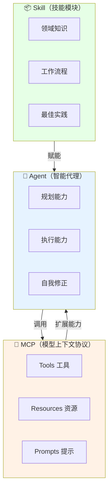
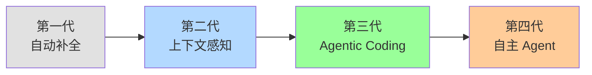
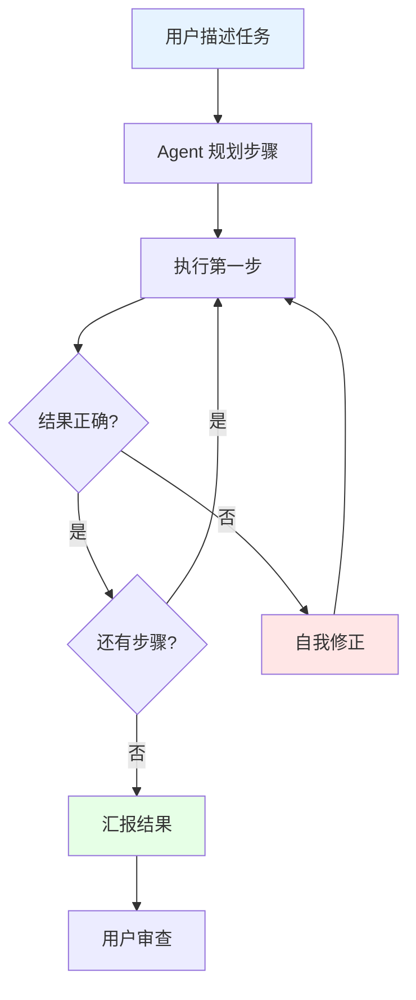
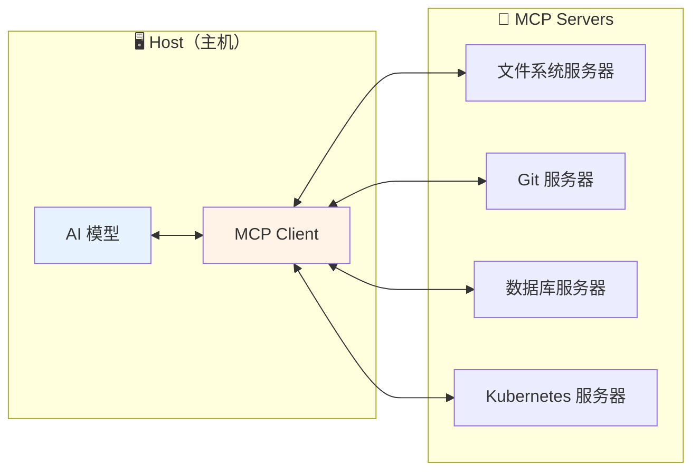
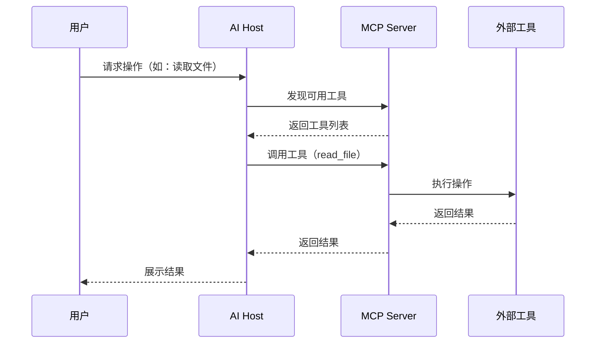
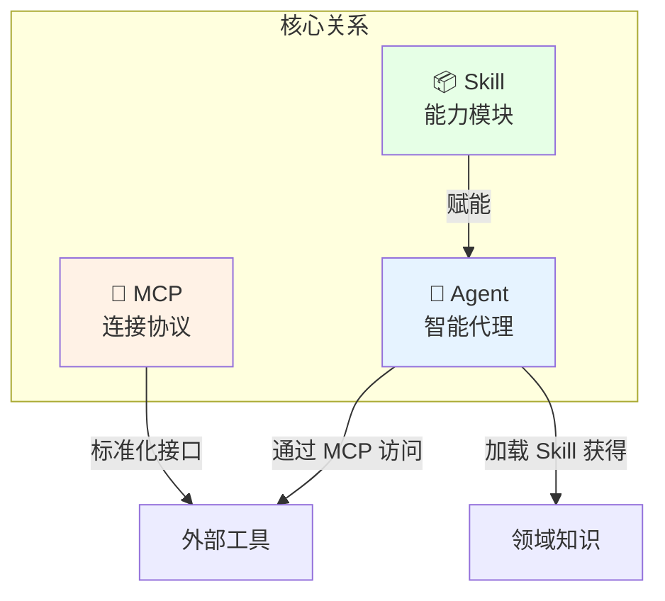

# Agent、MCP、Skill 核心概念详解

## 📋 概述

在 AI 编码工具的演进中，**Agent**、**MCP**、**Skill** 是三个推动范式转变的核心概念：

| 概念      | 定义                                         | 核心价值                     |
| --------- | -------------------------------------------- | ---------------------------- |
| **Agent** | 具有自主规划和执行能力的 AI 系统             | 从被动补全升级为主动协作     |
| **MCP**   | Model Context Protocol，标准化的工具扩展协议 | 统一 AI 与外部工具的交互方式 |
| **Skill** | 封装特定能力的可复用模块                     | 快速赋能 AI 特定领域知识     |



---

## 🤖 Agent（智能代理）

### 定义与演进

Agent 是具有自主规划、执行和自我修正能力的 AI 系统。在 AI 编码领域，Agent 标志着从"被动补全"到"主动编程"的范式转变。



### Agent 核心能力

| 能力                            | 描述                                 | 示例                             |
| ------------------------------- | ------------------------------------ | -------------------------------- |
| **规划（Planning）**            | 将复杂任务分解为可执行步骤           | 分析需求 → 设计方案 → 分步实现   |
| **执行（Execution）**           | 自主完成代码生成、文件编辑、命令运行 | 创建文件、编写代码、运行测试     |
| **自我修正（Self-Correction）** | 根据执行结果调整策略                 | 发现错误 → 分析原因 → 修复代码   |
| **工具使用（Tool Use）**        | 调用外部工具扩展能力                 | 搜索文档、读取文件、调用 API     |
| **记忆（Memory）**              | 维护上下文和历史信息                 | 记住项目结构、编码风格、用户偏好 |

### 代表性 Agent 实现

| 工具                  | Agent 特性           | 优势                 | 适用场景             |
| --------------------- | -------------------- | -------------------- | -------------------- |
| **Cursor Agent Mode** | IDE 内置，多文件编辑 | 深度集成，实时反馈   | 复杂重构、功能开发   |
| **Claude Code**       | 终端原生，自主执行   | 推理能力强，自动修正 | 新项目搭建、系统设计 |
| **Windsurf Cascade**  | 全面上下文感知       | 免费版功能丰富       | 日常开发、代码探索   |
| **Aider**             | 开源 CLI，Git 集成   | 完全开源，灵活定制   | 终端用户、自动化流程 |
| **Devin / OpenHands** | 完全自主的软件工程师 | 端到端任务完成       | 独立任务、POC 开发   |

### Agent 模式工作流



### Agent 在编码中的提升

> [!IMPORTANT] 核心价值
> Agent 将开发者从"代码实现者"转变为"任务指挥者"

| 维度     | 传统编码       | Agent 辅助编码           | 提升幅度 |
| -------- | -------------- | ------------------------ | -------- |
| 任务启动 | 手动分析、规划 | 描述目标，Agent 自动规划 | ⬆️ 50%   |
| 代码编写 | 逐文件手写     | Agent 自动多文件编辑     | ⬆️ 70%   |
| 错误修复 | 手动调试、搜索 | Agent 自动分析修复       | ⬆️ 60%   |
| 测试生成 | 手动编写用例   | Agent 自动生成测试       | ⬆️ 80%   |

---

## 🔌 MCP（Model Context Protocol）

### 什么是 MCP

> [!NOTE] 定义
> **MCP (Model Context Protocol)** 是由 Anthropic 提出的开放标准协议，用于规范 AI 模型与外部工具、数据源的交互方式。

MCP 解决了一个核心问题：**如何让 AI 安全、标准化地访问外部能力？**



### MCP 核心组件

| 组件                    | 描述              | 示例                                     |
| ----------------------- | ----------------- | ---------------------------------------- |
| **Tools（工具）**       | AI 可调用的函数   | `run_command`、`read_file`、`search_web` |
| **Resources（资源）**   | AI 可读取的数据源 | 文件内容、数据库记录、API 响应           |
| **Prompts（提示模板）** | 预定义的交互模式  | 代码审查模板、重构建议模板               |

### MCP 工作原理



### MCP 在编码中的提升

| 能力     | 无 MCP         | 有 MCP          | 提升点     |
| -------- | -------------- | --------------- | ---------- |
| 文件操作 | 复制粘贴代码   | 直接读写文件    | 无缝集成   |
| 命令执行 | 手动在终端运行 | AI 自动运行验证 | 即时反馈   |
| 外部数据 | 手动查询复制   | AI 直接访问     | 上下文连贯 |
| 工具扩展 | 固定功能       | 按需添加服务器  | 无限扩展   |

### 常用 MCP 服务器

| 服务器                                      | 功能            | 使用场景      |
| ------------------------------------------- | --------------- | ------------- |
| `@modelcontextprotocol/server-filesystem`   | 文件系统操作    | 代码读写      |
| `@modelcontextprotocol/server-github`       | GitHub 操作     | Issue/PR 管理 |
| `@modelcontextprotocol/server-postgres`     | PostgreSQL 操作 | 数据库查询    |
| `@modelcontextprotocol/server-brave-search` | 网络搜索        | 信息检索      |
| 自定义服务器                                | 业务特定功能    | 企业内部系统  |

---

## 📦 Skill（技能模块）

### 什么是 Skill

> [!NOTE] 定义
> **Skill** 是封装了特定能力的可复用模块，包含指令、脚本和资源，用于快速赋能 AI 特定领域知识。

Skill 解决的问题：**如何让 AI 快速获得特定领域的专业能力？**

### Skill 文件结构

```
.agent/skills/
└── kubernetes-deploy/
    ├── SKILL.md           # 主指令文件（必需）
    ├── scripts/           # 辅助脚本
    │   └── deploy.sh
    ├── examples/          # 参考示例
    │   └── deployment.yaml
    └── resources/         # 模板和资源
        └── base-config.yaml
```

### SKILL.md 规范

```yaml
---
name: Kubernetes Deployment
description: 指导 AI 进行 Kubernetes 应用部署
---

# Kubernetes 部署技能

## 前置检查
1. 确认 kubectl 已配置
2. 验证集群连接

## 部署流程
1. 创建 Namespace
2. 部署 ConfigMap 和 Secret
3. 部署应用 Deployment
4. 创建 Service
5. 验证部署状态

## 注意事项
- 生产环境需要资源限制
- 确保镜像拉取策略正确
```

### Skill 在编码中的提升

| 维度     | 无 Skill     | 有 Skill     | 提升点     |
| -------- | ------------ | ------------ | ---------- |
| 领域知识 | AI 通用知识  | 注入专业知识 | 准确度提升 |
| 工作流程 | 每次重新描述 | 复用标准流程 | 效率提升   |
| 团队规范 | 口头约定     | 代码化规范   | 一致性保证 |
| 最佳实践 | 依赖 AI 记忆 | 显式定义     | 质量保证   |

### 典型 Skill 使用场景

| 场景         | Skill 内容             | 收益         |
| ------------ | ---------------------- | ------------ |
| **代码审查** | 审查清单、安全检查点   | 审查质量一致 |
| **API 开发** | 接口规范、错误处理模式 | 接口风格统一 |
| **测试编写** | 测试策略、覆盖要求     | 测试覆盖完整 |
| **部署发布** | 部署流程、回滚策略     | 发布安全可靠 |
| **文档生成** | 文档模板、格式要求     | 文档结构一致 |

---

## 🔗 三者的关系



**关系总结：**

- **Agent** 是主体，负责思考、规划、执行
- **MCP** 是桥梁，连接 Agent 与外部工具
- **Skill** 是弹药，为 Agent 提供专业知识

---

## 📊 综合对比

### 优势对比

| 概念      | 核心优势                   | 最大价值     |
| --------- | -------------------------- | ------------ |
| **Agent** | 自主规划执行，减少人工干预 | 提升开发效率 |
| **MCP**   | 标准化扩展，生态共享       | 打破能力边界 |
| **Skill** | 知识封装复用，团队协作     | 保证质量一致 |

### 局限性对比

| 概念      | 主要局限                   | 应对策略                 |
| --------- | -------------------------- | ------------------------ |
| **Agent** | 复杂任务可能失控，需要审查 | 分步执行，人工检查点     |
| **MCP**   | 服务器需要开发和维护       | 使用官方服务器，渐进自研 |
| **Skill** | 编写和维护有成本           | 从高频场景开始，逐步积累 |

### 适用场景矩阵

| 场景         |   Agent    |    MCP     |   Skill    | 说明                 |
| ------------ | :--------: | :--------: | :--------: | -------------------- |
| 复杂重构     | ⭐⭐⭐⭐⭐ |   ⭐⭐⭐   |   ⭐⭐⭐   | Agent 规划多步骤重构 |
| 新功能开发   |  ⭐⭐⭐⭐  |  ⭐⭐⭐⭐  |  ⭐⭐⭐⭐  | 三者配合效果最佳     |
| 数据库操作   |   ⭐⭐⭐   | ⭐⭐⭐⭐⭐ |   ⭐⭐⭐   | MCP 直连数据库       |
| 团队规范落地 |   ⭐⭐⭐   |    ⭐⭐    | ⭐⭐⭐⭐⭐ | Skill 封装规范       |
| 快速原型     | ⭐⭐⭐⭐⭐ |   ⭐⭐⭐   |    ⭐⭐    | Agent 端到端生成     |

---

## 🎯 学习路径建议


1. **入门**：先阅读 [[Vibe Coding提效指南]]，理解 AI 编码范式
2. **进阶**：阅读 [[Agentic Coding实践指南]]，掌握 Agent 使用技巧
3. **深入**：阅读 [[MCP协议与工具扩展]]，学习 MCP 配置与 Skill 开发
4. **实践**：在项目中尝试使用，逐步积累经验

---

## 🔗 相关资源

- [[Agentic Coding实践指南]] - Agent 模式实战
- [[MCP协议与工具扩展]] - MCP 深度解析
- [[Vibe Coding提效指南]] - AI 编码基础方法论
- [[AI编码工具对比分析]] - 工具选型参考
- [[MOC - AI编码工具]] - 返回索引

---

_最后更新：2026-01-26_
