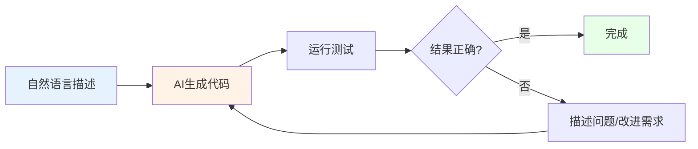
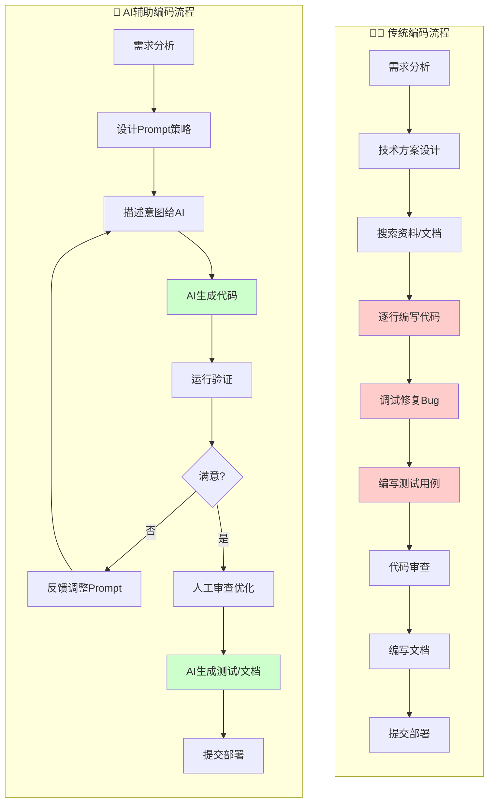
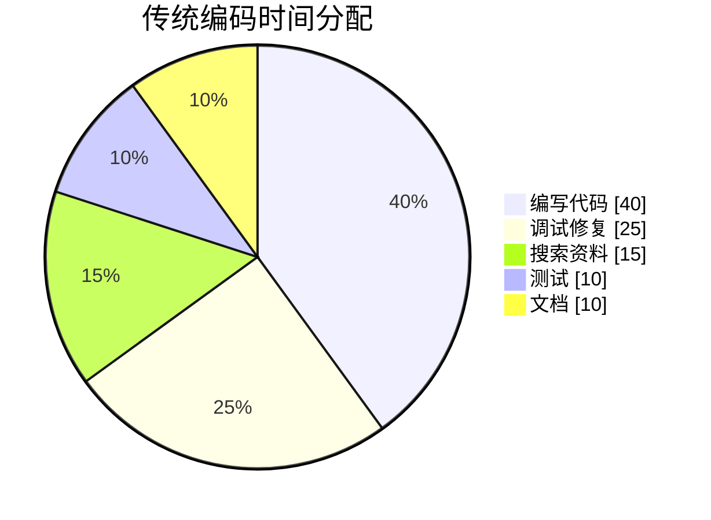
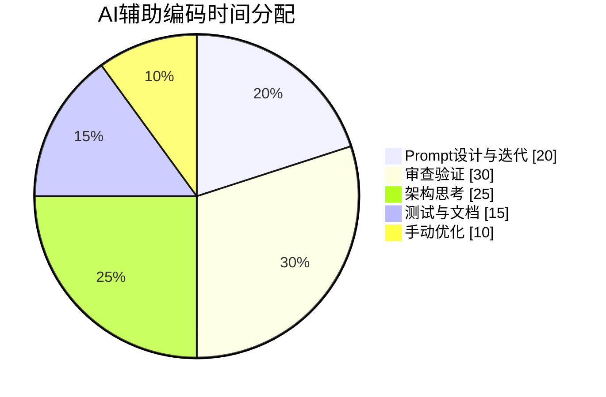
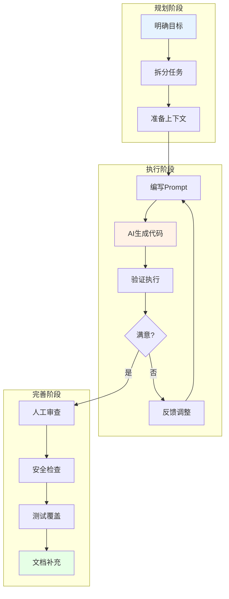
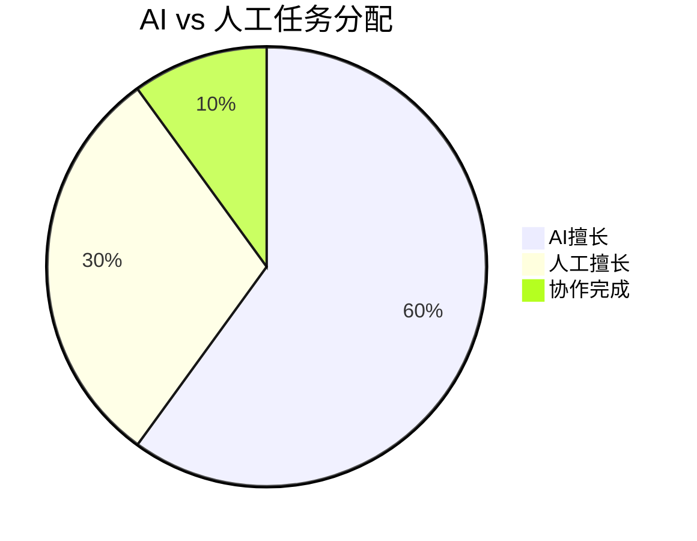
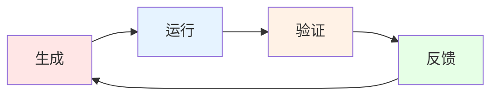

# Vibe Coding提效指南

## 📋 什么是Vibe Coding?

> [!NOTE] 定义
> **Vibe Coding**是由AI研究者Andrej Karpathy于2025年2月提出的AI辅助软件开发方法论。
> 核心理念：开发者通过自然语言提示指导大语言模型(LLM)生成代码，采用"先生成，后优化"的思维模式。



### 核心原则

1. **语言优先**：用自然语言描述意图，而非手写代码
2. **快速迭代**：先让AI生成，再根据结果调整
3. **工具验证**：通过运行和测试验证代码，而非逐行审查
4. **持续对话**：与AI保持迭代对话，逐步完善

---

## 传统编码 vs AI编码流程对比

### 整体流程对比图



### 各阶段详细对比

| 阶段 | 传统编码 | AI辅助编码 | 效率变化 |
|------|----------|------------|----------|
| **需求理解** | 阅读文档，与PM沟通 | 相同（AI不替代） | ➡️ 持平 |
| **方案设计** | 独立思考，查阅资料 | 可与AI讨论方案（如Claude） | ⬆️ 20% |
| **知识获取** | Google/Stack Overflow搜索 | 直接询问AI，获得定制答案 | ⬆️ 50% |
| **代码编写** | 逐行手写，频繁查文档 | 描述意图，AI生成，快速迭代 | ⬆️ 60-80% |
| **调试修复** | 打断点，看日志，搜索错误 | 让AI分析错误，建议修复方案 | ⬆️ 40% |
| **测试编写** | 手写每个测试用例 | AI生成测试框架，人工补充边界 | ⬆️ 70% |
| **代码审查** | 人工逐行审查 | AI预审 + 人工终审 | ⬆️ 30% |
| **文档编写** | 手动整理说明文档 | AI生成初稿，人工润色 | ⬆️ 80% |

### 思维模式转变

```
┌─────────────────────────────────────────────────────────────────────┐
│                        传统编码思维                                   │
├─────────────────────────────────────────────────────────────────────┤
│  "我需要写一个函数来..."                                               │
│      ↓                                                              │
│  1. 思考算法逻辑                                                     │
│  2. 考虑边界条件                                                     │
│  3. 回忆/查阅语法                                                    │
│  4. 敲键盘逐字输入                                                   │
│  5. 编译/运行查错                                                    │
│  6. 反复修改直到正确                                                 │
└─────────────────────────────────────────────────────────────────────┘

                              ⇩ 转变 ⇩

┌─────────────────────────────────────────────────────────────────────┐
│                        AI编码思维                                    │
├─────────────────────────────────────────────────────────────────────┤
│  "我需要让AI帮我生成一个函数来..."                                    │
│      ↓                                                              │
│  1. 清晰描述意图和约束                                               │
│  2. AI生成代码                                                       │
│  3. 运行验证结果                                                     │
│  4. 调整Prompt继续迭代                                               │
│  5. 审查并理解生成的代码                                             │
│  6. 必要时手动微调                                                   │
└─────────────────────────────────────────────────────────────────────┘
```

### 时间分配对比





### 具体场景对比示例

#### 场景：实现一个用户列表分页API

**传统编码流程：**
```
1. [5分钟] 查阅框架文档，了解分页参数处理
2. [15分钟] 编写Controller层代码
3. [10分钟] 编写Service层分页逻辑
4. [10分钟] 编写Repository层查询
5. [10分钟] 处理边界条件（空页、超出范围等）
6. [10分钟] 调试修复问题
7. [15分钟] 编写单元测试
8. [10分钟] 编写API文档

总计：约 85 分钟
```

**AI辅助编码流程：**
```
1. [3分钟] 编写Prompt描述需求和技术栈
2. [2分钟] AI生成Controller+Service+Repository代码
3. [5分钟] 运行验证，发现边界条件问题
4. [2分钟] 补充Prompt：处理空页和超出范围
5. [2分钟] AI更新代码
6. [5分钟] 人工审查，确认逻辑正确
7. [3分钟] Prompt让AI生成单元测试
8. [3分钟] Prompt让AI生成API文档

总计：约 25 分钟（节省 70%）
```

### 关键角色转变

| 维度 | 传统开发者 | AI时代开发者 |
|------|-----------|-------------|
| **核心技能** | 编码能力 | 问题拆解 + Prompt能力 |
| **知识存储** | 记忆语法和API | 理解概念，让AI查细节 |
| **工作模式** | 生产者 | 指挥者 + 审核者 |
| **效率瓶颈** | 打字速度、记忆量 | 表达准确性、判断力 |
| **价值定位** | 代码实现 | 架构设计、质量把控 |

---

## �🚀 Vibe Coding工作流

### 标准流程



### 实践示例

**场景：** 创建一个用户认证API

```
=== 第一轮 Prompt ===
创建一个用户认证模块，包含：
1. 用户注册接口（邮箱+密码）
2. 用户登录接口（返回JWT）
3. 密码哈希使用bcrypt
4. 使用Express.js + TypeScript

=== AI生成代码后 ===
运行测试，发现token过期时间太短

=== 第二轮 Prompt ===
将JWT过期时间改为7天，
并添加refresh token机制

=== 继续迭代... ===
```

---

## 📝 Prompt Engineering技巧

### 1. 结构化Prompt模板

```markdown
## 任务描述
[清晰描述要完成的功能]

## 技术约束
- 语言/框架：[如 Python 3.11 + FastAPI]
- 代码风格：[如 PEP8规范]
- 依赖限制：[如 不使用ORM]

## 输入/输出
- 输入：[数据格式描述]
- 输出：[期望结果描述]

## 示例
[提供输入输出示例]

## 注意事项
[边界条件、错误处理等要求]
```

### 2. 渐进式细化

> [!TIP] 策略
> 将复杂任务拆分为多个小步骤，逐步引导AI完成

**❌ 不推荐：**
```
帮我写一个完整的电商后端系统
```

**✅ 推荐：**
```
第1步：设计用户模块的数据模型
第2步：实现用户注册登录API
第3步：设计商品模块...
```

### 3. 提供足够上下文

```markdown
## 现有代码结构
```
src/
├── models/
│   └── user.py  # 用户模型，使用SQLAlchemy
├── services/
│   └── auth.py  # 认证服务，使用JWT
└── api/
    └── routes.py
```

## 现有User模型定义
```python
class User(Base):
    id: int
    email: str
    password_hash: str
    created_at: datetime
```

## 需求
在此基础上，添加用户Profile功能...

### 4. 明确约束条件

| 约束类型 | 示例 |
|----------|------|
| 性能要求 | "响应时间需<100ms" |
| 安全要求 | "所有输入需要验证和清理" |
| 兼容性 | "需要支持Python 3.8+" |
| 风格规范 | "遵循Google Python Style" |
| 错误处理 | "所有异常需要有友好错误信息" |

---

## ⚡ 提效策略

### 策略一：建立个人Prompt库

创建常用Prompt模板，提高重复任务效率：

```markdown
## 代码审查Prompt
审查以下代码，关注：
1. 潜在的安全漏洞
2. 性能瓶颈
3. 可维护性问题
4. 单元测试覆盖建议

## 重构Prompt
将以下代码重构，目标：
1. 遵循SOLID原则
2. 提高可测试性
3. 减少重复代码
```

### 策略二：合理分配任务



| AI擅长 | 人工擅长 |
|--------|----------|
| 样板代码生成 | 业务逻辑决策 |
| 数据转换代码 | 架构设计 |
| 测试用例编写 | 需求分析 |
| 文档生成 | 代码审查最终决策 |
| 简单重构 | 复杂问题诊断 |
| API集成代码 | 性能调优关键决策 |

### 策略三：迭代验证循环

> [!IMPORTANT] 关键原则
> **小步快跑**：每次迭代只处理一个小功能，立即验证



**实践建议：**
1. 每次Prompt控制在单一功能范围
2. 生成后立即运行测试
3. 发现问题立即反馈给AI
4. 避免积累过多未验证代码

### 策略四：利用工具生态

| 工具组合 | 场景 | 效率提升 |
|----------|------|----------|
| Cursor + Claude | 日常开发+代码审查 | 高 |
| Aider + Git | 终端自动化开发 | 高 |
| Copilot + IDE插件 | 轻量级补全 | 中 |

---

## ⚠️ 注意事项与风险

### 1. 必须保持人工监督

> [!CAUTION] 关键警示
> AI生成的代码必须经过人工审查，特别是安全相关代码

**审查清单：**
- [ ] 输入验证是否完整
- [ ] 是否存在SQL注入风险
- [ ] 敏感信息是否暴露
- [ ] 权限检查是否到位
- [ ] 错误处理是否合理

### 2. 警惕AI幻觉

AI可能：
- 编造不存在的API或函数
- 使用过时的库版本
- 生成看起来正确但逻辑有误的代码

**应对策略：**
```markdown
✅ 始终验证生成的代码
✅ 对照官方文档检查API使用
✅ 单元测试覆盖关键逻辑
✅ 不盲目信任AI的"正确性声明"
```

### 3. 避免过度依赖

| 问题 | 风险 | 解决方案 |
|------|------|----------|
| 思维惰化 | 忘记基础知识 | 定期手写代码练习 |
| 调试能力下降 | 无法独立解决问题 | 理解AI生成的代码逻辑 |
| 技术债务 | 代码质量下降 | 严格代码审查流程 |

### 4. 隐私与安全

> [!WARNING] 敏感代码处理
> 避免将敏感信息发送给云端AI服务

- 使用前移除API密钥、密码
- 敏感项目考虑本地部署方案（如Tabnine企业版）
- 了解工具的数据使用政策

---

## 📈 效率量化

### 典型提效场景

| 场景 | 传统方式 | Vibe Coding | 提效幅度 |
|------|----------|-------------|----------|
| CRUD API开发 | 2小时 | 30分钟 | **75%** |
| 单元测试编写 | 1小时 | 15分钟 | **75%** |
| 数据转换脚本 | 45分钟 | 10分钟 | **78%** |
| 文档生成 | 30分钟 | 5分钟 | **83%** |
| 代码重构 | 3小时 | 1小时 | **67%** |

### 生产力悖论

> [!NOTE] 研究发现
> 部分研究表明，资深开发者使用AI工具时任务完成时间可能增加19%，
> 但他们主观上认为自己更快了。

**原因分析：**
- AI加速了代码生成，但暴露了其他环节的瓶颈（审查、测试、集成）
- 生成的代码可能需要更多调试时间
- 上下文切换成本

**优化建议：**
- 在适合的场景使用AI（新代码、样板代码）
- 熟悉代码库的修改可能手写更快
- 建立适合自己的AI使用边界

---

## 🎯 最佳实践总结

### Do's ✅

1. **清晰表达意图**：Prompt越具体，结果越准确
2. **提供充足上下文**：包含相关代码、约束、示例
3. **小步迭代**：每次只处理一个功能点
4. **始终验证**：运行测试、审查代码
5. **持续学习**：理解AI生成的代码，提升自身能力

### Don'ts ❌

1. **盲目信任**：不加审查直接使用AI代码
2. **一步到位**：期望AI一次生成完美方案
3. **忽视安全**：不检查安全漏洞
4. **过度依赖**：丧失独立编码能力
5. **泄露敏感**：向AI发送密钥、密码等

---

## 🔗 相关资源

- [[AI编码工具对比分析]] - 工具选型指南
- [[MOC - AI编码工具]] - 返回索引

---

*最后更新：2026-01-26*
