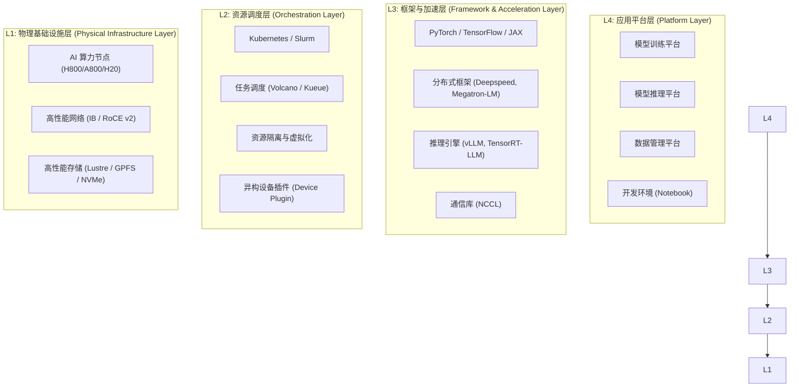

# AI Infra 架构设计概览

## 1. 什么是 AI Infra？

AI Infrastructure（AI 基础设施）是支撑人工智能应用（特别是大规模深度学习模型）全生命周期的底层技术底座。它不仅包含物理硬件（GPU、网络、存储），还包含之上的调度系统、分布式计算框架以及 MLOps/LLMOps 平台层。

对于大模型（LLM）时代，AI Infra 的核心挑战在于：**大规模（Scale）**、**高性能（Performance）** 和 **高稳定性（Stability）**。

## 2. 总体架构分层

AI Infra 通常采用分层架构设计，自底向上分为四层：

---

## 3. 各层设计详解

### 3.1 L1: 物理基础设施层 (Hardware)

这是 AI Infra 的基石，直接决定了训练和推理的性能上限。

*   **计算 (Compute)**: 
    *   **GPU 选型**: 针对 LLM 训练，带宽（HBM bandwidth）通常是瓶颈。常见选择：NVIDIA H100/A100, Huawei Ascend 910B 等。
    *   **节点拓扑**: 8卡模组（HGX/DGX）内部通过 NVSwitch/NVLink 全互联，提供极高的片间通信带宽（900GB/s+）。
*   **网络 (Network)**: 
    *   **参数面网络**: 用于多机分布式训练时的梯度同步。必须具备高带宽、低延迟。推荐 InfiniBand (IB) NDR/HDR 或 RoCE v2 高速以太网。设计上采用 Fat-Tree (胖树) 或 Dragonfly 拓扑来实现无阻塞通信。
    *   **数据面网络**: 用于读取训练数据和 Checkpoint 写入，通常使用标准以太网。
*   **存储 (Storage)**:
    *   **特点**: 读多写少（加载数据），定期的突发高频写（保存 Checkpoint）。
    *   **选型**: 
        *   **高性能并行文件系统**: Lustre, GPFS, WEKA。应对 Checkpoint 的瞬时写入压力。
        *   **对象存储加速**: MinIO + 加速层（如 Alluxio 或 JuiceFS）用于海量非结构化数据。

### 3.2 L2: 资源调度层 (Scheduling)

负责管理物理资源，提高资源利用率（MFU/HZn）。

*   **核心组件**: Kubernetes 是当前主流，HPC 场景偶尔沿用 Slurm。
*   **关键特性**:
    *   **Gang Scheduling (任务组调度)**: 训练任务是 "Scale-out" 的，所有 Worker 必须同时启动，只要有一个失败或等待，整个任务就无法运行。主要使用 Volcano 或 Kueue 实现。
    *   **Topology Awareness (拓扑感知)**: 调度器需要感知 GPU 物理拓扑（如 PCIe switch 亲和性，或 IB 网络拓扑），尽量将通信频繁的 Pod 调度在物理距离近的节点。
    *   **故障容错**: 节点故障自动隔离（Cordon），任务断点续训（Resume from Checkpoint）。

### 3.3 L3: 框架与加速层 (Framework)

提供分布式并行计算能力，屏蔽底层通信细节。

*   **3D 并行 (3D Parallelism)**: 也是系统设计的核心难点。
    *   **数据并行 (Data Parallelism, DP)**: 复制模型，切分数据。
    *   **张量并行 (Tensor Parallelism, TP)**: 切分矩阵乘法，通信量大，通常限制在单机内部（NVLink）。
    *   **流水线并行 (Pipeline Parallelism, PP)**: 层间切分，跨节点。
*   **通信库**: NCCL 是事实标准。需要针对具体网络环境调优 NCCL 参数（如 `NCCL_IB_GID_INDEX`, `NCCL_P2P_DISABLE` 等）。

### 3.4 L4: 应用平台层 (Platform)

面向算法工程师和数据科学家的统一入口。

*   **MLOps 流程**: 数据处理 -> 实验管理 (MLflow/WandB) -> 训练任务提交 -> 模型评估 -> 部署上线。
*   **可观测性**: 
    *   **集群监控**: Prometheus + Grafana (DCGM Exporter 监控 GPU 利用率、温度、ECC 错误)。
    *   **任务监控**: 训练 Loss 曲线，Throughput (tokens/sec)，MFU (Model Flops Utilization)。

## 4. 关键设计原则

1.  **最大化 MFU (Model FLOPS Utilization)**: 硬件买来很贵，软件优化的核心目标是让 GPU 尽可能也不空转。通过算子融合（FlashAttention）、通信重叠（Communication Overlap）等手段提升有效算力。
2.  **故障是常态 (Design for Failure)**: 在千卡集群中，硬件故障（ECC Error、Xid Error）是必然发生的。架构设计必须包含自动检测、自动隔离、快速恢复（Fast Failure Recovery）的能力。
3.  **数据本地化与缓存**: 避免 GPU 等待 I/O。使用 DALI 等数据加载库，以及多级缓存策略预取数据。

## 5. 总结

AI Infra 设计不是简单的堆砌硬件，而是从底层网络拓扑到上层分布式框架的**全栈协同优化 (Full-stack Optimization)**。优秀的架构师需要同时理解 GPU 硬件特性、Kubernetes 调度机制以及 PyTorch 分布式原理。
