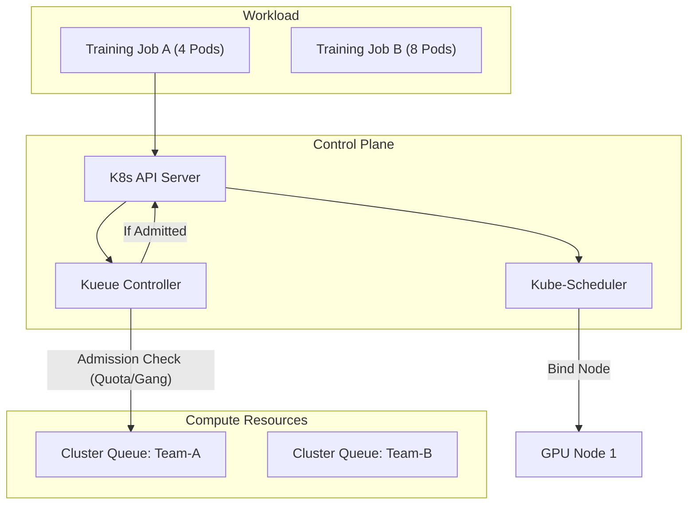

# 调度与资源管理 (Scheduling & Orchestration)

## 1. 为什么 AI 需要特殊的调度系统？

传统的 Kubernetes 调度器 (kube-scheduler) 专为微服务设计，强调一个个 Pod 的独立调度。而 AI 训练任务（特别是分布式训练）是 **Gang（帮派）** 性质的：
*   **All-or-Nothing**: 一个训练任务包含 N 个 Worker，这 N 个 Worker 必须**同时**获得资源并启动。如果只启动了 N-1 个，任务会卡死，导致死锁和资源浪费。
*   **拓扑敏感**: 不同的 GPU 之间通信开销巨大，调度器必须尽量把同一个任务的 Pod 放在物理网络距离最近的节点上。

## 2. 核心调度特性

### 2.1 Gang Scheduling (任务组调度)
保证一组 Pod 要么全部调度成功，要么全部排队。
*   **实现方案**: Volcano (基于 PodGroup), Kueue (Kubernetes Native), Coscheduling Plugin.
*   **资源预留**: 为了满足 Gang 需求，调度器有时需要"锁住"部分空闲资源等待后续资源释放，这会导致资源碎片。

### 2.2 Bin-packing vs. Spread (装箱 vs. 打散)
*   **Bin-packing (装箱)**: 优先填满一个节点再用下一个。对于 AI 训练，这有利于减少以太网通信（如果用了 NVLink 互联的单机多卡），并腾出大块空闲节点给大任务。
*   **Spread (打散)**: 微服务常用，提高可用性。AI 场景一般不推荐，除非是推理服务。

### 2.3 拓扑感知调度 (Topology Aware Scheduling)
*   **节点内拓扑**: 感知 PCIeSwitch 亲和性。
*   **节点间拓扑**: 感知机架 (Rack) 和交换机 (Switch) 层级。尽量让同一任务的 Pod 位于同一 ToR (Top of Rack) 下。

## 3. 调度系统选型

### 3.1 Kubernetes 生态
*   **Volcano**: CNCF 孵化项目，专为 Batch 任务设计。功能最全（Gang, DRF, Preemption），但引入了 CRD (VolcanoJob)，对原生 K8s 兼容性有一定侵入。
*   **Kueue**: K8s SIGs 新项目，基于原生 Job API。通过 Webhook 管理配额和队列，不替换 kube-scheduler，轻量级，兼容性好。**推荐未来趋势**。
*   **YuniKorn**: Apache 项目，层级队列管理能力强，适合大数据与 AI 混合负载。

### 3.2 HPC 生态
*   **Slurm**: 传统的 HPC 调度霸主。性能极高，支持 MPI 极好。但缺乏微服务支持，难以集成现代 MLOps 流程。目前多用于纯科研场景。

## 4. 资源隔离与共享

### 4.1 显存隔离
*   **MIG (Multi-Instance GPU)**: A100/H100 硬件特性。将一颗 GPU 物理切分为最多 7 个实例（算力和显存完全物理隔离）。适合推理和开发调试。
*   **MPS (Multi-Process Service)**: 控制进程共享 CUDA Context，提高小任务并发度。
*   **Time-Slicing**: 软件层面的时间片轮转。

### 4.2 队列管理 (Queue Management)
*   **多租户队列**: 按照部门/项目组划分 quota。
*   **借用与抢占 (Lending & Preemption)**: 
    *   优先级高的任务（生产训练）可以抢占优先级低的任务（开发调试）。
    *   空闲队列的资源可以借给忙碌队列，一旦忙碌队列有任务来，立即收回。

## 5. 故障容错 (Fault Tolerance)

在千卡训练中，故障是常态。
*   **自动隔离 (Cordon)**: 监控系统发现 GPU Xid 错误或 ECC 计数超标，自动触发 K8s Taint，阻止新任务调度到该节点。
*   **弹性训练 (Elastic Training)**: 配合 PyTorch Elastic (Torchelastic)，允许训练任务在 Worker 减少时继续运行（需要算法支持），或者自动重启恢复。

## 6. 架构图示

