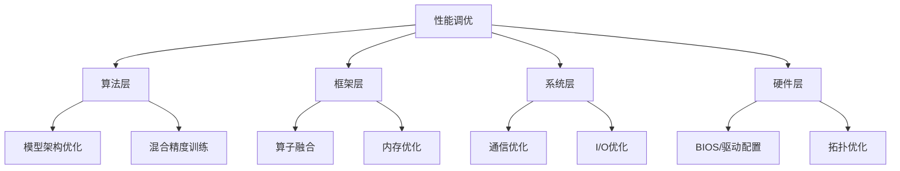

# GPU 性能调优最佳实践

## 📋 概述

GPU 性能调优的核心目标是**最大化 MFU（Model FLOPS Utilization）**，让昂贵的 GPU 算力尽可能用于有效计算，而非空转等待。

## 🎯 调优层次



---

## 1️⃣ 算法层优化

### 1.1 混合精度训练

使用 BF16/FP16 可以将吞吐量提升 2-3 倍：

```python
import torch
from torch.cuda.amp import autocast, GradScaler

scaler = GradScaler()

for data, target in dataloader:
    optimizer.zero_grad()
    
    with autocast(dtype=torch.bfloat16):  # 推荐 BF16
        output = model(data)
        loss = criterion(output, target)
    
    scaler.scale(loss).backward()
    scaler.step(optimizer)
    scaler.update()
```

> [!TIP]
> BF16 相比 FP16 具有更大的动态范围，通常不需要 Loss Scaling，训练更稳定。

### 1.2 FlashAttention

将标准 Attention 替换为 FlashAttention，显存降低 5-20x，速度提升 2-4x：

```python
from flash_attn import flash_attn_func

# 标准 Attention: O(N^2) 显存
# FlashAttention: O(N) 显存，IO-aware

attn_output = flash_attn_func(
    q, k, v,
    dropout_p=0.0,
    causal=True  # 自回归模型
)
```

### 1.3 Gradient Checkpointing

用计算换显存，允许训练更大的 Batch Size：

```python
from torch.utils.checkpoint import checkpoint_sequential

class LargeModel(nn.Module):
    def forward(self, x):
        # 每 4 层做一次 checkpoint
        return checkpoint_sequential(
            self.layers, 
            segments=len(self.layers) // 4, 
            input=x
        )
```

---

## 2️⃣ 框架层优化

### 2.1 算子融合 (Kernel Fusion)

减少 Kernel Launch 开销和中间结果的显存读写：

```python
# 未融合：3 次 Kernel Launch
x = linear(x)
x = gelu(x)
x = dropout(x)

# 融合后：1 次 Kernel Launch
x = fused_linear_gelu_dropout(x)
```

#### 使用 torch.compile

```python
import torch

model = MyModel()
model = torch.compile(model, mode="max-autotune")  # 最大化性能

# 首次前向会触发编译，之后运行更快
output = model(input)
```

### 2.2 CUDA Graph

捕获并重放 GPU 操作序列，消除 CPU 调度开销：

```python
# 预热
for _ in range(3):
    output = model(static_input)

# 捕获
g = torch.cuda.CUDAGraph()
with torch.cuda.graph(g):
    static_output = model(static_input)

# 重放（极快）
for data in dataloader:
    static_input.copy_(data)
    g.replay()
    result = static_output.clone()
```

### 2.3 显存优化

```python
# 1. 及时释放中间变量
del intermediate_tensor
torch.cuda.empty_cache()

# 2. 使用 inplace 操作
x.add_(y)  # 而非 x = x + y

# 3. 调整 PyTorch 内存分配器
os.environ["PYTORCH_CUDA_ALLOC_CONF"] = "expandable_segments:True"
```

---

## 3️⃣ 系统层优化

### 3.1 通信优化

#### NCCL 调优

```bash
# 选择最优算法
export NCCL_ALGO=Ring  # 或 Tree

# IB 网络配置
export NCCL_IB_DISABLE=0
export NCCL_IB_HCA=mlx5_0:1,mlx5_1:1
export NCCL_IB_GID_INDEX=3

# RoCE 网络配置
export NCCL_IB_DISABLE=1
export NCCL_SOCKET_IFNAME=eth0

# 调试
export NCCL_DEBUG=INFO
```

#### 通信与计算重叠

```python
from torch.distributed import all_reduce

# 异步通信
handle = all_reduce(tensor, async_op=True)

# 在通信进行的同时做计算
compute_result = heavy_computation()

# 等待通信完成
handle.wait()
```

### 3.2 数据加载优化

```python
dataloader = DataLoader(
    dataset,
    batch_size=64,
    num_workers=8,           # 多进程加载
    pin_memory=True,         # 锁页内存，加速 H2D
    prefetch_factor=2,       # 预取
    persistent_workers=True  # 进程持久化
)
```

#### 使用 NVIDIA DALI

```python
from nvidia.dali import pipeline_def
import nvidia.dali.fn as fn

@pipeline_def
def training_pipeline():
    jpegs, labels = fn.readers.file(file_root=data_dir)
    images = fn.decoders.image_random_crop(
        jpegs, 
        device="mixed",  # GPU 解码
        output_type=types.RGB
    )
    return fn.normalize(images), labels
```

---

## 4️⃣ 硬件层优化

### 4.1 BIOS 配置

| 配置项 | 推荐值 | 说明 |
|--------|--------|------|
| NUMA Balanced | Disabled | 避免内存迁移开销 |
| SVM | Enabled | AMD IOMMU |
| PCIe ACS | Disabled | 提升 P2P 性能 |
| Power Profile | Maximum Performance | 禁用节能 |

### 4.2 系统配置

```bash
# 关闭 NUMA 自动平衡
echo 0 > /proc/sys/kernel/numa_balancing

# 设置 CPU 性能模式
for gov in /sys/devices/system/cpu/cpu*/cpufreq/scaling_governor; do
    echo performance > $gov
done

# 配置大页
echo 16384 > /proc/sys/vm/nr_hugepages
```

### 4.3 GPU 配置

```bash
# 持久化模式（减少首次调用延迟）
nvidia-smi -pm 1

# 设置 GPU 时钟锁定（稳定测试）
nvidia-smi -lgc 1980,1980

# 设置 ECC 模式
nvidia-smi --ecc-config=0  # 关闭 ECC（性能模式）
```

---

## 📊 性能 Checklist

```
□ 使用 BF16/FP16 混合精度
□ 启用 FlashAttention
□ 使用 torch.compile
□ 配置 NCCL 环境变量
□ DataLoader 使用 pin_memory 和 num_workers
□ 关闭 NUMA 自动平衡
□ GPU 持久化模式开启
□ 监控 MFU 和 GPU 利用率
```

---

## 🔗 相关链接

### 内部文档
- [[GPU性能-GEMM测试分析]]：TFLOPS 测试分析
- [[GPU性能指标与监控]]：监控体系建设
- [[../推理服务/MOC - 推理服务|推理服务]]：推理优化

### 外部资源
- [PyTorch Performance Tuning Guide](https://pytorch.org/tutorials/recipes/recipes/tuning_guide.html)
- [NVIDIA Deep Learning Performance Guide](https://docs.nvidia.com/deeplearning/performance/)
- [FlashAttention GitHub](https://github.com/Dao-AILab/flash-attention)
