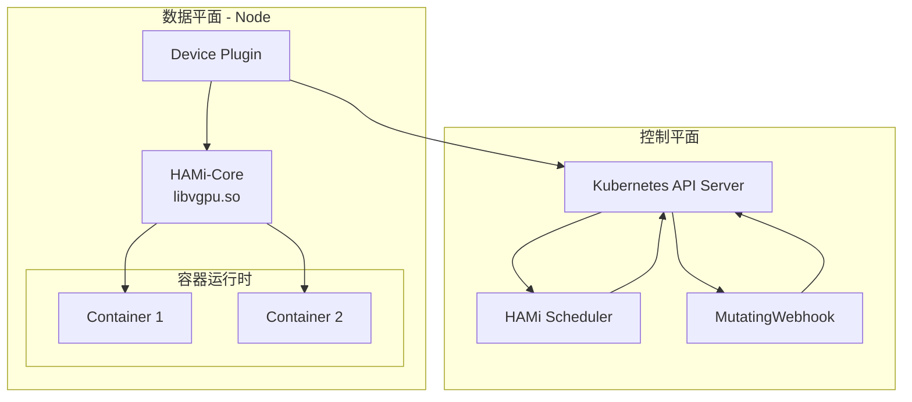
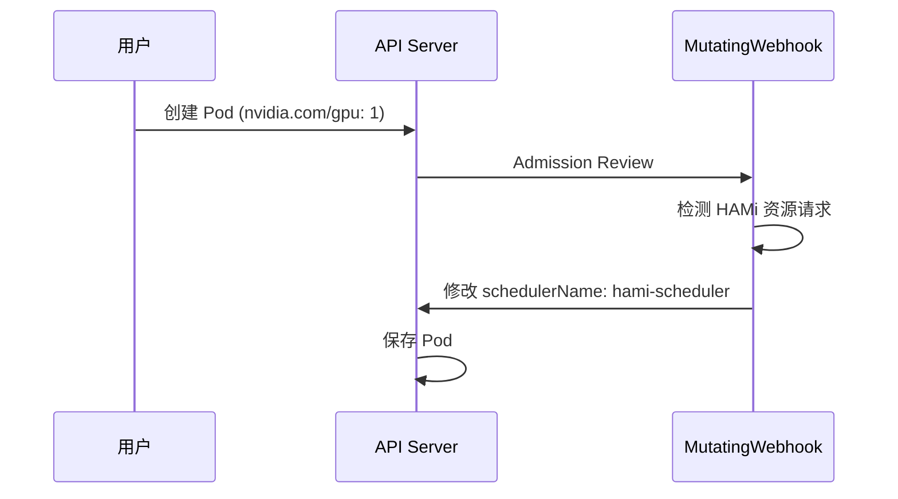
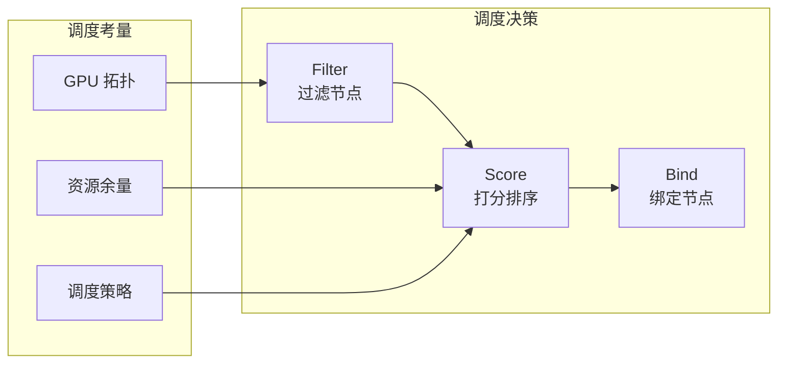
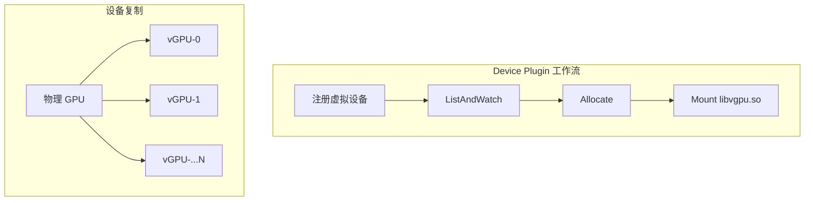
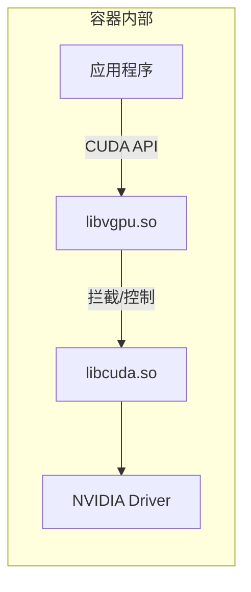
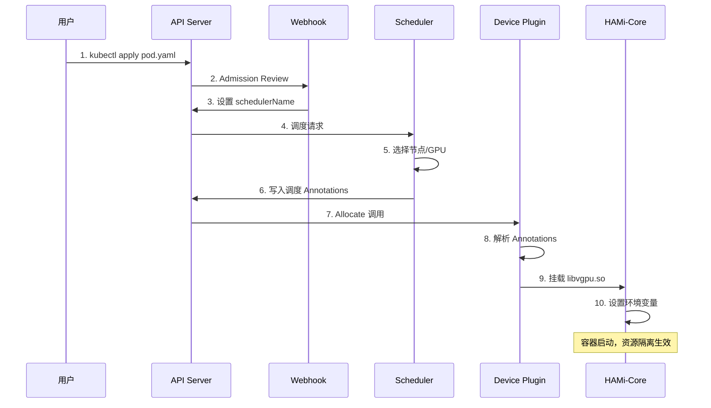
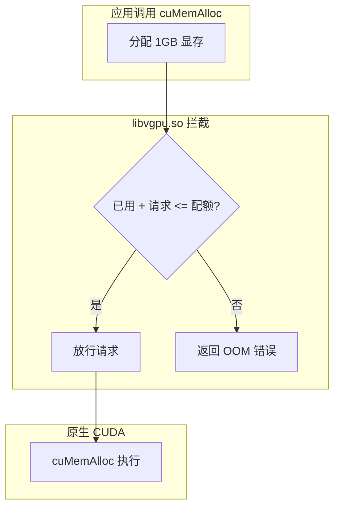
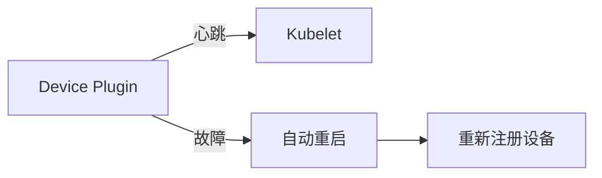

# HAMi 架构与组件

## 1. 整体架构

HAMi 采用 Kubernetes 原生架构，通过多个组件协同工作实现 GPU 虚拟化和共享。



## 2. 核心组件

### 2.1 MutatingWebhook

**职责**: 拦截 Pod 创建请求，修改调度器配置。



**工作逻辑**:
1. 检查 Pod 是否请求了 HAMi 管理的资源
2. 如果是，修改 `spec.schedulerName` 为 `hami-scheduler`
3. 添加必要的 Annotations

### 2.2 HAMi Scheduler

**职责**: 智能调度决策，分配 GPU 资源。



**核心功能**:

| 功能 | 描述 |
|------|------|
| **全局视图** | 维护所有节点的 GPU 资源状态 |
| **拓扑感知** | 考虑 NVLink/NVSwitch 拓扑 |
| **策略调度** | 支持 Binpack/Spread 策略 |
| **资源记账** | 跟踪已分配的 vGPU 资源 |

**调度结果**通过 Annotations 传递给 Device Plugin：

```yaml
annotations:
  # 调度结果示例
  hami.io/vgpu-devices-to-allocate: |
    [
      {
        "uuid": "GPU-xxxxx-yyyy-zzzz",
        "memory": 4000,
        "cores": 30
      }
    ]
```

### 2.3 Device Plugin

**职责**: 节点级 GPU 管理，设备分配到容器。



**核心功能**:

1. **设备发现**: 探测节点上的物理 GPU
2. **设备复制**: 将物理 GPU 复制为 N 个虚拟设备
3. **Allocate**: 读取调度结果，分配指定 GPU
4. **环境注入**: 设置 `LD_PRELOAD` 和资源限制环境变量

```go
// 设备复制逻辑示意
func replicateDevices(gpus []PhysicalGPU, replicas int) []VirtualDevice {
    var devices []VirtualDevice
    for _, gpu := range gpus {
        for i := 0; i < replicas; i++ {
            devices = append(devices, VirtualDevice{
                ID:     fmt.Sprintf("%s-%d", gpu.UUID, i),
                Parent: gpu.UUID,
            })
        }
    }
    return devices
}
```

### 2.4 HAMi-Core (libvgpu.so)

**职责**: 容器内资源控制，实现隔离和限制。



**实现原理**:

HAMi-Core 通过 `LD_PRELOAD` 机制注入 `libvgpu.so`，拦截 CUDA API 调用：

```c
// libvgpu.so 拦截原理示意
void* dlsym(void* handle, const char* symbol) {
    if (startsWith(symbol, "cu") || startsWith(symbol, "nvml")) {
        // 返回 HAMi 的 wrapper 函数
        return hami_get_wrapper(symbol);
    }
    return original_dlsym(handle, symbol);
}
```

**资源控制环境变量**:

| 环境变量 | 说明 | 示例 |
|---------|------|------|
| `CUDA_DEVICE_MEMORY_LIMIT` | 显存限制 | `4000` (MB) |
| `CUDA_DEVICE_SM_LIMIT` | 算力限制 | `30` (%) |
| `CUDA_VISIBLE_DEVICES` | 可见设备 | `0` |

## 3. 工作流程详解

### 3.1 Pod 创建流程



### 3.2 资源隔离流程



## 4. 组件通信机制

### 4.1 Annotations 传递数据

HAMi 组件间通过 Pod Annotations 传递调度信息：

```yaml
metadata:
  annotations:
    # Scheduler 写入
    hami.io/node-name: "node-1"
    hami.io/vgpu-devices-to-allocate: '[{"uuid":"GPU-xxx","memory":4000,"cores":30}]'
    
    # Device Plugin 更新
    hami.io/vgpu-devices-allocated: '[{"uuid":"GPU-xxx","idx":0}]'
    hami.io/container-id: "abc123..."
```

### 4.2 节点资源上报

Device Plugin 通过 Kubernetes 扩展资源机制上报：

```yaml
# kubectl describe node
Capacity:
  nvidia.com/gpu:     40    # 复制后的虚拟设备数
  nvidia.com/gpumem:  98304  # 总显存 MB
Allocatable:
  nvidia.com/gpu:     40
  nvidia.com/gpumem:  98304
```

## 5. 高可用设计

### 5.1 Scheduler 高可用

```yaml
# Scheduler Deployment
replicas: 2
strategy:
  type: RollingUpdate
  
# Leader 选举
leaderElection:
  enabled: true
  leaderElect: true
  resourceName: hami-scheduler
```

### 5.2 Device Plugin 容错



## 6. 监控指标

HAMi 暴露 Prometheus 指标：

| 指标 | 说明 |
|------|------|
| `hami_vgpu_allocated` | 已分配的 vGPU 数量 |
| `hami_gpu_memory_used` | GPU 显存使用量 |
| `hami_gpu_utilization` | GPU 利用率 |
| `hami_scheduler_latency` | 调度延迟 |

```yaml
# Prometheus ServiceMonitor
apiVersion: monitoring.coreos.com/v1
kind: ServiceMonitor
metadata:
  name: hami-metrics
spec:
  selector:
    matchLabels:
      app: hami-scheduler
  endpoints:
  - port: metrics
    interval: 15s
```

## 7. 总结

| 组件 | 部署位置 | 核心职责 |
|------|---------|---------|
| **MutatingWebhook** | 控制平面 | 拦截 Pod，设置调度器 |
| **HAMi Scheduler** | 控制平面 | 智能调度，资源分配 |
| **Device Plugin** | 每个节点 | 设备管理，容器注入 |
| **HAMi-Core** | 容器内部 | API 拦截，资源隔离 |

> [!NOTE]
> HAMi 的架构设计遵循 Kubernetes 原生模式，各组件职责清晰、松耦合，易于扩展和运维。
