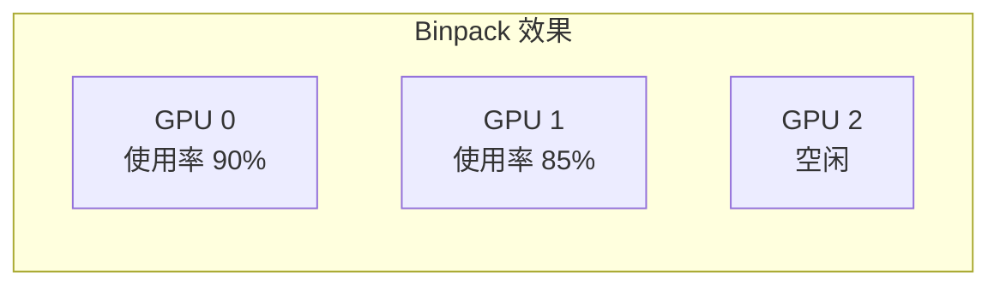
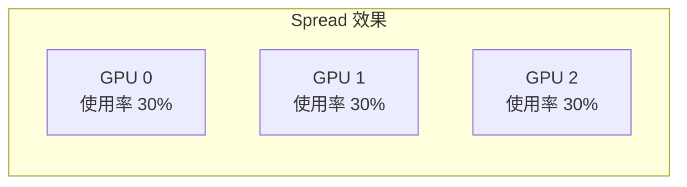

# HAMi 安装与配置

## 1. 环境要求

### 1.1 软件版本要求

| 组件 | 最低版本 | 推荐版本 |
|------|---------|---------|
| Kubernetes | 1.18+ | 1.28+ |
| Helm | 3.0+ | 3.12+ |
| NVIDIA Driver | 440+ | 535+ |
| Container Toolkit | 2.0+ | 1.14+ |
| glibc | 2.17 ~ 2.30 | 2.28 |
| Kernel | 3.10+ | 5.x+ |

### 1.2 前置条件检查

```bash
# 检查 Kubernetes 版本
kubectl version --short

# 检查 NVIDIA 驱动
nvidia-smi

# 检查 Container Toolkit
nvidia-ctk --version

# 检查容器运行时配置
cat /etc/containerd/config.toml | grep -A 5 nvidia
```

> [!IMPORTANT]
> 确保容器运行时已配置 NVIDIA 为默认 runtime：
> ```toml
> [plugins."io.containerd.grpc.v1.cri".containerd]
>   default_runtime_name = "nvidia"
> ```

## 2. Helm 安装

### 2.1 添加 HAMi Helm 仓库

```bash
# 添加仓库
helm repo add hami-charts https://project-hami.github.io/HAMi/

# 更新仓库
helm repo update

# 查看可用版本
helm search repo hami-charts/hami --versions
```

### 2.2 标记 GPU 节点

```bash
# 为 GPU 节点添加标签（HAMi 调度依赖此标签）
kubectl label nodes <node-name> gpu=on

# 验证标签
kubectl get nodes -l gpu=on
```

### 2.3 安装 HAMi

```bash
# 基础安装
helm install hami hami-charts/hami \
  --namespace hami-system \
  --create-namespace

# 自定义配置安装
helm install hami hami-charts/hami \
  --namespace hami-system \
  --create-namespace \
  -f values.yaml
```

### 2.4 验证安装

```bash
# 检查 Pod 状态
kubectl -n hami-system get pods

# 预期输出
# NAME                              READY   STATUS    RESTARTS   AGE
# hami-scheduler-xxxxx              2/2     Running   0          1m
# hami-device-plugin-xxxxx          1/1     Running   0          1m
```

## 3. 核心配置参数

### 3.1 values.yaml 完整配置

```yaml
# 调度器配置
scheduler:
  # 副本数 (建议生产环境 >= 2)
  replicas: 2
  
  # 调度策略
  schedulerPolicy:
    # binpack: 尽量填满一个 GPU
    # spread: 分散到不同 GPU
    nodeSchedulerPolicy: binpack
    gpuSchedulerPolicy: binpack
  
  # 资源限制
  resources:
    requests:
      cpu: 100m
      memory: 256Mi
    limits:
      cpu: 1000m
      memory: 1Gi

# Device Plugin 配置
devicePlugin:
  # DaemonSet 配置
  image:
    repository: projecthami/hami-device-plugin
    tag: "v2.0.0"
  
  # GPU 复制数量 (每个物理 GPU 可虚拟化为多少个设备)
  deviceSplitCount: 10
  
  # 默认显存分配 (MB)
  defaultMem: 0  # 0 表示不限制
  
  # 默认算力分配 (%)
  defaultCores: 0  # 0 表示不限制

# Webhook 配置
webhook:
  enabled: true
  failurePolicy: Ignore  # Ignore 或 Fail
```

### 3.2 关键参数说明

| 参数 | 说明 | 默认值 |
|------|------|-------|
| `deviceSplitCount` | 每个 GPU 的虚拟设备数 | 10 |
| `defaultMem` | 默认显存限制 (MB)，0=不限 | 0 |
| `defaultCores` | 默认算力限制 (%)，0=不限 | 0 |
| `nodeSchedulerPolicy` | 节点调度策略 | binpack |
| `gpuSchedulerPolicy` | GPU 调度策略 | binpack |

## 4. 调度策略配置

### 4.1 Binpack 策略

优先填满当前 GPU，适合资源紧张场景：

```yaml
schedulerPolicy:
  nodeSchedulerPolicy: binpack
  gpuSchedulerPolicy: binpack
```



### 4.2 Spread 策略

分散到不同 GPU，适合性能敏感场景：

```yaml
schedulerPolicy:
  nodeSchedulerPolicy: spread
  gpuSchedulerPolicy: spread
```



## 5. 高级配置

### 5.1 配置特定设备类型

```yaml
# 仅管理特定型号 GPU
devicePlugin:
  nodeSelector:
    nvidia.com/gpu.product: "NVIDIA-A100-SXM4-80GB"
```

### 5.2 配置资源限制范围

```yaml
# 限制单个 Pod 可申请的最大资源
resourceQuota:
  maxGPUPerPod: 4
  maxMemoryPerGPU: 40000  # 40GB
  maxCoresPerGPU: 100     # 100%
```

### 5.3 配置拓扑感知

```yaml
# 启用 NVLink 拓扑感知调度
scheduler:
  topologyAware: true
  nvlinkPreferred: true
```

## 6. 升级与卸载

### 6.1 升级 HAMi

```bash
# 更新 Helm 仓库
helm repo update

# 升级到最新版本
helm upgrade hami hami-charts/hami \
  --namespace hami-system \
  -f values.yaml

# 升级到指定版本
helm upgrade hami hami-charts/hami \
  --namespace hami-system \
  --version 2.1.0
```

> [!CAUTION]
> 升级期间可能影响到正在运行的 GPU 任务，建议在维护窗口进行。

### 6.2 卸载 HAMi

```bash
# 卸载 HAMi
helm uninstall hami -n hami-system

# 清理命名空间
kubectl delete namespace hami-system

# 清理节点标签
kubectl label nodes --all gpu-
```

## 7. 故障排查

### 7.1 常见问题

| 问题 | 可能原因 | 解决方案 |
|------|---------|---------|
| Pod 一直 Pending | 调度器未运行 | 检查 hami-scheduler Pod |
| GPU 不可见 | Device Plugin 异常 | 检查 DaemonSet 日志 |
| 资源不隔离 | HAMi-Core 未注入 | 检查 LD_PRELOAD 环境变量 |
| 调度失败 | 节点无 `gpu=on` 标签 | 添加节点标签 |

### 7.2 调试命令

```bash
# 查看调度器日志
kubectl -n hami-system logs -l app=hami-scheduler -f

# 查看 Device Plugin 日志
kubectl -n hami-system logs -l name=hami-device-plugin -f

# 查看 Webhook 日志
kubectl -n hami-system logs -l app=hami-webhook -f

# 检查节点资源
kubectl describe node <node-name> | grep -A 20 "Allocatable"

# 检查 Pod Annotations
kubectl describe pod <pod-name> | grep -A 10 "hami.io"
```

### 7.3 检查 HAMi-Core 注入

```bash
# 进入容器检查环境变量
kubectl exec -it <pod-name> -- env | grep -E "CUDA|LD_PRELOAD"

# 预期输出
# LD_PRELOAD=/usr/local/vgpu/libvgpu.so
# CUDA_DEVICE_MEMORY_LIMIT=4000
# CUDA_DEVICE_SM_LIMIT=30
```

## 8. 生产环境清单

### 8.1 部署检查清单

- [ ] NVIDIA 驱动版本 >= 440
- [ ] Container Toolkit 已配置
- [ ] 所有 GPU 节点已标记 `gpu=on`
- [ ] Helm values.yaml 已根据需求定制
- [ ] 调度器副本数 >= 2
- [ ] 监控和告警已配置

### 8.2 推荐配置示例

```yaml
# 生产环境 values.yaml
scheduler:
  replicas: 3
  resources:
    requests:
      cpu: 500m
      memory: 512Mi
    limits:
      cpu: 2000m
      memory: 2Gi

devicePlugin:
  deviceSplitCount: 20
  resources:
    requests:
      cpu: 100m
      memory: 128Mi
    limits:
      cpu: 500m
      memory: 512Mi

webhook:
  failurePolicy: Fail  # 生产环境建议 Fail

metrics:
  enabled: true
  port: 9394

logging:
  level: info
```

## 9. 总结

| 步骤 | 命令/操作 |
|------|----------|
| 1. 环境检查 | 验证 K8s、驱动、Container Toolkit |
| 2. 添加仓库 | `helm repo add hami-charts ...` |
| 3. 标记节点 | `kubectl label nodes ... gpu=on` |
| 4. 安装 | `helm install hami ...` |
| 5. 验证 | `kubectl -n hami-system get pods` |

> [!TIP]
> 建议先在测试环境验证，再部署到生产环境。使用 GitOps 管理 values.yaml 变更。
