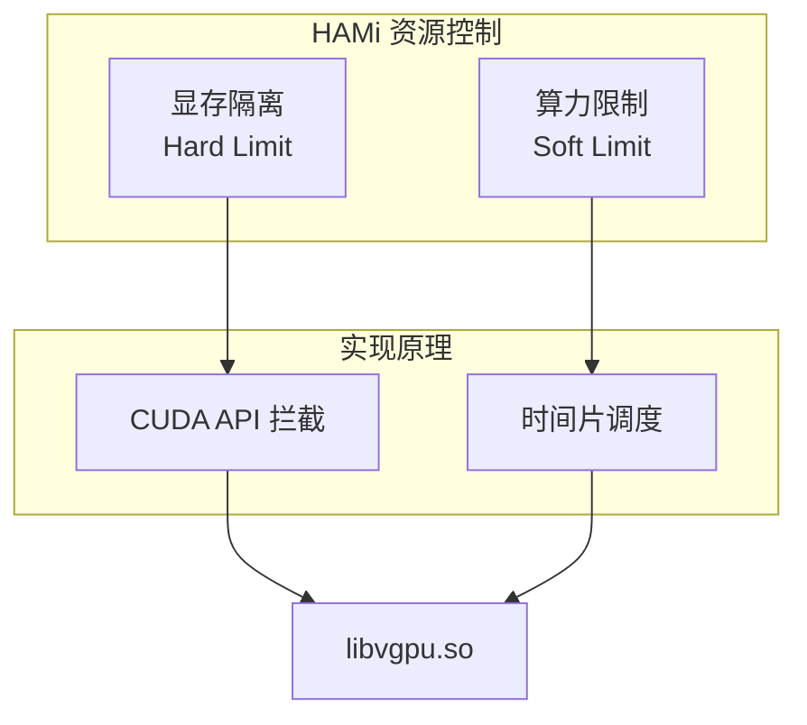
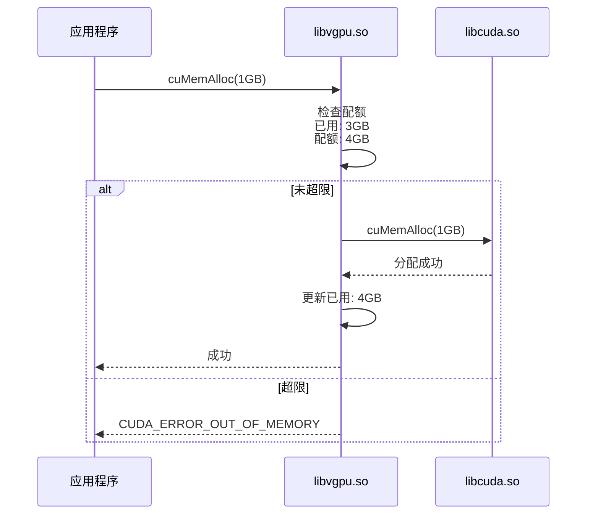
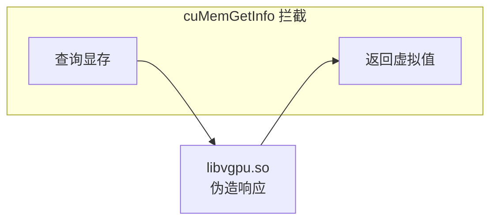
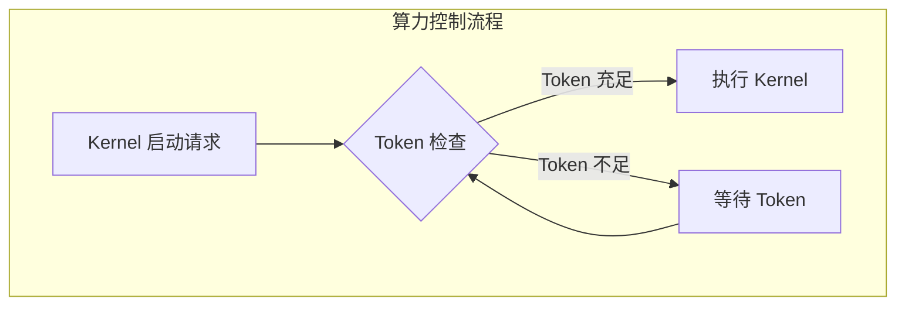
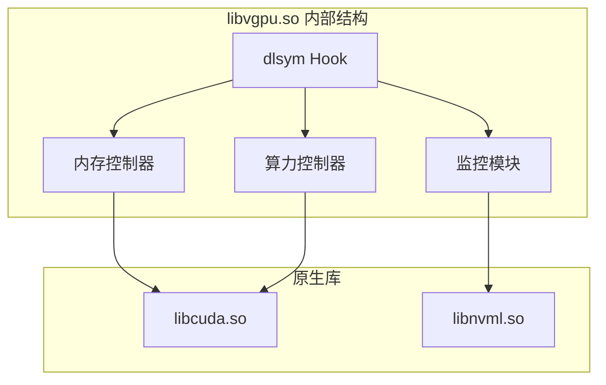
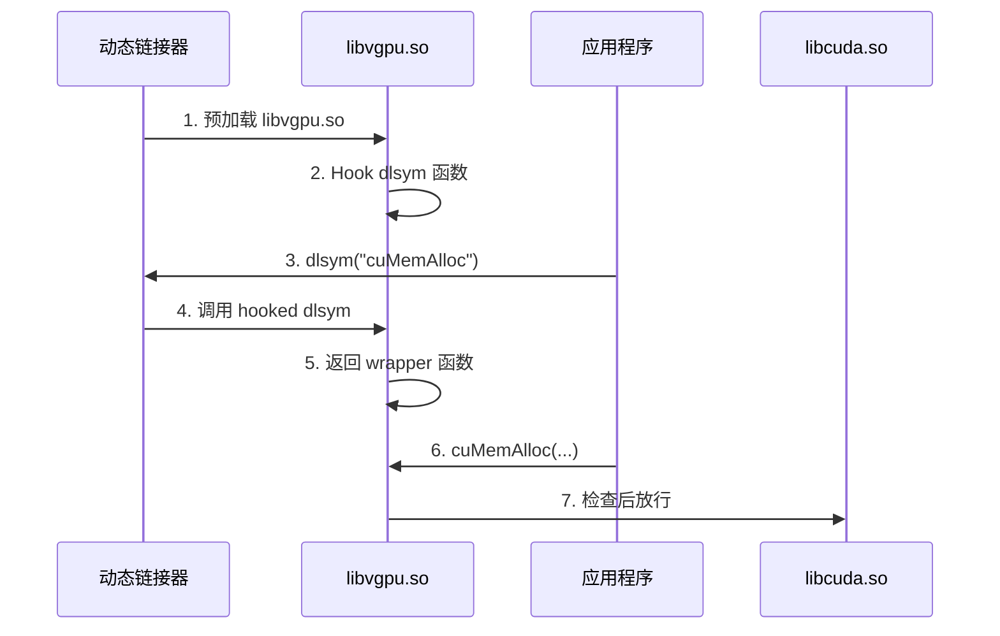
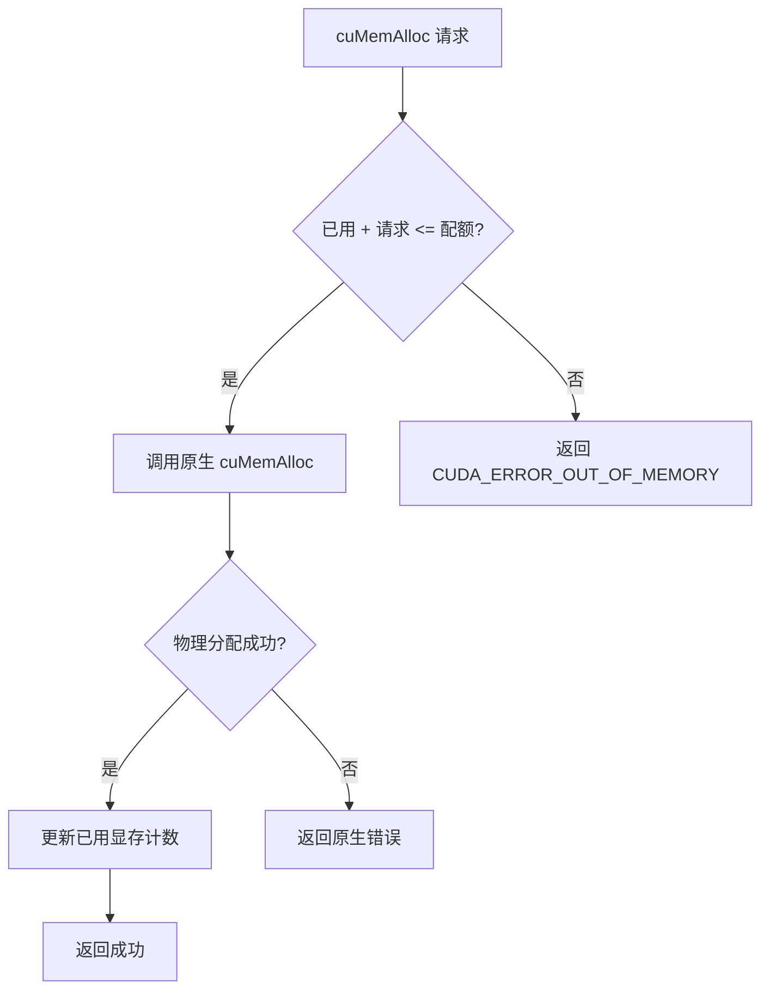

# GPU 资源隔离与共享

## 1. 隔离机制概述

HAMi 提供两种资源隔离能力：

| 资源类型 | 隔离方式 | 强度 | 实现层 |
|---------|---------|------|--------|
| **显存** | 硬隔离 | 强制限制 | API 拦截 |
| **算力** | 软隔离 | 弹性限制 | 时间片控制 |



## 2. 显存隔离 (Memory Isolation)

### 2.1 硬隔离原理

HAMi 通过拦截 CUDA 内存分配 API 实现显存硬隔离：



### 2.2 拦截的 CUDA API

```c
// libvgpu.so 拦截的内存相关 API
CUresult cuMemAlloc(CUdeviceptr *dptr, size_t bytesize);
CUresult cuMemAllocManaged(CUdeviceptr *dptr, size_t bytesize, unsigned int flags);
CUresult cuMemAllocPitch(CUdeviceptr *dptr, size_t *pPitch, size_t WidthInBytes, size_t Height, unsigned int ElementSizeBytes);
CUresult cuMemFree(CUdeviceptr dptr);
CUresult cuMemGetInfo(size_t *free, size_t *total);
```

### 2.3 显存限制配置

**方式一：绝对值 (MB)**

```yaml
resources:
  limits:
    nvidia.com/gpu: 1
    nvidia.com/gpumem: 4000  # 4GB 显存
```

**方式二：百分比**

```yaml
resources:
  limits:
    nvidia.com/gpu: 1
    nvidia.com/gpumem-percentage: 50  # 50% 显存
```

### 2.4 显存信息伪造

容器内查询显存时，HAMi 返回虚拟化后的值：

```python
import torch

# 实际物理显存: 80GB
# 容器配额: 8GB

print(torch.cuda.get_device_properties(0).total_memory)
# 输出: 8589934592 (8GB)
```



## 3. 算力限制 (Compute Limiting)

### 3.1 软限制原理

HAMi 通过**时间片控制**实现算力限制，这是一种软隔离：



### 3.2 Token 机制

```c
// 简化的算力限制逻辑
typedef struct {
    int available_tokens;
    int max_tokens;
    int refill_rate;  // tokens per interval
} TokenBucket;

CUresult hami_launch_kernel(CUfunction f, ...) {
    // 消耗 token
    while (token_bucket.available_tokens <= 0) {
        usleep(1000);  // 等待 token 补充
    }
    token_bucket.available_tokens--;
    
    // 放行 kernel 执行
    return original_cuLaunchKernel(f, ...);
}

// 后台线程定期补充 token
void token_refill_thread() {
    while (1) {
        usleep(REFILL_INTERVAL);
        token_bucket.available_tokens = 
            min(token_bucket.available_tokens + refill_rate, max_tokens);
    }
}
```

### 3.3 算力限制配置

```yaml
resources:
  limits:
    nvidia.com/gpu: 1
    nvidia.com/gpucores: 30  # 限制使用 30% 算力
```

### 3.4 软限制 vs 硬限制

| 特性 | 显存隔离 | 算力限制 |
|------|---------|---------|
| 隔离强度 | 硬隔离 | 软隔离 |
| 超限行为 | 立即报错 | 延迟执行 |
| 短时突发 | 不允许 | 允许 |
| 长期平均 | 严格遵守 | 接近目标 |

> [!NOTE]
> 算力是软限制意味着：短时间内可能超过配额，但长期平均会控制在目标值附近。

## 4. HAMi-Core 技术实现

### 4.1 libvgpu.so 架构



### 4.2 环境变量配置

Device Plugin 启动容器时设置的环境变量：

```bash
# 显存限制 (MB)
CUDA_DEVICE_MEMORY_LIMIT=4000

# 算力限制 (%)
CUDA_DEVICE_SM_LIMIT=30

# 可见设备
CUDA_VISIBLE_DEVICES=0

# 预加载库
LD_PRELOAD=/usr/local/vgpu/libvgpu.so
```

### 4.3 LD_PRELOAD 原理



## 5. 资源声明最佳实践

### 5.1 推理服务 (低显存高算力)

```yaml
apiVersion: v1
kind: Pod
metadata:
  name: inference-service
spec:
  containers:
  - name: inference
    image: my-inference:v1
    resources:
      limits:
        nvidia.com/gpu: 1
        nvidia.com/gpumem: 4000     # 4GB 显存
        nvidia.com/gpucores: 50     # 50% 算力
```

### 5.2 开发调试 (低算力灵活显存)

```yaml
apiVersion: v1
kind: Pod
metadata:
  name: dev-notebook
spec:
  containers:
  - name: notebook
    image: jupyter/pytorch-notebook
    resources:
      limits:
        nvidia.com/gpu: 1
        nvidia.com/gpumem: 8000     # 8GB 显存
        nvidia.com/gpucores: 20     # 20% 算力
```

### 5.3 批量处理 (灵活配置)

```yaml
apiVersion: v1
kind: Pod
metadata:
  name: batch-job
spec:
  containers:
  - name: batch
    image: batch-processor:v1
    resources:
      limits:
        nvidia.com/gpu: 1
        nvidia.com/gpumem-percentage: 30  # 30% 显存
        nvidia.com/gpucores: 30           # 30% 算力
```

## 6. 监控与调试

### 6.1 容器内查看资源

```python
import torch
import os

# 查看配置的限制
print(f"Memory Limit: {os.getenv('CUDA_DEVICE_MEMORY_LIMIT')} MB")
print(f"Cores Limit: {os.getenv('CUDA_DEVICE_SM_LIMIT')}%")

# 查看可见的显存
props = torch.cuda.get_device_properties(0)
print(f"Visible Memory: {props.total_memory / 1e9:.2f} GB")
```

### 6.2 查看实际使用

```bash
# 容器内
nvidia-smi --query-compute-apps=pid,used_memory --format=csv

# 节点上查看所有 GPU 使用
kubectl exec -it <hami-device-plugin-pod> -- \
  nvidia-smi --query-gpu=index,memory.used,utilization.gpu --format=csv
```

### 6.3 常见问题

| 问题 | 原因 | 解决方案 |
|------|------|---------|
| CUDA OOM 提前触发 | 配额设置过低 | 增加 gpumem 配置 |
| 任务运行缓慢 | 算力限制过严 | 增加 gpucores 配置 |
| nvidia-smi 显示异常 | NVML 拦截 | 正常现象，配额生效 |

## 7. 原理深入：OOM 处理

### 7.1 显存 OOM 流程



### 7.2 与原生 OOM 的区别

| 场景 | 原生 OOM | HAMi OOM |
|------|---------|----------|
| 触发条件 | 物理显存耗尽 | 达到配额限制 |
| 影响范围 | 整个 GPU | 仅当前容器 |
| 错误码 | CUDA_ERROR_OUT_OF_MEMORY | 相同 |
| 恢复方式 | 等待其他进程释放 | 仅需自己释放 |

## 8. 总结

| 隔离类型 | 配置方式 | 隔离强度 | 适用场景 |
|---------|---------|---------|---------|
| 显存硬隔离 | `gpumem`/`gpumem-percentage` | 强制 | 所有场景 |
| 算力软限制 | `gpucores` | 弹性 | 资源公平分配 |

> [!IMPORTANT]
> HAMi 的核心优势在于通过软件层面实现了**显存硬隔离**，这是 NVIDIA 原生 Time-slicing 无法提供的能力。结合算力软限制，可以实现多任务安全共享 GPU。
