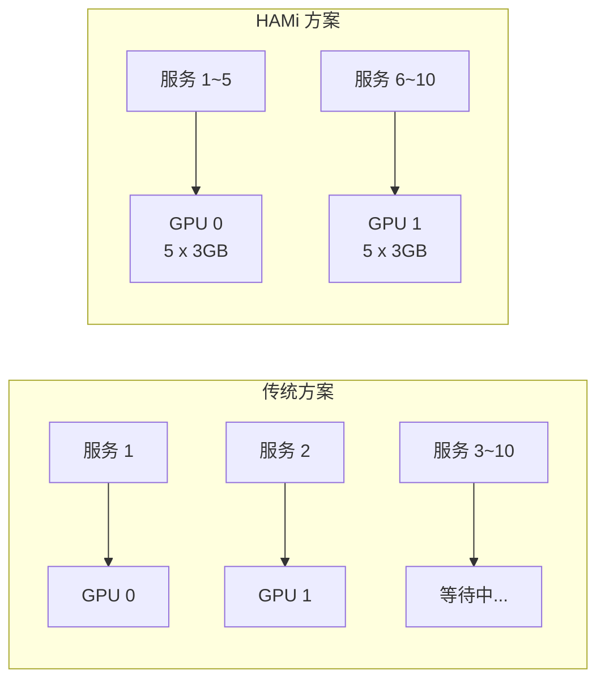
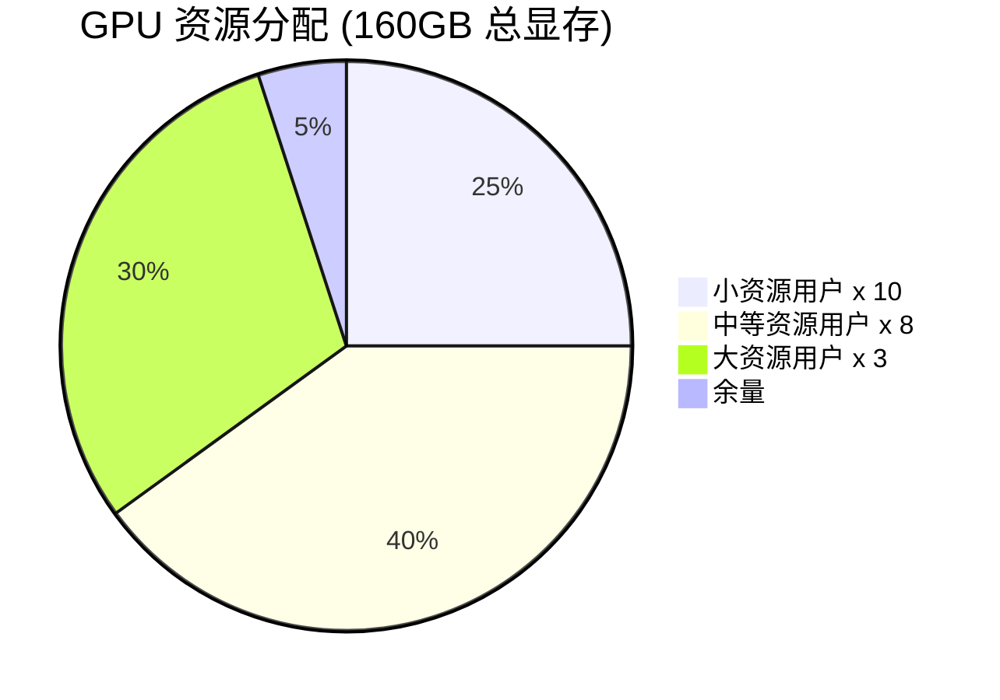
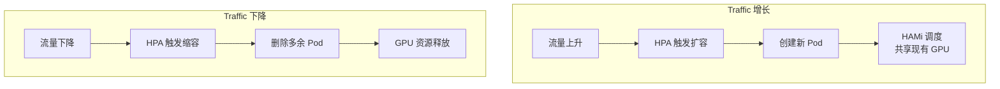

# HAMi 实战案例

## 1. 案例一：推理服务共享 GPU

### 1.1 场景描述

**背景**: 公司有 10 个轻量级 AI 推理服务，每个服务显存需求约 3GB，但只有 2 张 A100 80GB GPU。

**目标**: 让 10 个服务共享 2 张 GPU，实现资源高效利用。



### 1.2 Deployment 配置

```yaml
apiVersion: apps/v1
kind: Deployment
metadata:
  name: inference-service
  labels:
    app: inference
spec:
  replicas: 10
  selector:
    matchLabels:
      app: inference
  template:
    metadata:
      labels:
        app: inference
    spec:
      containers:
      - name: inference
        image: my-inference-service:v1.0
        ports:
        - containerPort: 8080
        resources:
          limits:
            nvidia.com/gpu: 1
            nvidia.com/gpumem: 3000      # 3GB 显存
            nvidia.com/gpucores: 15      # 15% 算力
          requests:
            nvidia.com/gpu: 1
            nvidia.com/gpumem: 3000
            nvidia.com/gpucores: 15
        env:
        - name: MODEL_PATH
          value: /models/llama-7b
        livenessProbe:
          httpGet:
            path: /health
            port: 8080
          initialDelaySeconds: 30
          periodSeconds: 10
---
apiVersion: v1
kind: Service
metadata:
  name: inference-service
spec:
  selector:
    app: inference
  ports:
  - port: 80
    targetPort: 8080
  type: ClusterIP
```

### 1.3 实施效果

| 指标 | 传统方案 | HAMi 方案 | 提升 |
|------|---------|----------|------|
| 可运行服务数 | 2 | 10 | 5x |
| GPU 利用率 | 15% | 75% | 5x |
| 资源成本 | 需 5 张 GPU | 2 张 GPU | 节省 60% |

## 2. 案例二：Jupyter 开发环境

### 2.1 场景描述

**背景**: 数据科学团队有 20 名成员需要 Jupyter 环境进行模型开发和调试。

**目标**: 每人分配独立的 GPU 资源，保证开发效率，控制资源使用。

### 2.2 JupyterHub 配置

```yaml
# JupyterHub values.yaml
singleuser:
  image:
    name: jupyter/pytorch-notebook
    tag: cuda-12.0
  
  profileList:
    - display_name: "小资源 (4GB 显存, 20% 算力)"
      description: "适合轻量开发和调试"
      kubespawner_override:
        extra_resource_limits:
          nvidia.com/gpu: "1"
          nvidia.com/gpumem: "4000"
          nvidia.com/gpucores: "20"
    
    - display_name: "中等资源 (8GB 显存, 30% 算力)"
      description: "适合模型微调和实验"
      kubespawner_override:
        extra_resource_limits:
          nvidia.com/gpu: "1"
          nvidia.com/gpumem: "8000"
          nvidia.com/gpucores: "30"
    
    - display_name: "大资源 (16GB 显存, 50% 算力)"
      description: "适合大模型开发"
      kubespawner_override:
        extra_resource_limits:
          nvidia.com/gpu: "1"
          nvidia.com/gpumem: "16000"
          nvidia.com/gpucores: "50"

hub:
  config:
    Authenticator:
      admin_users:
        - admin
```

### 2.3 ResourceQuota 限制

```yaml
apiVersion: v1
kind: ResourceQuota
metadata:
  name: gpu-quota
  namespace: jupyter
spec:
  hard:
    requests.nvidia.com/gpu: "30"
    limits.nvidia.com/gpu: "30"
    requests.nvidia.com/gpumem: "160000"   # 160GB 总显存
    limits.nvidia.com/gpumem: "160000"
```

### 2.4 效果展示



## 3. 案例三：多租户 GPU 平台

### 3.1 场景描述

**背景**: 平台需要支持多个团队独立使用 GPU 资源，要求：
- 资源隔离，互不影响
- 按团队计费
- 公平调度

### 3.2 Namespace 隔离

```yaml
# 团队 A 命名空间
apiVersion: v1
kind: Namespace
metadata:
  name: team-a
  labels:
    team: a
---
# 团队 A 资源配额
apiVersion: v1
kind: ResourceQuota
metadata:
  name: gpu-quota
  namespace: team-a
spec:
  hard:
    requests.nvidia.com/gpu: "10"
    limits.nvidia.com/gpumem: "80000"    # 80GB
    limits.nvidia.com/gpucores: "500"    # 相当于 5 张完整卡
---
# 团队 B 命名空间
apiVersion: v1
kind: Namespace
metadata:
  name: team-b
  labels:
    team: b
---
apiVersion: v1
kind: ResourceQuota
metadata:
  name: gpu-quota
  namespace: team-b
spec:
  hard:
    requests.nvidia.com/gpu: "15"
    limits.nvidia.com/gpumem: "120000"   # 120GB
    limits.nvidia.com/gpucores: "750"
```

### 3.3 优先级调度

```yaml
# 高优先级 (生产环境)
apiVersion: scheduling.k8s.io/v1
kind: PriorityClass
metadata:
  name: production-priority
value: 1000000
globalDefault: false
description: "生产环境工作负载"
---
# 中优先级 (开发环境)
apiVersion: scheduling.k8s.io/v1
kind: PriorityClass
metadata:
  name: development-priority
value: 100000
globalDefault: true
description: "开发环境工作负载"
---
# 低优先级 (批处理)
apiVersion: scheduling.k8s.io/v1
kind: PriorityClass
metadata:
  name: batch-priority
value: 10000
preemptionPolicy: Never
description: "批处理任务，不可抢占"
```

### 3.4 计费标签

```yaml
apiVersion: v1
kind: Pod
metadata:
  name: team-a-job
  namespace: team-a
  labels:
    app: training
    billing: team-a
    cost-center: "CC-12345"
  annotations:
    cost.team: "team-a"
    cost.project: "llm-fine-tuning"
spec:
  containers:
  - name: training
    image: training:v1
    resources:
      limits:
        nvidia.com/gpu: 1
        nvidia.com/gpumem: 8000
        nvidia.com/gpucores: 30
```

### 3.5 成本监控

```yaml
# Prometheus 查询示例
# 每个团队的 GPU 使用时长
sum by (namespace) (
  increase(
    container_gpu_usage_seconds_total{namespace=~"team-.*"}[24h]
  )
)

# 每个团队的显存使用量
sum by (namespace) (
  avg_over_time(
    container_gpu_memory_used_bytes{namespace=~"team-.*"}[24h]
  )
)
```

## 4. 案例四：弹性推理扩缩容

### 4.1 场景描述

**背景**: 推理服务流量波动大，需要根据请求量自动扩缩容。

### 4.2 HPA 配置

```yaml
apiVersion: autoscaling/v2
kind: HorizontalPodAutoscaler
metadata:
  name: inference-hpa
spec:
  scaleTargetRef:
    apiVersion: apps/v1
    kind: Deployment
    name: inference-service
  minReplicas: 2
  maxReplicas: 20
  metrics:
  - type: Pods
    pods:
      metric:
        name: inference_requests_per_second
      target:
        type: AverageValue
        averageValue: "100"
  behavior:
    scaleUp:
      stabilizationWindowSeconds: 60
      policies:
      - type: Pods
        value: 4
        periodSeconds: 60
    scaleDown:
      stabilizationWindowSeconds: 300
      policies:
      - type: Pods
        value: 2
        periodSeconds: 60
```

### 4.3 HAMi 配合 HPA 工作



## 5. 案例五：批量推理任务

### 5.1 场景描述

**背景**: 需要对 100 万张图片进行批量推理，要求高吞吐量。

### 5.2 Job 配置

```yaml
apiVersion: batch/v1
kind: Job
metadata:
  name: batch-inference
spec:
  parallelism: 10
  completions: 100
  template:
    spec:
      restartPolicy: OnFailure
      containers:
      - name: inference
        image: batch-inference:v1
        resources:
          limits:
            nvidia.com/gpu: 1
            nvidia.com/gpumem: 4000
            nvidia.com/gpucores: 40
        env:
        - name: BATCH_SIZE
          value: "32"
        - name: DATA_PATH
          value: "/data/images"
        volumeMounts:
        - name: data
          mountPath: /data
      volumes:
      - name: data
        persistentVolumeClaim:
          claimName: inference-data
```

### 5.3 资源优化

```yaml
# 使用 spread 策略分散负载
# values.yaml
scheduler:
  schedulerPolicy:
    nodeSchedulerPolicy: binpack
    gpuSchedulerPolicy: spread  # 分散到不同 GPU
```

## 6. 最佳实践总结

### 6.1 资源规划

| 工作负载类型 | 显存建议 | 算力建议 | 策略建议 |
|-------------|---------|---------|---------|
| 轻量推理 | 2-4GB | 10-20% | binpack |
| 标准推理 | 4-8GB | 20-40% | spread |
| 开发调试 | 8-16GB | 20-30% | binpack |
| 模型训练 | 16-40GB | 50-100% | spread |

### 6.2 监控告警

```yaml
# 关键告警规则
groups:
- name: hami-alerts
  rules:
  - alert: GPUMemoryExhausted
    expr: |
      (sum by (node) (nvidia_gpu_memory_used_bytes) / 
       sum by (node) (nvidia_gpu_memory_total_bytes)) > 0.95
    for: 5m
    labels:
      severity: warning
    annotations:
      summary: "节点 GPU 显存即将耗尽"
  
  - alert: SchedulerUnhealthy
    expr: up{job="hami-scheduler"} == 0
    for: 1m
    labels:
      severity: critical
    annotations:
      summary: "HAMi 调度器不可用"
```

### 6.3 成本优化建议

1. **合理设置 gpumem**: 根据实际使用量设置，避免过度预留
2. **使用 gpucores**: 限制不敏感任务的算力使用
3. **配合 HPA**: 根据负载自动扩缩容
4. **设置 ResourceQuota**: 防止单个团队过度占用

## 7. 常见问题处理

### 7.1 Pod Pending 问题

```bash
# 检查原因
kubectl describe pod <pod-name>

# 可能的原因和解决方案
# 1. 显存不足 → 减少 gpumem 请求或等待资源释放
# 2. 算力不足 → 减少 gpucores 请求
# 3. 节点无标签 → kubectl label nodes <node> gpu=on
```

### 7.2 OOM 错误

```python
# 容器内调试
import torch

# 检查可用显存
print(f"Total: {torch.cuda.get_device_properties(0).total_memory / 1e9:.2f} GB")
print(f"Allocated: {torch.cuda.memory_allocated() / 1e9:.2f} GB")
print(f"Reserved: {torch.cuda.memory_reserved() / 1e9:.2f} GB")

# 解决: 增加 gpumem 配置或优化模型内存使用
```

### 7.3 性能不及预期

```bash
# 检查是否受算力限制
kubectl exec -it <pod> -- env | grep CUDA_DEVICE_SM_LIMIT

# 如果值较低，可能是算力限制导致
# 解决: 增加 gpucores 配置
```

## 8. 总结

> [!TIP]
> HAMi 的核心价值在于让 GPU 资源像 CPU 一样可以灵活分配。通过合理的资源规划和监控，可以将 GPU 利用率从 15% 提升到 80%+，同时保证工作负载的隔离和稳定性。
