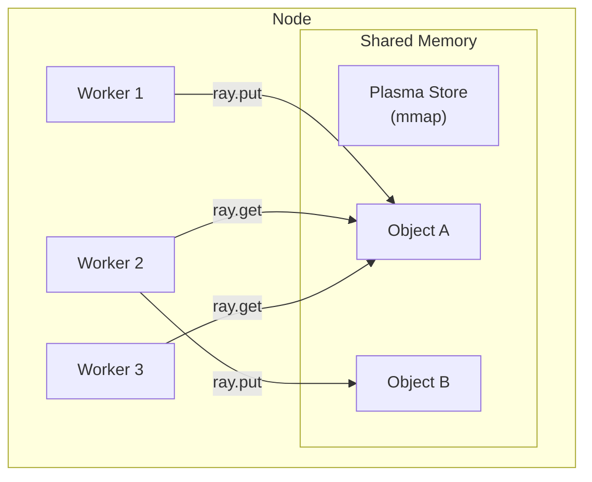
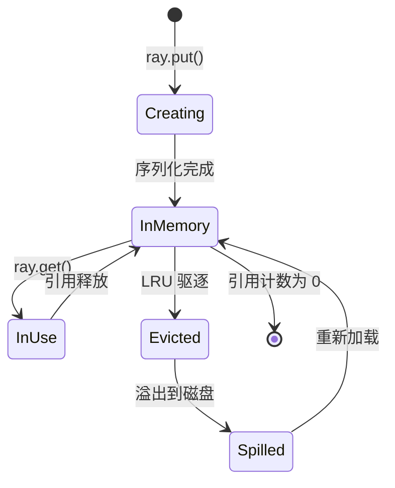
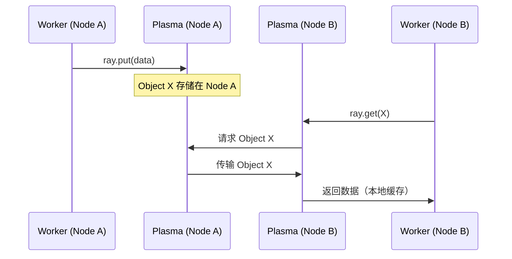
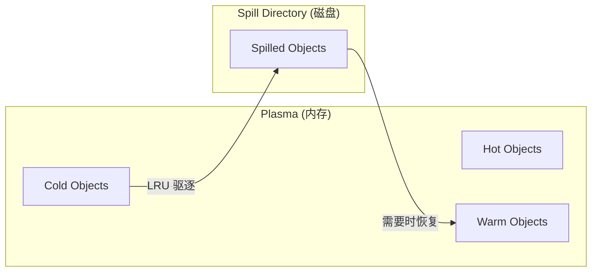

# Ray 对象存储与内存管理

## 1. 概述

Ray 使用 **Plasma** 对象存储作为分布式共享内存层，实现：
- 同节点进程间**零拷贝**数据共享
- 跨节点**自动数据传输**
- 内存不足时**自动溢出到磁盘**

---

## 2. Plasma 对象存储

### 2.1 基本原理



**关键特性：**

| 特性 | 说明 |
|------|------|
| 共享内存 | 使用 `mmap` 创建共享内存区 |
| 不可变 | 对象写入后不可修改 |
| 引用计数 | 自动垃圾回收 |
| Apache Arrow | 序列化格式，支持零拷贝 |

### 2.2 对象生命周期



---

## 3. 内存管理

### 3.1 内存布局

Ray 节点的内存分为多个区域：

```
┌─────────────────────────────────────────────────────┐
│                   系统内存 (RAM)                      │
├─────────────────────────────────────────────────────┤
│  Ray 对象存储    │    Worker 堆内存    │   系统预留    │
│   (Plasma)       │   (Python/NumPy)   │              │
│   默认 30%       │      动态分配       │    10%       │
└─────────────────────────────────────────────────────┘
```

### 3.2 配置参数

```bash
# 设置对象存储大小（50GB）
ray start --head --object-store-memory=50000000000

# 设置 Worker 可用内存
ray start --head --memory=200000000000
```

**Python API 配置：**

```python
ray.init(
    object_store_memory=50 * 1024**3,  # 50GB 对象存储
    _system_config={
        "object_spilling_config": json.dumps({
            "type": "filesystem",
            "params": {"directory_path": "/mnt/spill"}
        })
    }
)
```

### 3.3 内存使用监控

```python
# 查看内存使用
import ray

print(ray.cluster_resources())
# {'object_store_memory': 50000000000, ...}

# 获取详细内存信息
from ray._private.internal_api import memory_summary
print(memory_summary())
```

---

## 4. 对象传输机制

### 4.1 本地对象访问

同节点进程间通过 **零拷贝** 访问 Plasma 对象：

```python
import numpy as np
import ray

ray.init()

# 创建大数组
large_array = np.zeros((10000, 10000), dtype=np.float64)

# 放入对象存储（一次序列化）
ref = ray.put(large_array)

@ray.remote
def process(arr):
    return arr.sum()

# 多个任务共享同一对象（零拷贝）
futures = [process.remote(ref) for _ in range(10)]
results = ray.get(futures)
```

### 4.2 跨节点对象传输

当对象在远程节点时，Ray 自动拉取：



### 4.3 直接返回优化

小对象可绕过 Plasma，直接内联返回：

```python
# 小于 100KB 的对象直接返回
ray.init(_system_config={
    "max_direct_call_object_size": 100 * 1024  # 100KB
})

@ray.remote
def small_result():
    return [1, 2, 3]  # 直接返回，不经过 Plasma
```

---

## 5. 内存溢出 (Spilling)

### 5.1 溢出机制

当对象存储满时，Ray 自动将冷对象溢出到磁盘：



### 5.2 配置溢出

```python
import ray
import json

ray.init(
    _system_config={
        "object_spilling_config": json.dumps({
            "type": "filesystem",
            "params": {
                "directory_path": [
                    "/mnt/ssd1/ray_spill",
                    "/mnt/ssd2/ray_spill"  # 多目录负载均衡
                ]
            }
        }),
        # 内存使用超过 80% 时开始溢出
        "object_spilling_threshold": 0.8,
    }
)
```

### 5.3 外部存储溢出

也支持溢出到对象存储（S3/GCS 等）：

```python
ray.init(
    _system_config={
        "object_spilling_config": json.dumps({
            "type": "smart_open",
            "params": {
                "uri": "s3://my-bucket/ray-spill/"
            }
        })
    }
)
```

---

## 6. 引用计数与垃圾回收

### 6.1 引用类型

| 类型 | 说明 |
|------|------|
| **ObjectRef** | Python 对象引用 |
| **Owner Reference** | 创建者持有的引用 |
| **Borrowed Reference** | 传递给其他任务的引用 |

### 6.2 自动回收

```python
ref = ray.put(large_data)  # 创建对象，Owner = Driver

@ray.remote
def use_data(data_ref):
    data = ray.get(data_ref)  # Borrowed Reference
    return len(data)

result = ray.get(use_data.remote(ref))

# 当 ref 变量超出作用域，且没有其他引用时
# 对象会被自动回收
del ref
```

### 6.3 显式释放

```python
# 取消正在执行的任务
ray.cancel(object_ref)

# 显式释放对象（强制删除）
# 注意：可能导致依赖此对象的任务失败
ray._private.internal_api.free([object_ref])
```

---

## 7. 性能优化

### 7.1 减少序列化开销

```python
# ❌ 不推荐：每次调用都序列化
@ray.remote
def bad_pattern(large_arr):
    return large_arr.sum()

arr = np.zeros((10000, 10000))
futures = [bad_pattern.remote(arr) for _ in range(10)]  # 序列化 10 次

# ✅ 推荐：使用 ray.put 预先放入对象存储
arr_ref = ray.put(arr)  # 只序列化 1 次
futures = [bad_pattern.remote(arr_ref) for _ in range(10)]
```

### 7.2 数据本地化

```python
# 使用 scheduling_strategy 提示调度器
from ray.util.scheduling_strategies import NodeAffinitySchedulingStrategy

@ray.remote
def process_local(data_ref):
    return ray.get(data_ref)

# 尽量在数据所在节点执行
large_ref = ray.put(large_data)
node_id = ray.get(large_ref).local()  # 获取对象所在节点

process_local.options(
    scheduling_strategy=NodeAffinitySchedulingStrategy(
        node_id=node_id,
        soft=True
    )
).remote(large_ref)
```

### 7.3 批量操作

```python
# ❌ 不推荐：逐个 get
refs = [task.remote(i) for i in range(100)]
results = [ray.get(ref) for ref in refs]  # 串行等待

# ✅ 推荐：批量 get
results = ray.get(refs)  # 并行等待

# ✅ 推荐：流式处理（按完成顺序）
for ref in refs:
    ready, remaining = ray.wait(refs, num_returns=1)
    result = ray.get(ready[0])
    # 处理 result
    refs = remaining
```

---

## 8. 常见问题

### Q1: `ObjectStoreFullError`

```python
# 对象存储满了
# 解决方案：
# 1. 增大对象存储
ray.init(object_store_memory=100 * 1024**3)

# 2. 开启溢出
ray.init(_system_config={
    "object_spilling_config": '{"type": "filesystem", "params": {"directory_path": "/tmp/spill"}}'
})

# 3. 及时释放不需要的对象
del large_object_ref
```

### Q2: 内存泄漏排查

```python
# 启用内存分析
RAY_memory_monitor_refresh_ms=100 ray start --head

# 查看内存摘要
from ray._private.internal_api import memory_summary
print(memory_summary(stats_only=True))
```

### Q3: 跨节点传输慢

```python
# 检查网络带宽
ray.init(_system_config={
    # 增大对象传输线程
    "object_manager_pull_timeout_ms": 30000,
})

# 考虑数据分片
@ray.remote
def process_chunk(chunk):
    return chunk.mean()

data_chunks = np.array_split(large_array, 100)
chunk_refs = [ray.put(c) for c in data_chunks]
results = ray.get([process_chunk.remote(ref) for ref in chunk_refs])
```

---

## 9. 总结

| 概念 | 说明 |
|------|------|
| **Plasma** | 共享内存对象存储 |
| **ray.put()** | 将对象放入存储 |
| **ray.get()** | 获取对象值 |
| **ObjectRef** | 对象的分布式引用 |
| **Spilling** | 内存溢出到磁盘 |
| **Zero-copy** | 同节点零拷贝访问 |

> [!TIP]
> 性能优化的核心原则：**减少序列化、增加数据本地性、批量处理**。使用 `ray.put()` 预先存储大对象，使用 `ray.get()` 批量获取结果。
