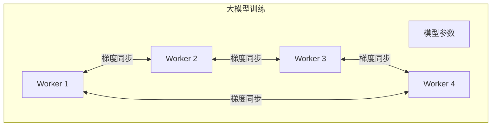
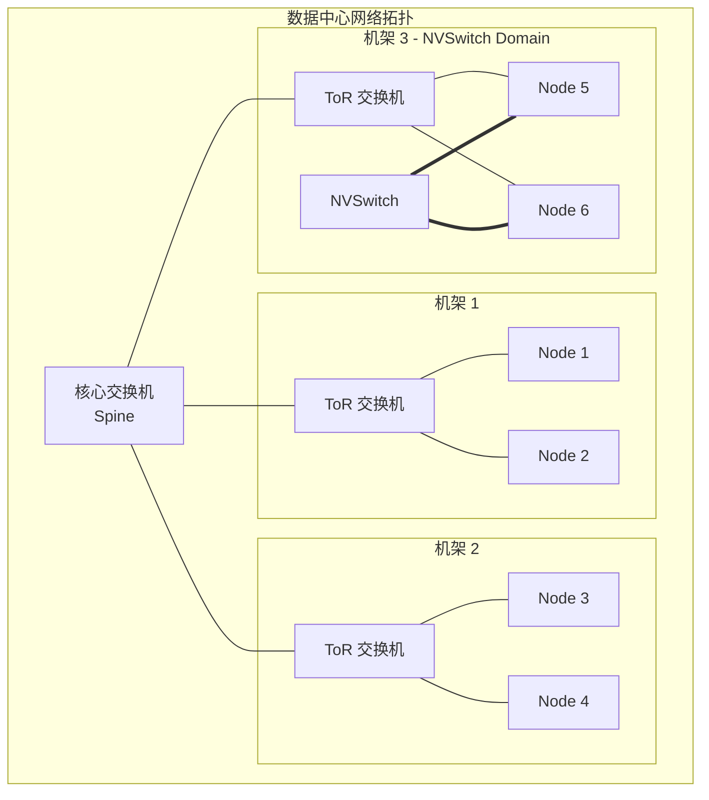
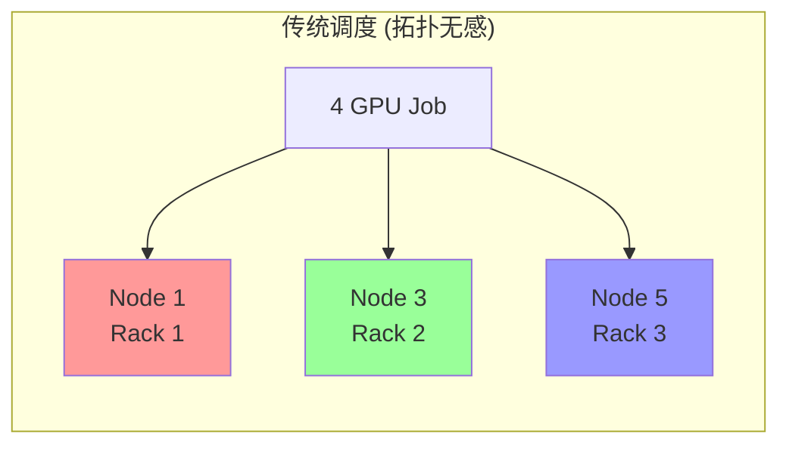
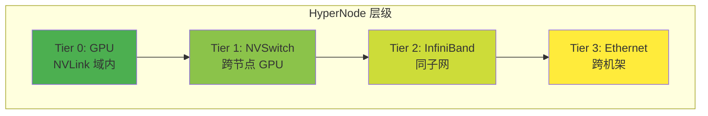
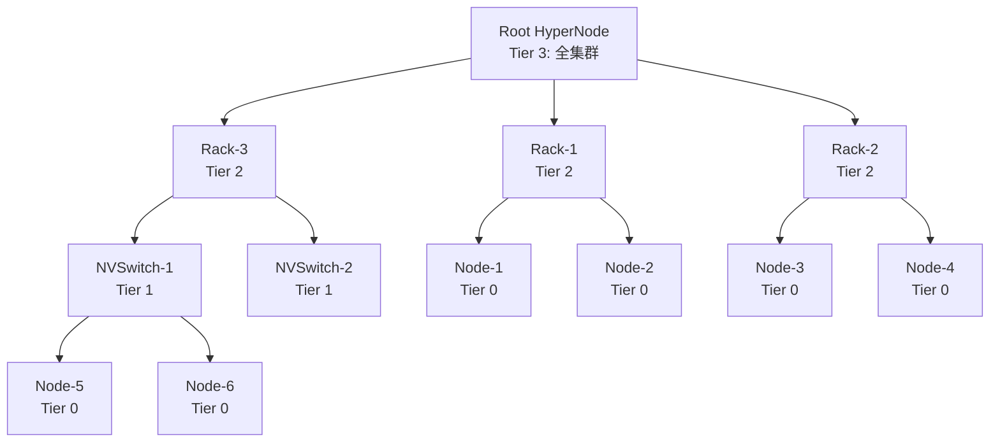
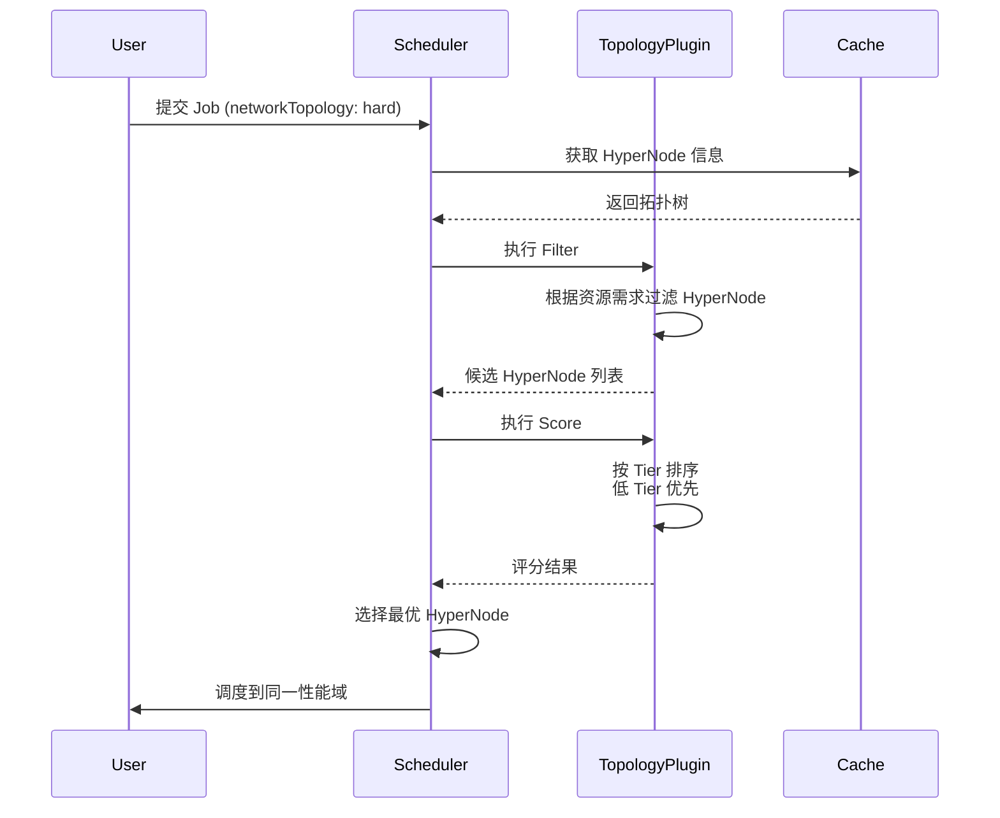
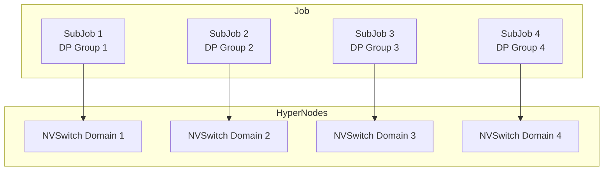
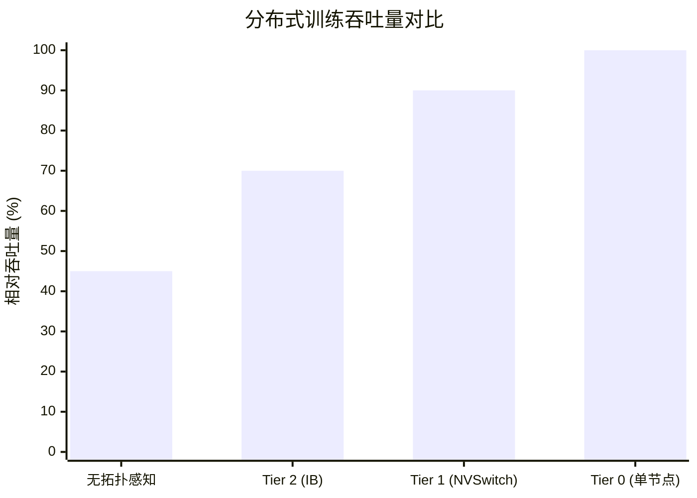
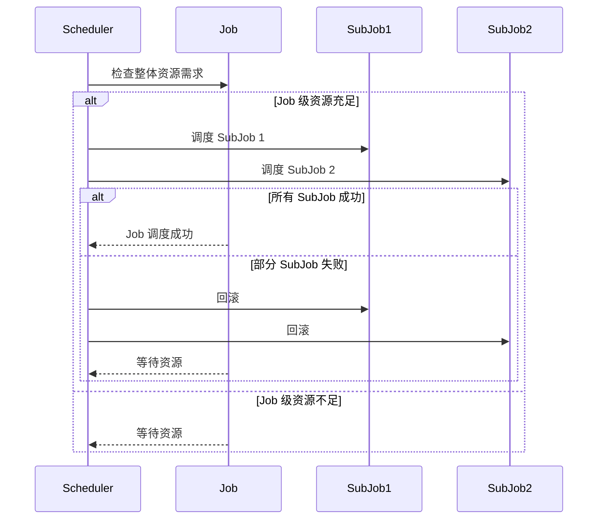

# 网络拓扑感知调度原理

## 1. 为什么需要网络拓扑感知？

### 1.1 分布式训练的通信挑战



**通信瓶颈**：
- 大模型训练涉及频繁的梯度同步 (All-Reduce)
- 每次迭代可能需要传输 GB 级数据
- 网络性能直接影响训练效率

### 1.2 网络拓扑的复杂性



**拓扑层级与带宽**：

| 层级 | 典型带宽 | 延迟 |
|------|---------|------|
| NVLink (同节点 GPU) | 600 GB/s | ~1μs |
| NVSwitch (跨节点 GPU) | 400 GB/s | ~2μs |
| InfiniBand HDR | 200 Gb/s | ~1μs |
| RoCE v2 | 100 Gb/s | ~2μs |
| 同机架以太网 | 25 Gb/s | ~10μs |
| 跨机架以太网 | 25 Gb/s | ~50μs |

> [!IMPORTANT]
> 同一 NVSwitch 域内的通信速度可能是跨机架通信的 **10-100 倍**！智能调度可以显著提升训练效率。

### 1.3 传统调度的问题



**问题**：Pod 分散到不同机架，跨机架通信成为瓶颈。

## 2. HyperNode 抽象

### 2.1 什么是 HyperNode？

HyperNode 是 Volcano 定义的 CRD，用于描述网络拓扑中的**性能域**：

```yaml
apiVersion: topology.volcano.sh/v1alpha1
kind: HyperNode
metadata:
  name: nvswitch-domain-1
spec:
  tier: 1              # 拓扑层级
  members:
    - type: Node
      selector:
        nvidia.com/nvswitch-domain: "domain-1"
```

### 2.2 拓扑层级模型



**层级设计原则**：
- **Tier 0**: 最高性能域 (NVLink)
- **Tier N+1**: 比 Tier N 性能更低的域
- 数字越小，性能越高

### 2.3 HyperNode 树形结构



## 3. 调度决策流程

### 3.1 拓扑感知调度流程



### 3.2 打分策略

```go
// 简化的打分逻辑
func scoreHyperNode(hyperNode *HyperNode, job *Job) int {
    baseScore := 0
    
    // 1. Tier 越低分数越高
    baseScore += (maxTier - hyperNode.Tier) * 10
    
    // 2. 已调度的 Pod 越多分数越高 (亲和性)
    scheduledPods := countScheduledPods(hyperNode, job)
    baseScore += scheduledPods * 5
    
    // 3. 资源利用率适中的分数更高
    utilizationScore := calculateUtilization(hyperNode)
    baseScore += utilizationScore
    
    return baseScore
}
```

### 3.3 约束类型

| 约束类型 | 行为 | 适用场景 |
|---------|------|---------|
| **hard** | 必须调度到同一 HyperNode | 对通信延迟敏感 |
| **soft** | 尽量调度到同一 HyperNode | 对通信不太敏感 |

## 4. Job 配置示例

### 4.1 强约束 (Hard)

```yaml
apiVersion: batch.volcano.sh/v1alpha1
kind: Job
metadata:
  name: llm-training
spec:
  minAvailable: 8
  schedulerName: volcano
  queue: training
  networkTopology:
    mode: hard              # 强约束
    highestTierAllowed: 1   # 最多允许 Tier 1 (NVSwitch 域)
  tasks:
  - name: worker
    replicas: 8
    template:
      spec:
        containers:
        - name: trainer
          image: training:v1
          resources:
            limits:
              nvidia.com/gpu: 8
```

### 4.2 软约束 (Soft)

```yaml
apiVersion: batch.volcano.sh/v1alpha1
kind: Job
metadata:
  name: inference-job
spec:
  minAvailable: 4
  schedulerName: volcano
  networkTopology:
    mode: soft              # 软约束
    highestTierAllowed: 2   # 可以跨 Tier 2 (InfiniBand)
  tasks:
  - name: worker
    replicas: 4
    template:
      spec:
        containers:
        - name: inference
          image: inference:v1
          resources:
            limits:
              nvidia.com/gpu: 1
```

## 5. 分区调度 (SubJob)

### 5.1 大规模任务分区

对于大规模训练任务，可以使用分区策略：



### 5.2 分区配置

```yaml
apiVersion: batch.volcano.sh/v1alpha1
kind: Job
metadata:
  name: large-scale-training
spec:
  minAvailable: 32
  schedulerName: volcano
  networkTopology:
    mode: hard
    highestTierAllowed: 1
  partitionPolicy:
    - name: dp-group-1
      replicas: 8
      networkTopology:
        mode: hard
        highestTierAllowed: 0    # 单节点内
    - name: dp-group-2
      replicas: 8
      networkTopology:
        mode: hard
        highestTierAllowed: 0
    - name: dp-group-3
      replicas: 8
      networkTopology:
        mode: hard
        highestTierAllowed: 0
    - name: dp-group-4
      replicas: 8
      networkTopology:
        mode: hard
        highestTierAllowed: 0
  tasks:
  - name: worker
    replicas: 32
    template:
      spec:
        containers:
        - name: trainer
          image: training:v1
          resources:
            limits:
              nvidia.com/gpu: 1
```

## 6. 调度优化效果

### 6.1 性能对比



### 6.2 典型优化效果

| 场景 | 无拓扑感知 | 拓扑感知 | 提升 |
|------|-----------|---------|------|
| 8 卡 LLM 训练 | 45% 效率 | 95% 效率 | 2.1x |
| 32 卡分布式训练 | 35% 效率 | 85% 效率 | 2.4x |
| All-Reduce 延迟 | 50ms | 5ms | 10x |

## 7. 两级调度策略

### 7.1 两级 Gang Scheduling



### 7.2 配置两级调度

```yaml
spec:
  minAvailable: 32
  gangScheduling:
    enabled: true
    level: two        # 两级调度
  partitionPolicy:
    - name: partition-1
      minMember: 8    # 每个分区最少 8 个
```

## 8. 总结

| 概念 | 说明 |
|------|------|
| **HyperNode** | 网络拓扑中的性能域抽象 |
| **Tier** | 拓扑层级，数字越小性能越高 |
| **hard 约束** | 必须调度到同一 HyperNode |
| **soft 约束** | 尽量调度到同一 HyperNode |
| **分区调度** | 大规模任务分割为多个子任务 |
| **两级 Gang** | Job 和 SubJob 两级原子调度 |

> [!TIP]
> 网络拓扑感知调度是大模型训练的关键优化点。通过 HyperNode 抽象，Volcano 可以将分布式任务调度到最优的性能域，显著提升训练效率。
