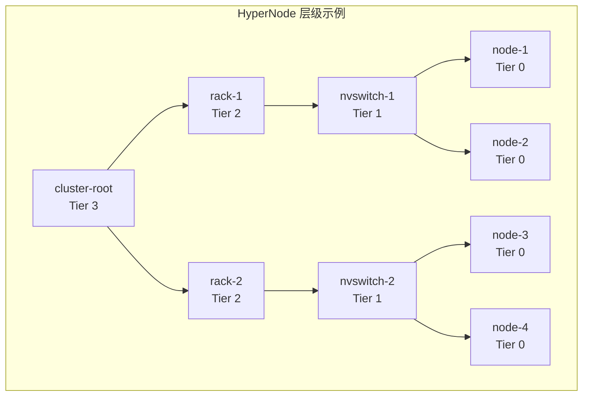
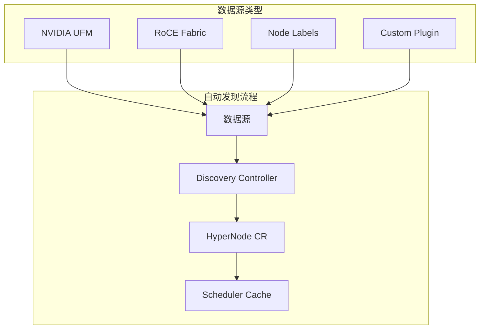

# HyperNode 配置与自动发现

## 1. HyperNode CRD 详解

### 1.1 CRD 定义

```yaml
apiVersion: apiextensions.k8s.io/v1
kind: CustomResourceDefinition
metadata:
  name: hypernodes.topology.volcano.sh
spec:
  group: topology.volcano.sh
  versions:
  - name: v1alpha1
    served: true
    storage: true
    schema:
      openAPIV3Schema:
        type: object
        properties:
          spec:
            type: object
            properties:
              tier:
                type: integer
                description: "拓扑层级，0 为最高性能"
              members:
                type: array
                items:
                  type: object
                  properties:
                    type:
                      type: string
                      enum: ["Node", "HyperNode"]
                    selector:
                      type: object
```

### 1.2 完整 HyperNode 示例

```yaml
apiVersion: topology.volcano.sh/v1alpha1
kind: HyperNode
metadata:
  name: nvswitch-domain-1
  labels:
    topology.volcano.sh/tier: "1"
    topology.volcano.sh/type: "nvswitch"
spec:
  tier: 1
  members:
    - type: Node
      selector:
        matchLabels:
          nvidia.com/nvswitch-domain: "domain-1"
  resources:
    allocatable:
      nvidia.com/gpu: "16"
      memory: "512Gi"
      cpu: "128"
```

### 1.3 层级关系配置



**配置示例**：

```yaml
# Tier 3: 集群根节点
apiVersion: topology.volcano.sh/v1alpha1
kind: HyperNode
metadata:
  name: cluster-root
spec:
  tier: 3
  members:
    - type: HyperNode
      selector:
        matchLabels:
          topology.volcano.sh/tier: "2"
---
# Tier 2: 机架级
apiVersion: topology.volcano.sh/v1alpha1
kind: HyperNode
metadata:
  name: rack-1
  labels:
    topology.volcano.sh/tier: "2"
    topology.volcano.sh/rack: "rack-1"
spec:
  tier: 2
  members:
    - type: HyperNode
      selector:
        matchLabels:
          topology.volcano.sh/tier: "1"
          topology.volcano.sh/rack: "rack-1"
---
# Tier 1: NVSwitch 域
apiVersion: topology.volcano.sh/v1alpha1
kind: HyperNode
metadata:
  name: nvswitch-1
  labels:
    topology.volcano.sh/tier: "1"
    topology.volcano.sh/rack: "rack-1"
spec:
  tier: 1
  members:
    - type: Node
      selector:
        matchLabels:
          nvidia.com/nvswitch-domain: "nvs-1"
```

## 2. 自动发现机制

### 2.1 自动发现架构



### 2.2 启用自动发现

```yaml
# Volcano Helm values.yaml
hyperNodeAutoDiscovery:
  enabled: true
  sources:
    - type: nodeLabels
      config:
        tierLabels:
          - "topology.kubernetes.io/zone"        # Tier 2
          - "nvidia.com/nvswitch-domain"         # Tier 1
    - type: ufm
      config:
        endpoint: "https://ufm.example.com"
        secretRef:
          name: ufm-credentials
          namespace: volcano-system
    - type: roce
      config:
        fabricDiscovery: true
```

### 2.3 基于 Node Labels 自动发现

最简单的自动发现方式是使用节点标签：

```bash
# 为节点打标签
kubectl label node node-1 nvidia.com/nvswitch-domain=domain-1
kubectl label node node-2 nvidia.com/nvswitch-domain=domain-1
kubectl label node node-3 nvidia.com/nvswitch-domain=domain-2
kubectl label node node-4 nvidia.com/nvswitch-domain=domain-2

# 配置自动发现
kubectl apply -f - <<EOF
apiVersion: v1
kind: ConfigMap
metadata:
  name: hypernode-discovery-config
  namespace: volcano-system
data:
  discovery.yaml: |
    sources:
      - type: nodeLabels
        config:
          groupByLabels:
            - "nvidia.com/nvswitch-domain"
          tierMapping:
            "nvidia.com/nvswitch-domain": 1
EOF
```

### 2.4 UFM 自动发现

对于 InfiniBand 网络，可以通过 NVIDIA UFM 自动发现：

```yaml
apiVersion: v1
kind: Secret
metadata:
  name: ufm-credentials
  namespace: volcano-system
type: Opaque
data:
  username: YWRtaW4=    # admin
  password: cGFzc3dvcmQ=  # password
---
apiVersion: v1
kind: ConfigMap
metadata:
  name: hypernode-discovery-config
  namespace: volcano-system
data:
  discovery.yaml: |
    sources:
      - type: ufm
        config:
          endpoint: "https://ufm.example.com:443"
          secretRef:
            name: ufm-credentials
          refreshInterval: 5m
          tierMapping:
            switch: 2
            leaf: 1
```

## 3. 手动配置示例

### 3.1 单机房拓扑

```yaml
# 3 个机架，每机架 4 个节点
---
apiVersion: topology.volcano.sh/v1alpha1
kind: HyperNode
metadata:
  name: datacenter-1
spec:
  tier: 3
  members:
    - type: HyperNode
      selector:
        matchLabels:
          topology.volcano.sh/datacenter: "dc-1"
---
apiVersion: topology.volcano.sh/v1alpha1
kind: HyperNode
metadata:
  name: rack-a
  labels:
    topology.volcano.sh/datacenter: "dc-1"
spec:
  tier: 2
  members:
    - type: Node
      selector:
        matchLabels:
          topology.kubernetes.io/rack: "rack-a"
---
apiVersion: topology.volcano.sh/v1alpha1
kind: HyperNode
metadata:
  name: rack-b
  labels:
    topology.volcano.sh/datacenter: "dc-1"
spec:
  tier: 2
  members:
    - type: Node
      selector:
        matchLabels:
          topology.kubernetes.io/rack: "rack-b"
---
apiVersion: topology.volcano.sh/v1alpha1
kind: HyperNode
metadata:
  name: rack-c
  labels:
    topology.volcano.sh/datacenter: "dc-1"
spec:
  tier: 2
  members:
    - type: Node
      selector:
        matchLabels:
          topology.kubernetes.io/rack: "rack-c"
```

### 3.2 NVSwitch 拓扑

```yaml
# DGX SuperPOD 拓扑示例
---
apiVersion: topology.volcano.sh/v1alpha1
kind: HyperNode
metadata:
  name: superpod-1
spec:
  tier: 2
  members:
    - type: HyperNode
      selector:
        matchLabels:
          nvidia.com/superpod: "sp-1"
---
apiVersion: topology.volcano.sh/v1alpha1
kind: HyperNode
metadata:
  name: nvswitch-domain-a
  labels:
    nvidia.com/superpod: "sp-1"
spec:
  tier: 1
  members:
    - type: Node
      selector:
        matchLabels:
          nvidia.com/nvswitch-domain: "nv-a"
---
apiVersion: topology.volcano.sh/v1alpha1
kind: HyperNode
metadata:
  name: nvswitch-domain-b
  labels:
    nvidia.com/superpod: "sp-1"
spec:
  tier: 1
  members:
    - type: Node
      selector:
        matchLabels:
          nvidia.com/nvswitch-domain: "nv-b"
```

## 4. 调度器配置

### 4.1 启用拓扑插件

```yaml
apiVersion: v1
kind: ConfigMap
metadata:
  name: volcano-scheduler-configmap
  namespace: volcano-system
data:
  volcano-scheduler.conf: |
    actions: "enqueue, allocate, backfill"
    tiers:
    - plugins:
      - name: priority
      - name: gang
    - plugins:
      - name: drf
      - name: predicates
      - name: proportion
    - plugins:
      - name: topology
        enablePreemption: false
        arguments:
          hypernode.order: "tier"
          hypernode.weight:
            tier0: 100
            tier1: 80
            tier2: 50
            tier3: 20
```

### 4.2 拓扑插件参数

| 参数 | 说明 | 默认值 |
|------|------|-------|
| `hypernode.order` | HyperNode 排序方式 | tier |
| `hypernode.weight.*` | 各层级权重 | tier0:100, tier1:80... |
| `hypernode.prefilter` | 启用预过滤优化 | true |
| `hypernode.strictMode` | 严格模式 | true |

## 5. 验证配置

### 5.1 查看 HyperNode

```bash
# 列出所有 HyperNode
kubectl get hypernodes

# 查看详细信息
kubectl describe hypernode nvswitch-domain-1

# 查看拓扑关系
kubectl get hypernodes -o custom-columns=\
NAME:.metadata.name,\
TIER:.spec.tier,\
MEMBERS:.spec.members[*].selector.matchLabels
```

### 5.2 验证调度结果

```bash
# 提交测试任务
kubectl apply -f test-job.yaml

# 查看调度结果
kubectl get pods -l volcano.sh/job-name=test-job \
  -o custom-columns=\
NAME:.metadata.name,\
NODE:.spec.nodeName,\
HYPERNODE:.metadata.annotations."volcano\.sh/hypernode"
```

### 5.3 调试日志

```bash
# 查看调度器日志
kubectl -n volcano-system logs -l app=volcano-scheduler \
  --tail=100 | grep -i topology

# 开启调试日志
kubectl -n volcano-system set env deployment/volcano-scheduler \
  VOLCANO_LOG_LEVEL=debug
```

## 6. 常见问题

### 6.1 HyperNode 不生效

**症状**: Pod 分散到不同 HyperNode

**排查**:
```bash
# 检查 HyperNode 是否创建
kubectl get hypernodes

# 检查调度器配置
kubectl -n volcano-system get cm volcano-scheduler-configmap -o yaml

# 检查 Job 配置
kubectl get job.batch.volcano.sh <job-name> -o yaml | grep networkTopology
```

### 6.2 自动发现不工作

**症状**: HyperNode 无法自动创建

**排查**:
```bash
# 检查 Discovery Controller 状态
kubectl -n volcano-system logs -l app=hypernode-discovery

# 检查数据源连接
kubectl -n volcano-system exec -it <discovery-pod> -- curl <ufm-endpoint>/health
```

## 7. 最佳实践

### 7.1 拓扑设计原则

1. **层级数量**: 建议 3-4 层
2. **命名规范**: 使用清晰的命名如 `tier-X-name`
3. **标签一致**: 确保节点标签与 HyperNode selector 匹配

### 7.2 配置检查清单

- [ ] 所有节点已正确打标签
- [ ] HyperNode 层级关系正确
- [ ] 调度器已启用 topology 插件
- [ ] Job 配置了 networkTopology

## 8. 总结

| 配置方式 | 适用场景 | 复杂度 |
|---------|---------|-------|
| **Node Labels** | 简单拓扑 | 低 |
| **手动配置** | 精确控制 | 中 |
| **UFM 自动发现** | InfiniBand 网络 | 中 |
| **自定义插件** | 特殊需求 | 高 |

> [!TIP]
> 建议从 Node Labels 自动发现开始，验证功能后再根据需要切换到更精确的配置方式。
