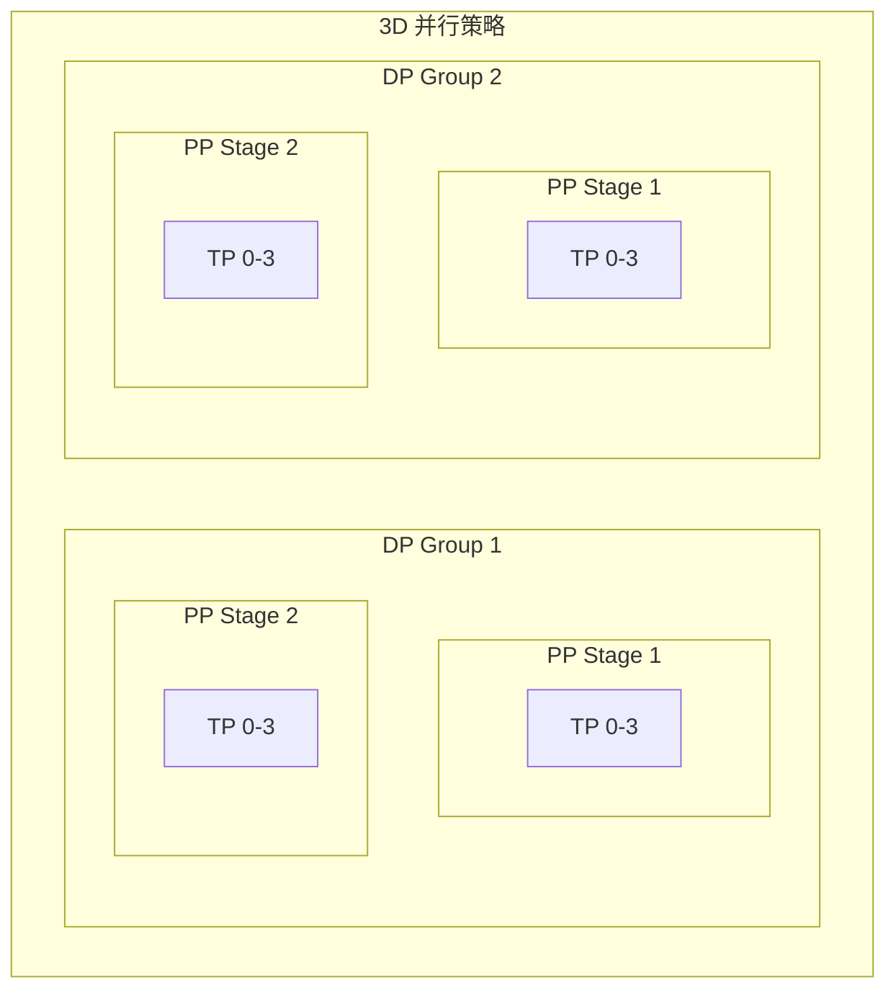

# 拓扑感知调度实战

## 1. 案例一：LLM 分布式训练

### 1.1 场景描述

**背景**: 训练 70B 参数的 LLM，需要 32 张 A100 GPU，使用 3D 并行策略（TP+PP+DP）。

**目标**: 利用网络拓扑感知调度，将 TP 组调度到同一 NVSwitch 域，最大化通信效率。



### 1.2 环境准备

```bash
# 1. 为节点打标签
# NVSwitch Domain 1 (节点 1-4)
kubectl label node node-1 nvidia.com/nvswitch-domain=nv-1
kubectl label node node-2 nvidia.com/nvswitch-domain=nv-1
kubectl label node node-3 nvidia.com/nvswitch-domain=nv-1
kubectl label node node-4 nvidia.com/nvswitch-domain=nv-1

# NVSwitch Domain 2 (节点 5-8)
kubectl label node node-5 nvidia.com/nvswitch-domain=nv-2
kubectl label node node-6 nvidia.com/nvswitch-domain=nv-2
kubectl label node node-7 nvidia.com/nvswitch-domain=nv-2
kubectl label node node-8 nvidia.com/nvswitch-domain=nv-2
```

### 1.3 HyperNode 配置

```yaml
# hypernode-config.yaml
---
apiVersion: topology.volcano.sh/v1alpha1
kind: HyperNode
metadata:
  name: cluster-root
spec:
  tier: 2
  members:
    - type: HyperNode
      selector:
        matchLabels:
          topology.volcano.sh/tier: "1"
---
apiVersion: topology.volcano.sh/v1alpha1
kind: HyperNode
metadata:
  name: nvswitch-domain-1
  labels:
    topology.volcano.sh/tier: "1"
spec:
  tier: 1
  members:
    - type: Node
      selector:
        matchLabels:
          nvidia.com/nvswitch-domain: "nv-1"
---
apiVersion: topology.volcano.sh/v1alpha1
kind: HyperNode
metadata:
  name: nvswitch-domain-2
  labels:
    topology.volcano.sh/tier: "1"
spec:
  tier: 1
  members:
    - type: Node
      selector:
        matchLabels:
          nvidia.com/nvswitch-domain: "nv-2"
```

### 1.4 训练任务配置

```yaml
# llm-training-job.yaml
apiVersion: batch.volcano.sh/v1alpha1
kind: Job
metadata:
  name: llm-70b-training
spec:
  minAvailable: 32
  schedulerName: volcano
  queue: training
  
  # 网络拓扑约束
  networkTopology:
    mode: hard
    highestTierAllowed: 1    # TP 组必须在同一 NVSwitch 域
  
  # 分区策略：每个 TP 组作为一个分区
  partitionPolicy:
    - name: tp-group-1
      replicas: 4
      networkTopology:
        mode: hard
        highestTierAllowed: 0  # 同一节点更好
    - name: tp-group-2
      replicas: 4
      networkTopology:
        mode: hard
        highestTierAllowed: 0
    - name: tp-group-3
      replicas: 4
      networkTopology:
        mode: hard
        highestTierAllowed: 0
    - name: tp-group-4
      replicas: 4
      networkTopology:
        mode: hard
        highestTierAllowed: 0
    - name: tp-group-5
      replicas: 4
      networkTopology:
        mode: hard
        highestTierAllowed: 0
    - name: tp-group-6
      replicas: 4
      networkTopology:
        mode: hard
        highestTierAllowed: 0
    - name: tp-group-7
      replicas: 4
      networkTopology:
        mode: hard
        highestTierAllowed: 0
    - name: tp-group-8
      replicas: 4
      networkTopology:
        mode: hard
        highestTierAllowed: 0
  
  policies:
    - event: PodEvicted
      action: RestartJob
    - event: TaskCompleted
      action: CompleteJob
  
  plugins:
    ssh: []
    env: []
    svc: []
  
  tasks:
    - name: trainer
      replicas: 32
      template:
        spec:
          containers:
          - name: trainer
            image: megatron-lm:latest
            command:
              - "python"
              - "-m"
              - "torch.distributed.launch"
              - "--nproc_per_node=8"
              - "--nnodes=4"
              - "--node_rank=$(VOLCANO_TASK_INDEX)"
              - "--master_addr=$(MASTER_ADDR)"
              - "--master_port=29500"
              - "pretrain_gpt.py"
            env:
              - name: MASTER_ADDR
                valueFrom:
                  fieldRef:
                    fieldPath: status.podIP
              - name: NCCL_IB_DISABLE
                value: "0"
              - name: NCCL_NET_GDR_LEVEL
                value: "5"
            resources:
              limits:
                nvidia.com/gpu: 8
                rdma/rdma_shared_device_a: 1
            volumeMounts:
              - name: shm
                mountPath: /dev/shm
          volumes:
            - name: shm
              emptyDir:
                medium: Memory
                sizeLimit: 64Gi
          restartPolicy: OnFailure
```

### 1.5 验证调度

```bash
# 提交任务
kubectl apply -f llm-training-job.yaml

# 查看 Pod 分布
kubectl get pods -l volcano.sh/job-name=llm-70b-training \
  -o custom-columns=NAME:.metadata.name,NODE:.spec.nodeName,STATUS:.status.phase

# 验证拓扑约束
kubectl get pods -l volcano.sh/job-name=llm-70b-training -o json | \
  jq '.items[] | {name: .metadata.name, node: .spec.nodeName, hypernode: .metadata.annotations["volcano.sh/hypernode"]}'
```

## 2. 案例二：多租户 GPU 平台

### 2.1 场景描述

**背景**: 平台支持多个团队，每个团队有独立的 Queue 和资源配额。

**目标**: 通过网络拓扑感知，确保同一任务的 Pod 在最优性能域内运行。

### 2.2 队列配置

```yaml
# queues.yaml
---
apiVersion: scheduling.volcano.sh/v1beta1
kind: Queue
metadata:
  name: team-a-queue
spec:
  weight: 2
  capability:
    cpu: "200"
    memory: "400Gi"
    nvidia.com/gpu: "32"
---
apiVersion: scheduling.volcano.sh/v1beta1
kind: Queue
metadata:
  name: team-b-queue
spec:
  weight: 1
  capability:
    cpu: "100"
    memory: "200Gi"
    nvidia.com/gpu: "16"
---
apiVersion: scheduling.volcano.sh/v1beta1
kind: Queue
metadata:
  name: dev-queue
spec:
  weight: 1
  reclaimable: true    # 可回收资源
  capability:
    cpu: "50"
    memory: "100Gi"
    nvidia.com/gpu: "8"
```

### 2.3 团队任务模板

```yaml
# team-job-template.yaml
apiVersion: batch.volcano.sh/v1alpha1
kind: Job
metadata:
  name: team-a-training-${JOB_ID}
  namespace: team-a
spec:
  minAvailable: 8
  schedulerName: volcano
  queue: team-a-queue
  
  networkTopology:
    mode: soft              # 尽量满足，不强制
    highestTierAllowed: 2   # 允许跨 Tier 2
  
  tasks:
    - name: worker
      replicas: 8
      template:
        metadata:
          labels:
            team: team-a
            cost-center: cc-12345
        spec:
          containers:
          - name: trainer
            image: pytorch/pytorch:2.0-cuda12.0
            resources:
              limits:
                nvidia.com/gpu: 1
```

## 3. 案例三：混合并行训练

### 3.1 场景描述

**背景**: 使用张量并行 (TP=4) + 数据并行 (DP=8) 训练中等规模模型。

```mermaid
graph LR
    subgraph "TP Group 1 (同一节点)"
        G1_0[GPU 0]
        G1_1[GPU 1]
        G1_2[GPU 2]
        G1_3[GPU 3]
    end
    
    subgraph "TP Group 2 (同一节点)"
        G2_0[GPU 0]
        G2_1[GPU 1]
        G2_2[GPU 2]
        G2_3[GPU 3]
    end
    
    G1_0 <-->|NVLink| G1_1
    G1_2 <-->|NVLink| G1_3
    
    G1_0 <-.->|All-Reduce (DP)| G2_0
```

### 3.2 Job 配置

```yaml
apiVersion: batch.volcano.sh/v1alpha1
kind: Job
metadata:
  name: tp4-dp8-training
spec:
  minAvailable: 8
  schedulerName: volcano
  queue: training
  
  networkTopology:
    mode: hard
    highestTierAllowed: 1
  
  partitionPolicy:
    # 每个 TP 组必须在同一节点
    - name: tp-group-0
      replicas: 1
      networkTopology:
        mode: hard
        highestTierAllowed: 0
    - name: tp-group-1
      replicas: 1
      networkTopology:
        mode: hard
        highestTierAllowed: 0
    - name: tp-group-2
      replicas: 1
      networkTopology:
        mode: hard
        highestTierAllowed: 0
    - name: tp-group-3
      replicas: 1
      networkTopology:
        mode: hard
        highestTierAllowed: 0
    - name: tp-group-4
      replicas: 1
      networkTopology:
        mode: hard
        highestTierAllowed: 0
    - name: tp-group-5
      replicas: 1
      networkTopology:
        mode: hard
        highestTierAllowed: 0
    - name: tp-group-6
      replicas: 1
      networkTopology:
        mode: hard
        highestTierAllowed: 0
    - name: tp-group-7
      replicas: 1
      networkTopology:
        mode: hard
        highestTierAllowed: 0
  
  tasks:
    - name: worker
      replicas: 8
      template:
        spec:
          containers:
          - name: trainer
            image: training:v1
            command:
              - python
              - train.py
              - --tensor-parallel-size=4
              - --data-parallel-size=8
            resources:
              limits:
                nvidia.com/gpu: 4
```

## 4. 监控与调优

### 4.1 Prometheus 指标

```yaml
# 关键监控指标
groups:
- name: volcano-topology
  rules:
  - record: volcano_job_topology_constraint_satisfied
    expr: |
      sum by (job_name) (
        volcano_job_pods_scheduled_in_same_hypernode
      ) / sum by (job_name) (
        volcano_job_total_pods
      )
  
  - alert: TopologyConstraintViolation
    expr: volcano_job_topology_constraint_violated > 0
    for: 5m
    labels:
      severity: warning
    annotations:
      summary: "Job {{ $labels.job_name }} 违反拓扑约束"
```

### 4.2 调度延迟分析

```bash
# 查看调度耗时
kubectl -n volcano-system logs -l app=volcano-scheduler | \
  grep "scheduling latency" | tail -20

# 分析瓶颈
kubectl -n volcano-system logs -l app=volcano-scheduler | \
  grep "topology plugin" | grep -i "filter\|score"
```

### 4.3 性能对比测试

```bash
# 创建测试脚本
cat > test-topology-perf.sh << 'EOF'
#!/bin/bash

# 测试无拓扑约束
kubectl apply -f job-no-topology.yaml
sleep 60
kubectl logs -l volcano.sh/job-name=test-no-topo | grep "throughput"

# 测试有拓扑约束
kubectl apply -f job-with-topology.yaml
sleep 60
kubectl logs -l volcano.sh/job-name=test-with-topo | grep "throughput"
EOF
```

## 5. 最佳实践

### 5.1 拓扑层级设计

| 层级 | 典型映射 | 用途 |
|------|---------|------|
| Tier 0 | 单节点 | TP 组 |
| Tier 1 | NVSwitch 域 | 高带宽 PP/DP |
| Tier 2 | 机架/IB 子网 | 一般 DP |
| Tier 3 | 集群 | 大规模分布式 |

### 5.2 约束选择指南

| 场景 | 约束类型 | highestTierAllowed |
|------|---------|-------------------|
| 张量并行 | hard | 0 |
| 流水线并行 | hard | 1 |
| 数据并行 | soft | 2 |
| 推理服务 | soft | 3 |

### 5.3 常见优化建议

1. **TP 组**: 始终使用 `hard` + `tier=0`
2. **PP 组**: 优先同一 NVSwitch 域 (`tier=1`)
3. **DP 组**: 允许跨机架但尽量同子网
4. **预留资源**: 为关键任务预留 HyperNode

## 6. 故障排查

### 6.1 调度失败

```bash
# 检查事件
kubectl describe job.batch.volcano.sh <job-name>

# 常见原因
# 1. HyperNode 资源不足
# 2. 拓扑约束过于严格
# 3. 节点标签缺失
```

### 6.2 性能不及预期

```bash
# 验证 Pod 是否在同一 HyperNode
kubectl get pods -l volcano.sh/job-name=xxx \
  -o jsonpath='{range .items[*]}{.metadata.name} {.spec.nodeName}{"\n"}{end}' | \
  sort -k2

# 检查网络连通性
kubectl exec -it <pod-1> -- ping -c 3 <pod-2-ip>
kubectl exec -it <pod-1> -- ib_read_bw -d mlx5_0 <pod-2-ip>
```

## 7. 总结

| 场景 | 推荐配置 |
|------|---------|
| **LLM 训练** | TP: hard/tier0, PP: hard/tier1, DP: soft/tier2 |
| **多租户平台** | soft/tier2, 配合 Queue 资源隔离 |
| **混合并行** | 使用 partitionPolicy 精确控制 |
| **推理服务** | soft/tier2-3, 关注可用性而非性能 |

> [!IMPORTANT]
> 网络拓扑感知调度是大模型训练性能优化的关键。正确的拓扑配置可以带来 **2-10 倍**的训练效率提升。
