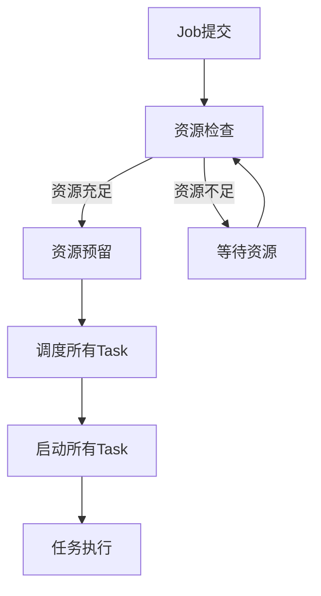

# Gang Scheduling

## 📋 定义

Gang Scheduling（成组调度）是Volcano的核心特性之一，确保一组相关的Task同时被调度，要么全部成功，要么全部失败。这对于分布式训练等需要多个节点同时运行的任务至关重要。

## 🎯 核心价值

### 1. 避免资源浪费
- **问题**：传统调度器可能只调度部分Task，导致已调度的Task等待其他Task，浪费资源
- **解决方案**：Gang Scheduling确保所有Task同时获得资源，避免部分调度

### 2. 提高任务成功率
- **问题**：分布式训练任务中，部分节点失败会导致整个任务失败
- **解决方案**：Gang Scheduling确保所有节点同时可用，提高任务成功率

### 3. 公平资源分配
- **问题**：长周期任务可能占用资源，导致其他任务饥饿
- **解决方案**：Gang Scheduling通过资源预留机制，确保公平分配

## 🔍 实现原理

### 1. 调度流程



### 2. 核心算法

#### 2.1 严格Gang Scheduling
- **策略**：只有当所有Task的资源都可用时，才调度整个Job
- **优点**：确保任务完整性
- **缺点**：可能导致资源利用率下降

#### 2.2 弹性Gang Scheduling
- **策略**：允许部分Task先调度，其他Task在资源可用时再调度
- **优点**：提高资源利用率
- **缺点**：可能导致部分Task等待

#### 2.3 层级Gang Scheduling
- **策略**：支持多层级的Gang Scheduling，适用于复杂的依赖关系
- **优点**：支持复杂任务拓扑
- **缺点**：实现复杂

## 🚀 使用示例

### YAML配置示例

```yaml
apiVersion: batch.volcano.sh/v1alpha1
kind: Job
metadata:
  name: distributed-training-job
spec:
  minAvailable: 4  # 至少需要4个Task可用
  schedulerName: volcano
  queue: default
  tasks:
  - name: worker
    replicas: 4
    template:
      spec:
        containers:
        - name: worker
          image: pytorch/pytorch:latest
          command: ["python", "train.py"]
          resources:
            requests:
              cpu: "4"
              memory: "16Gi"
              nvidia.com/gpu: 1
            limits:
              cpu: "4"
              memory: "16Gi"
              nvidia.com/gpu: 1
        restartPolicy: OnFailure
```

### 关键配置说明

| 配置项 | 说明 | 默认值 |
|--------|------|--------|
| `minAvailable` | 成组调度的最小可用Task数量 | 1 |
| `schedulerName` | 指定使用Volcano调度器 | - |
| `queue` | 提交到的队列名称 | default |
| `tasks[].replicas` | Task副本数量 | 1 |

## 💡 最佳实践

### 1. 合理设置minAvailable
- **建议**：根据任务重要性和资源情况设置
- **生产环境**：通常设置为Task总数的80%-100%
- **测试环境**：可以设置为较小值，提高资源利用率

### 2. 结合队列优先级
- **建议**：将重要任务提交到高优先级队列
- **好处**：确保重要任务优先获得资源，提高Gang Scheduling成功率

### 3. 监控资源使用情况
- **建议**：使用Prometheus监控集群资源使用
- **好处**：及时调整任务资源需求，提高Gang Scheduling成功率

### 4. 避免超大任务
- **建议**：将超大任务拆分为多个小任务
- **好处**：提高Gang Scheduling成功率，减少资源竞争

## 🔗 相关链接

### 核心概念
- [[Volcano核心概念]]
- [[Job]]
- [[Task]]

### 实践案例
- [[../实践案例/AI训练调度|AI训练调度]]

### 架构设计
- [[../架构设计/Scheduler|调度器]]

## 💬 思考问题

1. Gang Scheduling在AI训练中的具体作用是什么？
2. 如何平衡Gang Scheduling的完整性和资源利用率？
3. Gang Scheduling与Kubernetes原生调度器的区别是什么？
4. 在大规模集群中，如何优化Gang Scheduling的性能？

## 📚 学习资源

### 官方文档
- [Volcano Gang Scheduling Documentation](https://volcano.sh/en/docs/design/scheduling/gang-scheduling/)

### 相关论文
- [Gang Scheduling for Large-Scale Parallel Jobs](https://www.cs.cmu.edu/~harchol/Performance/papers/gang.pdf)

### 实践指南
- [AI训练中的Gang Scheduling最佳实践](https://cloud.google.com/kubernetes-engine/docs/how-to/gang-scheduling)
