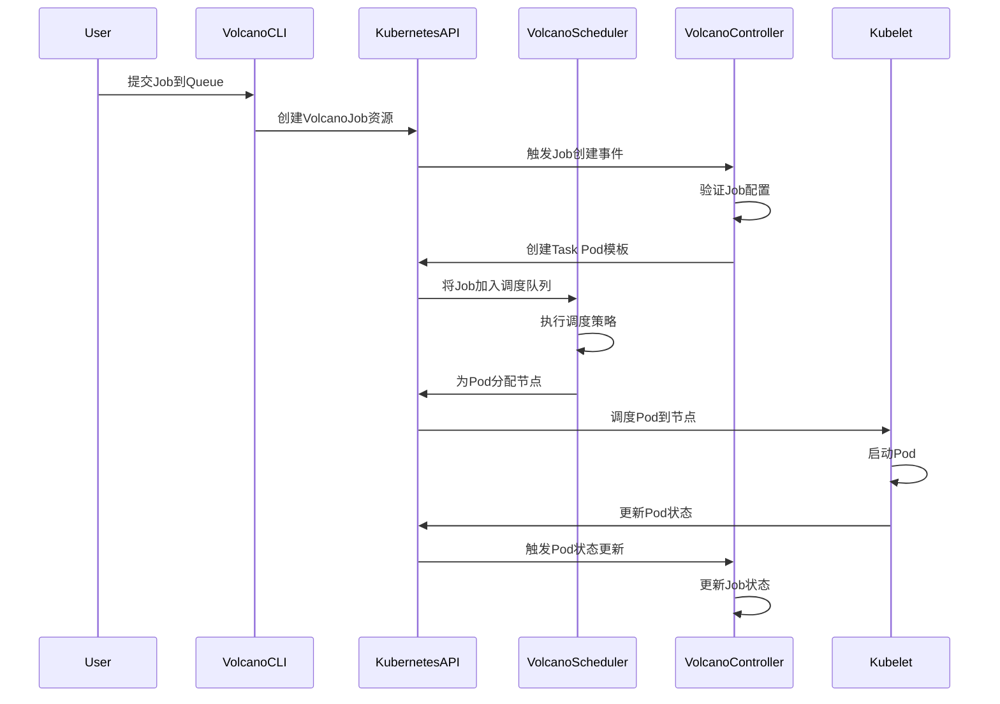

# Volcano核心概念

## 📋 概述

Volcano定义了一系列核心概念，用于描述和管理批处理工作负载。理解这些概念是使用Volcano的基础。

## 🎯 核心概念列表

### 1. Job
> Volcano Job是Volcano中最基本的工作单元，用于描述一个完整的批处理任务。

- **定义**：包含一个或多个Task，描述了任务的执行逻辑和资源需求
- **特性**：支持重启策略、超时控制、生命周期管理
- **类型**：普通Job、MPI Job、TF Job等
- **相关链接**：[[Job]]

### 2. Task
> Task是Job的组成部分，代表Job中的一个执行单元。

- **定义**：对应Kubernetes中的Pod，描述了单个执行单元的资源需求和执行命令
- **特性**：支持模板化定义、节点亲和性、资源限制
- **关系**：一个Job可以包含多个Task，Task之间可以有依赖关系
- **相关链接**：[[Task]]

### 3. Queue
> Queue是Volcano中的队列，用于管理和调度多个Job。

- **定义**：Job提交到Queue中，按照调度策略进行调度
- **特性**：支持层级队列、优先级、资源配额
- **策略**：FIFO、Fair Sharing、Priority-based等
- **相关链接**：[[Queue]]

### 4. Gang Scheduling
> 成组调度，确保一组Task同时被调度，要么全部成功，要么全部失败。

- **定义**：为分布式训练等需要多个节点同时运行的任务设计
- **特性**：确保任务的所有组件同时可用，避免资源浪费
- **算法**：支持多种Gang Scheduling算法
- **相关链接**：[[Gang Scheduling]]

### 5. Resource Quota
> 资源配额，用于限制Queue或用户可以使用的资源总量。

- **定义**：设置CPU、内存、GPU等资源的使用上限
- **特性**：支持层级配额、动态调整
- **作用**：确保资源公平分配，防止资源饥饿
- **相关链接**：[[Resource Quota]]

### 6. PriorityClass
> 优先级类，用于为Job设置优先级。

- **定义**：基于Kubernetes PriorityClass，扩展了Volcano特有的优先级策略
- **特性**：支持抢占式调度、优先级继承
- **作用**：确保重要任务优先获得资源

### 7. SchedulerPolicy
> 调度策略，用于配置Volcano调度器的行为。

- **定义**：包含Queue调度策略、Job调度策略和Task调度策略
- **特性**：支持插件化设计，可扩展自定义调度策略
- **组件**：包含默认调度器、自定义调度器插件

## 🔄 工作流程

## 🔗 相关链接

### 架构设计
- [[../架构设计/Volcano架构设计|Volcano架构设计]]
- [[../架构设计/Scheduler|调度器]]

### 部署指南
- [[../部署指南/Volcano部署指南|Volcano部署指南]]

### 实践案例
- [[../实践案例/Volcano实践案例|Volcano实践案例]]

## 💡 设计理念

Volcano的设计理念体现了云原生批处理调度的核心需求：

1. **完整性优先**：对于分布式训练等任务，要么全部成功，要么全部失败
2. **资源效率**：最大化集群资源利用率，避免资源碎片
3. **公平性**：确保多个租户和任务之间的资源公平分配
4. **可扩展性**：支持大规模集群和多样化的工作负载
5. **灵活性**：支持多种调度策略和资源类型

理解这些设计理念有助于更好地使用和配置Volcano，以满足不同场景下的需求。
